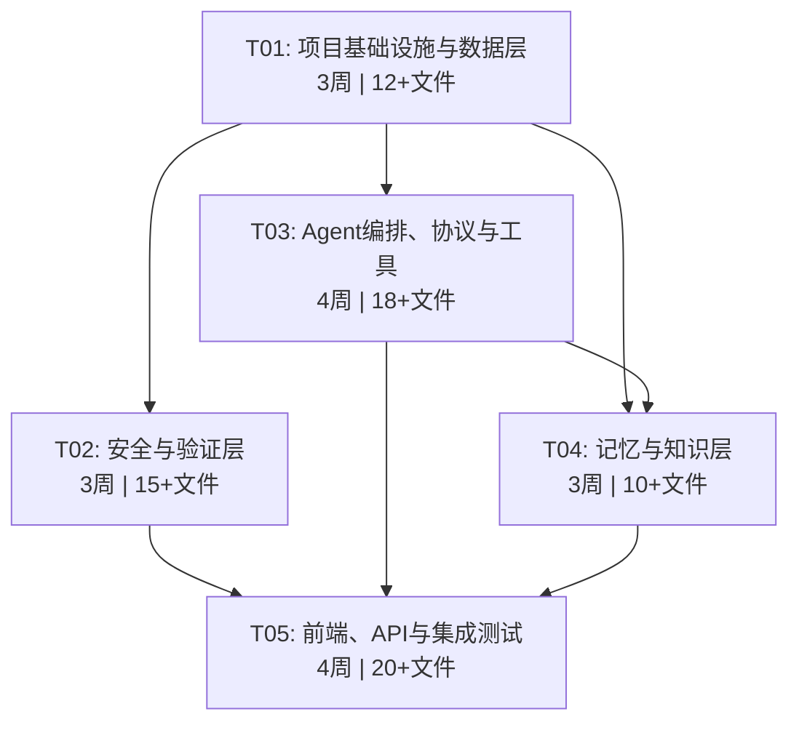

# EcoMind OS 技术开发方案 v2.0 Final

> **版本**: v2.0 Final（综合开源生态扫描 + Agent团队管理调研）
> **日期**: 2026-05-25
> **状态**: 最终版 · 可直接用于开发
> **编制**: 高见远（Gao）· 架构师
> **依据**:
> - `ecomind-os-tech-development-plan.md` v1.1（基础方案，1100行）
> - `ecomind-os-opensource-ecosystem-scan-2026.md`（60+项目开源生态扫描）
> - `ecomind-os-agent-team-management-scan-2026.md`（9大Agent编排框架调研）
> - `MEMORY.md`（D1-D11 全部技术决策）

---

## 目录

1. [项目定位与目标](#1-项目定位与目标)
2. [技术架构总设计](#2-技术架构总设计)
3. [Agent团队协作架构](#3-agent团队协作架构)
4. [自我学习闭环架构](#4-自我学习闭环架构)
5. [L5八层纵深防御链](#5-l5八层纵深防御链)
6. [产品功能规格](#6-产品功能规格)
7. [核心模块接口规格](#7-核心模块接口规格)
8. [数据模型设计](#8-数据模型设计)
9. [Phase 1 实施任务分解（0-3月）](#9-phase-1-实施任务分解0-3月)
10. [Phase 2-4 路线图摘要](#10-phase-2-4-路线图摘要)
11. [License 合规清单](#11-license-合规清单)
12. [风险与缓解](#12-风险与缓解)
13. [附录](#13-附录)

---

## 1. 项目定位与目标

### 1.1 产品定义

**EcoMind OS**（代号 **GAIA-ECO**）是面向**生态环境垂直领域**的智能操作系统，服务于政府生态环境局、环保执法机构及相关公众。

| 属性 | 内容 |
|------|------|
| **产品类型** | 工具型垂直领域 AI OS（非通用 AGI） |
| **核心差异化** | 政务合规 + 生态专业知识 + 可审计人机协同 + 多Agent团队协作 |
| **目标用户** | 执法人员、环境监测人员、审批人员、公众 |
| **核心承诺** | 可审计、人在环路（HITL）、不做"AI虚幻"承诺 |

### 1.2 业务域覆盖目标

| 状态 | 业务域 | 优先级 |
|------|--------|--------|
| ✅ Phase 1 覆盖 | 环境监测、政务审批合规、排污许可管理 | P0 |
| ✅ Phase 2 覆盖 | 执法监察、应急管理、生态督察、生物多样性保护、生态修复 | P1 |
| ✅ Phase 3 覆盖 | 环境影响评价 | P2 |
| 🔶 Phase 3 目标覆盖 | 碳排放管理 | P2 |
| 🔶 Phase 4 增强 | 公众参与/信息公开、气候变化适应 | P3 |

### 1.3 十一大技术决策（D1-D11，不可更改）

| # | 决策 | 选择 | 依据 | 来源 |
|---|------|------|------|------|
| **D1** | 后端核心框架 | **TAIJI-AGENT 2.0（fork + 二次开发）** | 已内置 Agent Loop + EventBus + Plugin + GovMCP + 国密 + 审批，省 6-12 个月 | v1.1 |
| **D2** | 验证引擎 | **TAIJI-VERIFY 2.0（pip 依赖 + 适配器）** | 六层架构 + 450 测试 + 91% 覆盖率 + 16 种失败模式 | v1.1 |
| **D3** | 记忆系统 | **Hermes MemoryProvider（Plugin 模式集成）** | 12 钩子全生命周期管理，业界最成熟记忆抽象 | v1.1 |
| **D4** | 路由编排 | **OpenClaw Gateway + ACP 协议** | 成熟多 Agent 路由标准，沙箱 + 技能市场生态 | v1.1 |
| **D5** | OpenHuman | **仅参考设计理念，严禁复制任何代码** | GPL-3.0 传染风险，所有功能有 MIT 替代方案 | v1.1 |
| **D6** | 记忆系统升级 | **Mem0 + Graphiti + GraphRAG + Hermes 四层架构** | Mem0持久化跨会话记忆，Graphiti时序知识图谱，GraphRAG自动KG构建，Hermes管短期 | 生态扫描 |
| **D7** | L5安全治理 | **八层纵深防御链**：象信(中文) → NeMo → LLM → TAIJI-VERIFY → LettuceDetect → Guardrails AI → Langfuse → GovMCP | 中文政务合规唯一开源方案 + 幻觉检测 + 全链路审计 | 生态扫描 |
| **D8** | 数据层 | **PostgreSQL + TimescaleDB + PostGIS + pgvector 四合一** | 统一PG运维，时序+空间+向量+关系全部基于PG扩展 | 生态扫描 |
| **D9** | 协议矩阵 | **MCP + A2A + ACP + GovMCP 四协议** | MCP工具层，A2A Agent互操作，ACP生命周期，GovMCP政务合规 | 生态扫描 |
| **D10** | 本地推理 | **SGLang（报告生成）+ vLLM（通用推理）+ LiteLLM（统一路由）** | 政务数据不出本地，SGLang结构化输出优于vLLM 5x | 生态扫描 |
| **D11** | Agent团队管理 | **LangGraph（主编排引擎，94%准确率）+ CrewAI（业务角色团队建模）** | 双引擎互补：LangGraph复杂编排，CrewAI快速业务建模 | Agent调研 |

---

## 2. 技术架构总设计

### 2.1 五层系统架构图（v2.0 增强版）

```mermaid
graph TB
    subgraph L1["L1 智能交互与任务编排"]
        GW["OpenClaw Gateway\n多Agent路由 + ACP协议"]
        AL["TAIJI Agent Loop\nmax 25 iterations"]
        LG["LangGraph 编排引擎\n有向状态图 + Checkpoint + interrupt()"]
        CA["CrewAI 团队引擎\n角色驱动 + Hierarchical/Sequential"]
        MCP["MCP + A2A + ACP + GovMCP\n四协议Agent通信矩阵"]
        PM["PM主Agent\nDAG依赖图调度 + 团队任务分配"]
    end

    subgraph L2["L2 多Agent协同执行"]
        SB["OpenClaw 沙箱\nDocker/SSH 隔离"]
        SA["SubAgent编排\nTAIJI SubAgentOrchestrator"]
        LP["LLM Provider\nLiteLLM + TAIJI适配器\n(Anthropic/OpenAI/Qwen/GLM/Kimi)"]
        TR["EcoToolRegistry\nMCP工具 + GovMCP工具集 + A2A发现"]
        LF["Langfuse 全链路追踪\nPrompt版本管理 + A/B测试 + 审计"]
        NM["NeMo Guardrails\n5层安全管道 + Colang DSL"]
    end

    subgraph L3["L3 系统与硬件贯通"]
        IOT["物联接入\nEMQX(MQTT) + OPC UA"]
        DT["数字孪生\nReact + Cesium.js"]
        OS["OS级API抽象\n设备调用/跨端协同"]
        EDF["环境数据流引擎\n实时监测→分析→告警"]
        TS["TimescaleDB\n时序数据超表+连续聚合"]
        PG["PostGIS\n空间索引+地理函数"]
    end

    subgraph L4["L4 认知记忆与知识层"]
        MP["Hermes MemoryProvider\n12钩子 + 短期记忆管理"]
        M0["Mem0\n跨会话长期记忆 + 多信号融合检索"]
        GT["Graphiti\n时序知识图谱 + Neo4j + 增量构建"]
        GR["GraphRAG\nKG自动构建 + 层次社区检测"]
        EE["EvolutionEngine\nTAIJI 组织级进化"]
        LC["学习循环\nHermes 策展+固化+审查"]
        KG["生态知识图谱\nNeo4j + LlamaIndex"]
        EX["EvoAgentX\nAgent自我进化参考跟踪"]
    end

    subgraph L5["L5 安全与伦理治理（八层纵深防御）"]
        L5L1["[L5-1] 象信AI安全护栏\n中文Prompt安全前置拦截"]
        L5L2["[L5-2] NeMo Guardrails\n5层安全管道"]
        L5L3["[L5-3] LLM推理层\nSGLang+vLLM本地推理"]
        L5L4["[L5-4] TAIJI-VERIFY 六层引擎\n16种失败模式 + EcoRules"]
        L5L5["[L5-5] LettuceDetect\nToken级RAG幻觉检测"]
        L5L6["[L5-6] Guardrails AI\nPydantic结构化输出验证"]
        L5L7["[L5-7] Langfuse\n全链路审计日志+证据链"]
        L5L8["[L5-8] GovMCP\nSM2/SM3/SM4 + 审批工作流(8状态)"]
        HL["HITL 人机协同\n置信度门控 + 计划预览 + L2硬确认"]
    end

    User["👤 用户（4种角色）"]
    FE["前端\nReact + MUI + Tailwind CSS"]
    DB["数据层\nPostgreSQL + TimescaleDB + PostGIS + pgvector + Redis"]
    WF["工作流引擎\nTemporal.io（DAG+signal）"]

    User --> FE --> L1
    L1 --> L2
    L2 --> L3
    L3 --> L4
    L4 --> L5
    L1 --> DB
    L2 --> DB
    L4 --> DB
    L5 --> DB
    L1 --> WF
    WF --> L2
```



### 2.2 技术栈汇总（v2.0 完整版）

| 层面 | 技术选型 | 来源 | License | v2.0变更 |
|------|----------|------|---------|----------|
| 后端核心框架 | TAIJI-AGENT 2.0 (fork) | TAIJI | MIT ✅ | — |
| Agent编排引擎 | **LangGraph**（有向状态图） | LangChain | MIT ✅ | 🆕 D11 |
| Agent团队建模 | **CrewAI**（角色驱动） | ekrtf/crewai | Apache-2.0 ✅ | 🆕 D11 |
| Agent通信协议 | **MCP + A2A + ACP + GovMCP** | 开放标准 | — | 🆕 D9 |
| LLM 统一接口 | LiteLLM + TAIJI 原生适配器 | LiteLLM + TAIJI | MIT ✅ | — |
| 记忆-短期 | Hermes MemoryProvider | Hermes-Agent | MIT ✅ | — |
| 记忆-长期 | **Mem0** | mem0ai/mem0 | Apache-2.0 ✅ | 🆕 D6 |
| 知识图谱-时序 | **Graphiti** | getzep/graphiti | Apache-2.0 ✅ | 🆕 D6 |
| 知识图谱-构建 | **GraphRAG** | microsoft/graphrag | MIT ✅ | 🆕 D6 |
| 验证引擎 | TAIJI-VERIFY 2.0 (pip 依赖) | TAIJI | MIT ✅ | — |
| 安全-中文护栏 | **象信AI安全护栏** | 象信 | Apache-2.0 ✅ | 🆕 D7 |
| 安全-输入防护 | **NeMo Guardrails** | NVIDIA | Apache-2.0 ✅ | 🆕 D7 |
| 安全-幻觉检测 | **LettuceDetect** | — | MIT ✅ | 🆕 D7 |
| 安全-结构验证 | **Guardrails AI** | guardrails-ai | Apache-2.0 ✅ | 🆕 D7 |
| 审计追踪 | **Langfuse** | langfuse | MIT ✅ | 🆕 D7 |
| 政务合规 | GOVMCP (内嵌) | GOVMCP/TAIJI | MIT ✅ | — |
| 本地推理-报告 | **SGLang** | sgl-project | Apache-2.0 ✅ | 🆕 D10 |
| 本地推理-通用 | **vLLM** | vllm-project | Apache-2.0 ✅ | 🆕 D10 |
| 评估引擎 | **DeepEval** | confident-ai | Apache-2.0 ✅ | 🆕 生态扫描 |
| 路由编排 | OpenClaw Gateway + ACP | OpenClaw | MIT ✅ | — |
| 前端框架 | React + MUI + Tailwind CSS | — | MIT ✅ | — |
| 前端状态管理 | Zustand + React Query | — | MIT ✅ | — |
| 流式通信 | Server-Sent Events (SSE) | — | — | — |
| 地理可视化 | Cesium.js（数字孪生，Phase 3） | Cesium | Apache-2.0 ✅ | — |
| 2D地图备选 | **MapLibre GL JS**（Phase 3） | MapLibre | BSD-3 ✅ | 🆕 生态扫描 |
| 工作流引擎 | Temporal.io | Temporal | MIT ✅ | — |
| 主数据库 | **PostgreSQL + TimescaleDB + PostGIS + pgvector** | — | BSD/GPL-2.0 ⚠️ | 🆕 D8 |
| 缓存与会话存储 | Redis | — | BSD ✅ | — |
| 消息队列 | RabbitMQ / NATS（Phase 2） | — | Apache/MIT ✅ | — |
| 知识图谱存储 | Neo4j Enterprise 或 Apache AGE | — | 商业/Apache ✅ | — |
| 物联接入 | EMQX (MQTT) + OPC UA | — | Apache ✅ | — |
| 自我进化参考 | **EvoAgentX** | — | — | 🆕 跟踪 |
| 安全沙箱 | Docker + L2 硬确认 | — | Apache ✅ | — |
| 全链路追踪 | Langfuse + OpenTelemetry | — | MIT ✅ | 升级 |
| 容器编排 | Docker + Kubernetes | — | Apache ✅ | — |

### 2.3 项目目录结构（v2.0 扩充版）

```
ecomind-os/
├── ecomind/                          # 主 Python 包（基于 TAIJI-AGENT fork）
│   ├── core/                         # 核心引擎（TAIJI 保留模块）
│   │   ├── engine.py                 # EcoAgentEngine（TAIJI AgentLoop 扩展）
│   │   ├── event_bus.py              # EventBus（20+事件类型 + 生态扩展）
│   │   ├── plugin.py                 # Plugin 生命周期管理
│   │   ├── guardrails.py             # 输入/输出护栏（增强 Prompt 注入防护）
│   │   └── hitl.py                   # HITL 人工审批（置信度门控+计划预览）
│   ├── orchestration/                # 🆕 Agent团队编排层
│   │   ├── langgraph_engine.py       # LangGraph 编排引擎（状态图+Checkpoint+interrupt）
│   │   ├── crewai_teams.py           # CrewAI 业务角色团队定义
│   │   ├── orchestrator_state.py     # OrchestratorState 编排状态管理
│   │   ├── team_config.py            # Team / AgentConfig 配置模型
│   │   └── patterns/                 # 四大编排模式实现
│   │       ├── supervisor.py         # Supervisor 主管委派模式
│   │       ├── router.py             # Router 路由分类模式
│   │       ├── pipeline.py           # Pipeline 流水线模式
│   │       └── swarm.py              # Swarm 群体自组织模式
│   ├── verify/                       # TAIJI-VERIFY 适配器
│   │   └── adapter.py                # EcoVerifyAdapter
│   ├── memory/                       # 🆕 扩展：四层记忆架构
│   │   ├── hermes_plugin.py          # HermesMemoryPlugin（Plugin 模式，短期记忆）
│   │   ├── mem0_plugin.py            # 🆕 Mem0 长期记忆插件（跨会话持久化）
│   │   ├── graphiti_plugin.py        # 🆕 Graphiti 时序知识图谱插件
│   │   ├── graphrag_plugin.py        # 🆕 GraphRAG KG自动构建插件
│   │   └── provider.py               # EcoMemoryProvider（统一记忆接口）
│   ├── safety/                       # 🆕 安全层（L5八层纵深防御）
│   │   ├── langfuse_tracer.py        # Langfuse 全链路审计追踪
│   │   ├── nemo_guardrails.py        # NeMo Guardrails 5层安全管道
│   │   ├── xiangxin_guardrails.py    # 象信AI安全护栏 中文合规拦截
│   │   ├── lettuce_detect.py         # LettuceDetect Token级幻觉检测
│   │   ├── guardrails_validator.py   # Guardrails AI 结构化输出验证
│   │   └── deepeval_runner.py        # DeepEval 评估引擎运行器
│   ├── govmcp/                       # GOVMCP 政务模块
│   │   ├── crypto.py                 # SM2/SM3/SM4 国密
│   │   ├── workflow.py               # GovWorkflowManager（8状态审批）
│   │   └── tools.py                  # 政务工具集（公文/脱敏/地址）
│   ├── agents/                       # 生态环境 Agent Profile
│   │   ├── enforcement.py            # 执法Agent（EnforcementAgentProfile）
│   │   ├── monitoring.py             # 监测Agent（MonitoringAgentProfile）
│   │   ├── approval.py               # 审批Agent（ApprovalAgentProfile）
│   │   └── public.py                 # 公众Agent（PublicAgentProfile）
│   ├── providers/                    # LLM 适配器
│   │   ├── litellm_gateway.py        # LiteLLM 统一网关
│   │   ├── taiji_adapters.py         # TAIJI 原生适配器（Qwen/GLM/Kimi）
│   │   ├── sglang_provider.py        # 🆕 SGLang 本地推理Provider
│   │   └── vllm_provider.py          # 🆕 vLLM 本地推理Provider
│   ├── tools/                        # 工具注册
│   │   ├── registry.py               # EcoToolRegistry
│   │   ├── mcp_registry.py           # 🆕 MCP协议工具注册（含A2A发现）
│   │   └── eco_tools/                # 生态专属工具
│   ├── auth/                         # 认证鉴权
│   │   ├── middleware.py             # JWT 认证中间件
│   │   ├── models.py                 # User / Session / AuthToken 模型
│   │   └── dependencies.py           # FastAPI 依赖注入（get_current_user）
│   ├── api/                          # REST API 路由
│   │   ├── chat.py                   # /api/v1/chat（含 SSE 流式端点）
│   │   ├── approval.py               # /api/v1/approval
│   │   ├── monitoring.py             # /api/v1/monitoring
│   │   ├── verify.py                 # /api/v1/verify
│   │   ├── auth.py                   # /api/v1/auth（登录/刷新/登出）
│   │   ├── report.py                 # /api/v1/report
│   │   └── team.py                   # 🆕 /api/v1/team（团队编排API）
│   ├── ecosystem/                    # 生态环境专属业务模块
│   │   ├── monitoring/               # 环境监测
│   │   ├── enforcement/              # 执法监察
│   │   ├── approval/                 # 政务审批
│   │   └── rules/                    # EcoRules 规则集
│   ├── evolution/                    # 🆕 自我学习进化模块
│   │   ├── evo_agent_x.py            # EvoAgentX 参考跟踪实现
│   │   └── learning_loop.py          # 自我学习闭环调度器
│   ├── iot/                          # 物联接入层（Phase 3）
│   │   ├── mqtt_client.py            # EMQX MQTT 客户端
│   │   └── opcua_adapter.py          # OPC UA 工业协议适配器
│   └── observability/                # 可观测性
│       ├── langfuse_exporter.py      # 🆕 Langfuse 导出器
│       └── otel_exporter.py          # OpenTelemetry 导出
│
├── frontend/                         # React 前端
│   ├── src/
│   │   ├── components/               # MUI + Tailwind 组件
│   │   ├── pages/                    # 4种角色对应页面
│   │   ├── cesium/                   # Cesium.js 数字孪生（Phase 3）
│   │   └── stores/                   # 状态管理
│   └── package.json
│
├── tests/                            # 测试
│   ├── unit/
│   ├── integration/
│   └── e2e/
│
├── pyproject.toml                    # Python 依赖（含所有新增包）
├── docker-compose.yml                # 本地开发环境（含TimescaleDB+PostGIS+Neo4j+Langfuse）
└── k8s/                              # Kubernetes 部署配置
```

---

## 3. Agent团队协作架构

### 3.1 双引擎架构设计

EcoMind OS v2.0 采用 **LangGraph + CrewAI 双引擎架构**，解决 v1.1 中"缺少多Agent团队协作编排层"的核心差距：

```
┌──────────────────────────────────────────────────────────────────┐
│                    L1 交互与路由层                                 │
│  OpenClaw Gateway → 用户意图分类 → 路由到对应引擎                  │
│                                                                 │
│  ┌─────────────────────────────────────────────────────────┐    │
│  │           Agent 团队协作层（🆕 v2.0核心新增）             │    │
│  │                                                          │    │
│  │  ┌─────────────────┐    ┌──────────────────┐            │    │
│  │  │   LangGraph      │    │    CrewAI        │            │    │
│  │  │   (复杂编排引擎)  │    │   (业务角色团队)  │            │    │
│  │  │                  │    │                  │            │    │
│  │  │ • 有向状态图     │    │ • Agent角色定义   │            │    │
│  │  │ • 条件分支路由   │    │ • Task任务链      │            │    │
│  │  │ • Checkpoint持久 │    │ • Crew团队协作    │            │    │
│  │  │ • interrupt()审批 │    │ • 多LLM混用      │            │    │
│  │  │ • 并行扇出/聚合  │    │ • A2A互操作      │            │    │
│  │  │ 准确率: 94%      │    │ 快速原型: 低延迟  │            │    │
│  │  └────────┬─────────┘    └────────┬─────────┘            │    │
│  │           │      统一Agent接口     │                       │    │
│  │           └───────────┬───────────┘                       │    │
│  │                       ▼                                   │    │
│  │  ┌──────────────────────────────────────────┐            │    │
│  │  │       TAIJI-AGENT Agent Loop              │            │    │
│  │  │       + Plugin + EventBus                 │            │    │
│  │  │       + MCP + A2A + GovMCP (四协议)       │            │    │
│  │  └──────────────────────────────────────────┘            │    │
│  │                                                          │    │
│  │  Temporal.io DAG ← 工作流持久化 + 重试 + 超时            │    │
│  └─────────────────────────────────────────────────────────┘    │
└──────────────────────────────────────────────────────────────────┘
```

### 3.2 双引擎分工矩阵

| 维度 | LangGraph | CrewAI |
|------|-----------|--------|
| **定位** | 复杂流程编排引擎 | 业务角色团队建模 |
| **编排模式** | Supervisor + Router + Pipeline + Swarm（全四种） | Supervisor（Hierarchical）+ Pipeline（Sequential） |
| **适用场景** | 环评报告多步生成、应急指挥条件分支、排污许可状态机 | 日常监测团队、执法队、督察组、审批会签组 |
| **状态管理** | Checkpoint（Redis/PG持久化）| Crew Memory（轻量会话级） |
| **人工介入** | `interrupt()` 审批确认节点 | `HumanInput` 角色输入 |
| **协议集成** | LangChain MCP适配器 | 社区MCP + A2A原生 |
| **调试工具** | LangGraph Studio / Langfuse | CrewAI Enterprise AMP |
| **准确率** | **94%**（多步任务） | 87%（简单编排更快30-60%） |
| **Token成本** | $0.08/task | $0.12/task |
| **学习曲线** | 陡峭（需理解有向图+Reducer） | 平缓（直觉式角色定义） |

### 3.3 四大编排模式实现

```
┌─────────────────────────────────────────────────────────────────┐
│                 四大 Agent 编排模式                               │
├────────────────┬────────────────┬───────────────┬───────────────┤
│  Supervisor    │   Router       │   Pipeline    │    Swarm      │
│  主管/委派      │   路由/分类     │   流水线       │   群体/自组织   │
│                │                │               │               │
│  ┌───┐         │  ┌───┐         │  A → B → C    │  A B C D     │
│  │ S │→A,B,C   │  │ R │→A/B/C  │               │  ↕ ↕ ↕ ↕    │
│  │   │←A,B,C   │  └───┘         │  顺序链式      │  任意对等通信   │
│  └───┘         │  轻量分类      │               │               │
│  中心化控制     │  低延迟       │  可预测       │  最高吞吐      │
│  可审计        │  高容错       │  好调试       │  难预测        │
└────────────────┴────────────────┴───────────────┴───────────────┘
```

#### 模式1：Supervisor（主管模式）— 审批工作流

```
[审批请求] → LangGraph Supervisor
    │
    ├→ [材料审查Agent] → 完整性检查
    ├→ [合规Agent] → 法规符合性检查
    ├→ [信用Agent] → 企业信用查询
    │
    └→ Supervisor 汇总 → 生成审批意见 → interrupt() 人工确认
```

#### 模式2：Router（路由模式）— 用户请求分类

```
[用户输入] → LangGraph Router
    │
    ├ 是监测查询？ → [MonitoringAgent]
    ├ 是执法请求？ → [EnforcementAgent]
    ├ 是审批事务？ → [ApprovalAgent]
    └ 是公众咨询？ → [PublicAgent]
```

#### 模式3：Pipeline（流水线模式）— 环评报告生成

```
[项目材料] → [分类Agent] → [数据收集Agent] → [报告生成Agent]
    → [质量审核Agent] → [合规校验Agent] → [审批Agent] → [归档Agent]
```

#### 模式4：Swarm（群体模式）— 应急指挥（Phase 2+）

```
[应急告警] → Swarm启动
    ├ [水质Agent] ⇄ [大气Agent] ⇄ [土壤Agent]
    ├ [通知Agent] ⇄ [指挥Agent] ⇄ [资源Agent]
    └ 通过共享状态协调，各Agent并行评估
```

### 3.4 业务场景映射

#### 场景1：环境影响评价报告生成（LangGraph驱动）

```
用户上传材料
    │
    ▼
┌──────────────────────────────────────────────────┐
│ LangGraph 状态图                                   │
│                                                    │
│ [分类Agent] → 判断项目类型（工业/交通/水利/...）   │
│      │                                             │
│      ├→ [环评Agent] → 收集数据 → 生成初稿          │
│      │       │                                     │
│      │       ├→ [审核Agent] → 质量检查             │
│      │       │       │                             │
│      │       │       ├ 通过 → [审批Agent]          │
│      │       │       │    │                        │
│      │       │       │    ├ L1 → 自动通过          │
│      │       │       │    ├ L2 → interrupt()人工确认│
│      │       │       │    └ L3 → 双因子+审批链     │
│      │       │       │                             │
│      │       │       └ 驳回 → 回到[环评Agent]       │
│      │       │                                     │
│      └→ [验收Agent] → 竣工环保验收                  │
└──────────────────────────────────────────────────┘
```

#### 场景2：日常环境监测团队（CrewAI驱动）

```
┌──────────────────────────────────────────────────┐
│ CrewAI: "XX监测站值班团队"                          │
│                                                    │
│ 👤 站长Agent (Manager) —— LLM: Qwen-Max           │
│    → 任务分配、结果审核                             │
│                                                    │
│ 👷 监测Agent (Worker) —— LLM: Qwen-Plus            │
│    → 调取传感器数据 → 超标判断 → 生成预警           │
│                                                    │
│ 📊 分析Agent (Worker) —— LLM: GLM-4                │
│    → 数据趋势分析 → 报告生成                        │
│                                                    │
│ 📢 通报Agent (Worker) —— LLM: Qwen-Turbo           │
│    → 超标时自动通报 → 发送通知                      │
│                                                    │
│ 流程: Hierarchical（站长→自动分配任务）             │
└──────────────────────────────────────────────────┘
```

#### 场景3：突发环境应急指挥（LangGraph + CrewAI混合）

```
[报警触发] → LangGraph Router 分类
    │
    ├─ 水污染 → CrewAI团队: 应急处置组
    │              (指挥Agent + 水质Agent + 通知Agent)
    │
    ├─ 大气污染 → CrewAI团队: 大气应急组
    │
    └─ 危化品泄漏 → LangGraph复杂流程
                     (隔离→评估→处置→恢复→复盘)
                     每步都有interrupt()人工确认
```

### 3.5 Agent通信协议矩阵（D9）

| 协议 | 定位 | 用途 | 状态 |
|------|------|------|------|
| **MCP** | Tool连接协议 | Agent调用工具/资源/提示词 | ✅ 已采用 |
| **A2A** | Agent互操作协议 | Agent间发现/通信/协调（150+伙伴） | 🆕 Phase 2 集成 |
| **ACP** | Agent控制协议 | Agent生命周期/权限/沙箱管理 | ✅ 已采用（OpenClaw） |
| **GovMCP** | MCP治理扩展 | 政务合规/审批/国密 | ✅ 自研，跟踪MCP上游 |

---

## 4. 自我学习闭环架构

### 4.1 四层进化架构

EcoMind OS v2.0 的自我学习能力按四层进化模型逐步实现：

```
┌─────────────────────────────────────────────────────────────────┐
│                    EcoMind OS 自我学习闭环                        │
├─────────────────────────────────────────────────────────────────┤
│                                                                 │
│  Layer 1: 记忆进化（Phase 2）                                    │
│  ┌─────────────────────────────────────────────┐               │
│  │  短期记忆(Hermes) → 长期记忆(Mem0)            │               │
│  │       ↓                                      │               │
│  │  知识图谱(Graphiti时序KG) → 固化(GraphRAG)    │               │
│  │                                              │               │
│  │  从"遗忘"到"记住"：用户偏好、常用查询、       │               │
│  │  工作习惯自动沉淀为持久知识                    │               │
│  └─────────────────────────────────────────────┘               │
│                         ↓                                       │
│  Layer 2: 技能进化（Phase 3）                                    │
│  ┌─────────────────────────────────────────────┐               │
│  │  Hermes 学习循环:                              │               │
│  │    高频任务自动识别 → 策展 → 固化 → Skill      │               │
│  │                                              │               │
│  │  TAIJI EvolutionEngine:                       │               │
│  │    个体级 → 部门级 → 系统级 三层进化           │               │
│  │                                              │               │
│  │  从"记住"到"会用"：自动发现高频任务模式，      │               │
│  │  生成可复用的Skill Bundle                     │               │
│  └─────────────────────────────────────────────┘               │
│                         ↓                                       │
│  Layer 3: 工作流进化（Phase 3-4）                                │
│  ┌─────────────────────────────────────────────┐               │
│  │  EvoAgentX 参考跟踪:                           │               │
│  │    工作流模式挖掘 → 优化建议 → A/B测试         │               │
│  │                                              │               │
│  │  从"会用"到"更优"：分析Agent团队协作模式，     │               │
│  │  自动推荐编排优化（如Supervisor→Pipeline切换）  │               │
│  └─────────────────────────────────────────────┘               │
│                         ↓                                       │
│  Layer 4: 模型进化（Phase 4）                                    │
│  ┌─────────────────────────────────────────────┐               │
│  │  环境领域微调（SFT/RLHF）:                     │               │
│  │    EcoRules反馈 → 模型迭代                     │               │
│  │    幻觉修正 → 准确率持续提升                   │               │
│  │                                              │               │
│  │  从"更优"到"更准"：基于生产环境feedback        │               │
│  │  持续微调领域模型                              │               │
│  └─────────────────────────────────────────────┘               │
│                                                                 │
└─────────────────────────────────────────────────────────────────┘
```

### 4.2 EvoAgentX POC 计划

| 阶段 | 内容 | 优先级 | 预计工时 |
|------|------|--------|---------|
| Phase 2 | 基础数据采集：Agent调用日志 + 用户反馈埋点 | P1 | 1周 |
| Phase 3 | 工作流模式挖掘：高频任务识别 + 优化建议生成 | P2 | 2周 |
| Phase 3 | A/B测试框架：编排模式切换对比 + 效果度量 | P2 | 2周 |
| Phase 4 | 自动化建议：AI驱动的工作流优化推荐 | P2 | 2周 |

---

## 5. L5八层纵深防御链

### 5.1 完整架构

```
用户请求
  │
  ▼
┌─────────────────────────────────────────────────────────────────┐
│ [L5-1] 象信AI安全护栏                                            │
│  ↳ 中文Prompt安全前置拦截（敏感词/越狱/注入检测）                  │
│  ↳ 唯一面向中文政务合规的开源方案                                  │
│  ↳ License: Apache-2.0 ✅                                        │
├─────────────────────────────────────────────────────────────────┤
│ [L5-2] NeMo Guardrails                                           │
│  ↳ 5层安全管道：输入→对话→检索→执行→输出                           │
│  ↳ Colang DSL 自定义安全规则 + 事实核查                            │
│  ↳ GPU加速 + 低延迟（<50ms）                                      │
│  ↳ License: Apache-2.0 ✅                                        │
├─────────────────────────────────────────────────────────────────┤
│ [L5-3] LLM推理层（SGLang / vLLM / LiteLLM）                      │
│  ↳ SGLang: 环境报告生成 + 结构化输出（Agent场景吞吐5x vLLM）      │
│  ↳ vLLM: 通用推理 + PagedAttention高吞吐                          │
│  ↳ LiteLLM: 统一路由网关（本地+云端混合）                          │
│  ↳ License: Apache-2.0 ✅                                        │
├─────────────────────────────────────────────────────────────────┤
│ [L5-4] TAIJI-VERIFY 2.0（六层输出验证）                           │
│  ↳ L1文法 → L2事实 → L3逻辑 → L4安全 → L5合规 → L6生态           │
│  ↳ 16种失败模式（FM01-FM16）检测                                  │
│  ↳ EcoRules 生态环境专属规则集                                    │
│  ↳ License: MIT ✅                                               │
├─────────────────────────────────────────────────────────────────┤
│ [L5-5] LettuceDetect（RAG幻觉检测）                               │
│  ↳ Token级精确标注（哪几个token是幻觉）                            │
│  ↳ 中文支持 + 68M极轻量模型可本地部署                              │
│  ↳ 环境报告幻觉检测专用方案                                        │
│  ↳ License: MIT ✅                                               │
├─────────────────────────────────────────────────────────────────┤
│ [L5-6] Guardrails AI（结构化输出验证）                             │
│  ↳ Pydantic Schema验证 + 数值范围检查 + 必填字段校验               │
│  ↳ 50+内置验证器 + OnFailActions（重试/修正/拒绝）                │
│  ↳ License: Apache-2.0 ✅                                        │
├─────────────────────────────────────────────────────────────────┤
│ [L5-7] Langfuse（全链路审计日志）                                  │
│  ↳ 输入→模型→输出→验证→签名 完整证据链                             │
│  ↳ Prompt版本管理 + A/B测试 + 成本追踪                             │
│  ↳ OpenTelemetry原生导出 + 合规审计报告                            │
│  ↳ License: MIT ✅                                               │
├─────────────────────────────────────────────────────────────────┤
│ [L5-8] GovMCP（政务合规与审批）                                    │
│  ↳ SM2/SM3/SM4 国密签名与加密                                     │
│  ↳ 8状态审批工作流（待受理→受理→审查→补充→会签→审核→发证→归档）    │
│  ↳ License: MIT ✅                                               │
└─────────────────────────────────────────────────────────────────┘
  │
  ▼
最终输出（经八层验证 + 审计签名）
```

### 5.2 各层职责与数据流

| 层 | 职责 | 输入 | 输出 | 失败处理 | 延迟 |
|---|------|------|------|---------|------|
| L5-1 | 中文敏感词/越狱检测 | 用户原始输入 | 清洗后输入 / 拦截 | 直接拒绝 + 告警 | <10ms |
| L5-2 | 5层安全管道校验 | L5-1输出 | 安全上下文 + 约束 | 按规则拒绝/警告 | <50ms |
| L5-3 | LLM推理执行 | 安全上下文 | 原始LLM输出 | 模型降级/重试 | 1-30s |
| L5-4 | 六层验证（16种失败模式） | LLM输出 | 验证结果(PASS/WARN/FAIL) | 触发HITL | <5s |
| L5-5 | RAG幻觉Token级检测 | LLM输出+RAG上下文 | 幻觉标注 | 触发修正/人工确认 | <200ms |
| L5-6 | 结构化Schema验证 | 最终文本 | Pydantic对象/验证报告 | OnFailAction | <10ms |
| L5-7 | 全链路审计签名 | 全流程数据 | 审计证据链 | 记录异常 | <10ms |
| L5-8 | 国密签名+审批 | L5-7签名后数据 | 合规输出 | 审批驳回/重签 | 按审批流 |

### 5.3 安全层性能预算

```
总延迟预算: < 5s（不含LLM推理时间）

L5-1 象信:     < 10ms  (0.2%)
L5-2 NeMo:     < 50ms  (1.0%)
L5-3 LLM推理:  1-30s   (主要耗时)
L5-4 VERIFY:   < 5s    (验证预算)
L5-5 Lettuce:  < 200ms (4.0%)
L5-6 Guardrails: < 10ms (0.2%)
L5-7 Langfuse: < 10ms  (0.2%)
L5-8 GovMCP:   按审批流 (异步)
```

---

## 6. 产品功能规格

### 6.1 四类用户角色 Agent Profile

#### 6.1.1 执法人员（EnforcementAgent）

**核心用户故事**：
- 作为执法人员，我想要拍摄现场照片后由 AI 自动识别违规点，以便快速生成执法记录
- 作为执法人员，我想要语音下达检查指令，以便在现场无需手动操作即可记录
- 作为执法人员，我想要查询被检查企业的历史违规记录，以便制定针对性执法方案
- 作为执法人员，我想要生成符合国家标准的执法文书，以便减少人工撰写工作量
- **🆕 作为执法队长，我想要在突发环境事件中由AI指挥团队（指挥员+监测Agent+执法Agent+通报Agent）自动联动响应，以便缩短应急响应时间**

**关键功能清单**：

| 优先级 | 功能 | 验收标准 |
|--------|------|---------|
| P0 | 现场照片违规识别 | 准确率 ≥80%，响应 ≤10s |
| P0 | 执法记录自动生成 | 符合生态环境部标准模板，人工审核通过率 ≥90% |
| P0 | 企业历史记录查询 | 查询响应 ≤3s，覆盖近5年记录 |
| P1 | 语音指令识别 | 中文普通话识别准确率 ≥95% |
| P1 | 执法文书国密加密传输 | 全程 SM4 加密，无明文传输 |
| P2 | 离线执法模式 | 无网络时本地缓存，恢复网络后自动同步 |

#### 6.1.2 监测人员（MonitoringAgent）

**核心用户故事**：
- 作为监测人员，我想要自然语言查询环境监测数据，以便无需学习SQL即可快速获取所需指标
- 作为监测人员，我想要系统自动识别异常数据并推送告警，以便第一时间响应超标事件
- **🆕 作为监测站长，我想要组建一个AI监测团队（站长+监测员+分析师+通报员），由AI自动分配任务协同完成数据查询→超标判断→通报生成，以便提升值班效率**

| 优先级 | 功能 | 验收标准 |
|--------|------|---------|
| P0 | 自然语言数据查询 | 支持时间/地点/指标多维查询（TimescaleDB时序），响应 ≤5s |
| P0 | 阈值告警规则配置 | 支持 PM2.5/PM10/SO2/NOx/CO/O3 六种指标 |
| P0 | 监测数据分析报告生成 | 一键生成（SGLang结构化输出），符合 HJ/T 系列标准格式 |
| 🆕 P1 | **CrewAI监测团队协作** | 4 Agent（站长/监测员/分析师/通报员）协同完成"查询→判断→通报"全流程，任务分配可追踪，端到端 ≤30s |
| P1 | 数据异常检测 | 自动识别传感器故障/数据异常，准确率 ≥85% |
| P2 | 污染溯源分析 | 基于气象数据+排放源数据的综合溯源（PostGIS空间分析） |

#### 6.1.3 审批人员（ApprovalAgent）

**核心用户故事**：
- 作为审批人员，我想要AI自动审查申请材料完整性，以便减少人工逐一核对的重复劳动
- **🆕 作为审批人员，我想要多Agent会签团队自动分配会签任务并汇总各会签人意见，以便加速审批流程减少等待时间**

| 优先级 | 功能 | 验收标准 |
|--------|------|---------|
| P0 | 申请材料完整性审查 | 覆盖排污许可申请12项必备材料，缺漏检出率 ≥95% |
| P0 | 8状态审批工作流 | 待受理→受理→审查→补充材料→会签→审核→发证→归档 |
| P0 | **多Agent会签团队**（🆕 CrewAI驱动） | 3+ Agent模拟会签分配（审批员+环保专家+法律顾问），意见自动汇总，CrewAI Hierarchical模式 |
| P1 | 环境信用查询 | 联通全国排污许可管理系统，响应 ≤5s |
| P1 | 审批意见模板库 | 内置 20+ 常用审批意见模板 |
| P2 | 审批时效预警 | 临近法定审批期限自动提醒 |

#### 6.1.4 公众（PublicAgent）

| 优先级 | 功能 | 验收标准 |
|--------|------|---------|
| P0 | 环境质量查询（对话式）| 支持自然语言提问，响应 ≤3s |
| P1 | 环境违法举报 | 一键上传证据+定位（PostGIS地理标记），生成举报编号 |
| P1 | 法规政策问答 | 覆盖生态环境保护主要法律法规，准确率 ≥90%（GraphRAG增强） |
| P2 | 个性化环境提醒 | 按用户位置推送空气质量/污染预警 |

### 6.2 Phase 1 MVP 产品功能规格

#### IN SCOPE（必须实现）

| 功能模块 | 具体功能 | 验收标准 |
|---------|---------|---------|
| **Agent 核心** | 4种角色的对话式交互 | 完成一次完整对话 ≤30s 响应 |
| **Agent团队编排** | 🆕 CrewAI基础团队建模（监测站值班团队DEMO） | 4 Agent（站长+监测员+分析师+通报员）协同完成"查询XX园区PM2.5→判断超标→生成通报"全流程，任务分配可追踪，端到端 ≤30s |
| **环境监测** | 自然语言查询环境数据（Mock数据+TimescaleDB） | 支持时间+地点+指标3维查询 |
| **政务审批** | 完整8状态审批工作流演示 | 全部8个状态可达，会签可用 |
| **验证引擎** | TAIJI-VERIFY 对 LLM 输出全链路验证 | 100% 输出经过验证 |
| **记忆系统** | Hermes短期记忆 + Mem0 POC | ≥5轮对话上下文连贯 |
| **安全护栏** | 🆕 象信中文护栏 + Langfuse审计追踪 | 100%请求经过护栏+追踪 |
| **国密加密** | SM4 加密敏感数据传输 | 100% 覆盖 |
| **GovMCP 工具集** | MCP 协议注册政务工具（公文生成/脱敏/地址） | 至少 3 个政务工具可通过 MCP 调用 |
| **前端 UI** | 4种角色可切换的基础对话界面 | 可正常使用，无 P0 Bug |

#### OUT OF SCOPE（明确不做）

- 物联网设备真实接入（用 Mock 数据代替）
- Cesium.js 数字孪生（Phase 3）
- 离线模式
- SGLang/vLLM 本地推理部署（Phase 2）
- NeMo Guardrails 完整部署（Phase 2）
- Graphiti/GraphRAG 知识图谱（Phase 2 POC）
- 学习循环/自进化（Phase 4）
- 等保三级合规（Phase 4）
- A2A 协议集成（Phase 2）
- 真实生产环境部署（MVP 阶段为本地/演示环境）

#### Demo 场景：环境监测数据分析对话闭环（v2.0 增强版）

**场景描述**：监测人员对某工业园区进行日常监测数据分析，CrewAI监测团队协作

**步骤**：
1. 用户登录 → 选择"监测人员"角色
2. 输入："查询XX工业园区本周PM2.5数据，是否超标？"
3. 系统：象信护栏 L5-1 中文安全检测 → 通过
4. EcoAgentEngine 接收请求 → TAIJI-VERIFY L5-4 输入验证
5. LangGraph Router 路由到监测团队
6. CrewAI 监测团队：
   - 站长Agent 分配任务 → 监测Agent 调取TimescaleDB时序数据
   - 分析Agent 判断是否超标
7. TAIJI-VERIFY L5-4 输出验证 → 返回数据 + 验证结果
8. 如超标：自动触发告警事件（EventBus → `MONITORING_ALERT`），通报Agent生成通报
9. 生成分析报告草稿 → HITL 置信度门控（>0.8 自动审批，≤0.8 人工确认）
10. **【异常路径演示】**模拟验证失败：LLM输出被 VERIFY 判定 FAIL（幻觉数据）→ 触发 `HITL_REQUIRED` 事件 → 前端弹出人工确认面板 → 操作员查看失败原因（FM02 事实冲突）→ LettuceDetect L5-5 标注幻觉Token → 修正数据 → 重新提交 → 验证 PASS
11. Langfuse L5-7 全链路审计记录 → 国密 SM4 加密 → 传输至政务平台 Mock API
12. Hermes MemoryProvider 同步记录短期记忆 + Mem0 沉淀长期记忆
13. 用户收到：数据分析结果 + 超标告警 + 报告草稿链接

**成功标准**：正常流程 ≤30s，异常路径（步骤 10）全程可演示，所有 13 个步骤均可操作。

### 6.3 API 接口需求（v2.0 增强版）

#### 前端所需后端 API 能力

```
# ─── 认证鉴权 ───
POST   /api/v1/auth/login          # 用户登录（返回 JWT）
POST   /api/v1/auth/refresh         # 刷新 Token
POST   /api/v1/auth/logout          # 登出

# ─── Agent 对话（含流式输出）───
POST   /api/v1/chat                 # 发起 Agent 对话（同步）
GET    /api/v1/chat/stream          # SSE 流式 Agent 对话
GET    /api/v1/chat/{session_id}    # 查询会话历史

# ─── 团队编排（🆕 v2.0）───
POST   /api/v1/team/create          # 创建Agent团队（LangGraph/CrewAI）
POST   /api/v1/team/execute         # 执行团队任务
GET    /api/v1/team/{team_id}/status # 查询团队执行状态

# ─── 政务审批 ───
POST   /api/v1/approval/submit      # 提交审批申请
GET    /api/v1/approval/{id}        # 查询审批状态
POST   /api/v1/approval/{id}/countersign  # 会签意见提交

# ─── 环境监测 ───
GET    /api/v1/monitoring/query     # 查询监测数据（TimescaleDB时序）

# ─── 验证与 HITL ───
POST   /api/v1/hitl/confirm         # 人工审批确认
GET    /api/v1/verify/result/{id}   # 查询验证结果

# ─── 报告与审计（🆕 v2.0）───
POST   /api/v1/report/generate      # 生成报告
GET    /api/v1/audit/trace/{id}     # 查询Langfuse审计追踪

# ─── GovMCP 政务工具 ───
POST   /api/v1/tools/desensitize    # 数据脱敏
POST   /api/v1/tools/address-parse  # 地址标准化解析（PostGIS）
POST   /api/v1/tools/document-generate  # 公文辅助生成
```

#### 错误码规范

| 错误码 | 含义 | HTTP 状态码 |
|--------|------|:-----------:|
| EC-001 | 认证失败（Token 无效/过期） | 401 |
| EC-002 | 权限不足（角色无权访问） | 403 |
| EC-003 | 输入验证失败（PARAM 校验） | 400 |
| EC-004 | 🆕 安全护栏拦截（象信/NeMo拒绝） | 403 |
| EC-010 | Agent 执行超时 | 504 |
| EC-011 | Agent 迭代次数超限 | 500 |
| EC-020 | 验证引擎判定 FAIL | 200（附带 verify_result） |
| EC-021 | 验证引擎超时 | 504 |
| EC-030 | HITL 等待人工确认 | 202（Accepted） |
| EC-040 | 审批工作流非法状态转换 | 409 |
| EC-050 | 工具调用失败 | 500 |
| EC-060 | 🆕 团队编排失败（LangGraph/CrewAI异常） | 500 |
| EC-061 | 🆕 Agent通信协议错误（MCP/A2A） | 502 |

---

## 7. 核心模块接口规格

### 7.1 EcoVerifyAdapter（TAIJI-VERIFY 接入适配器）

```python
# ecomind/verify/adapter.py
from typing import Optional, Any
from dataclasses import dataclass
from taiji_verify.engine import TaijiVerifyEngine, Verdict
from ecomind.core.event_bus import EventBus, EventType, Event


@dataclass
class EcoVerifyConfig:
    """EcoMind 验证适配器配置"""
    enable_eco_rules: bool = True
    min_confidence_threshold: float = 0.8
    failure_mode_filter: list[str] = None
    hitl_on_verify_fail: bool = True


class EcoVerifyAdapter:
    """TAIJI-VERIFY 六层引擎 → EcoMind EventBus 适配器"""

    def __init__(self, event_bus: EventBus, config: EcoVerifyConfig = None):
        self._bus = event_bus
        self._config = config or EcoVerifyConfig()
        self._engine = TaijiVerifyEngine(
            eco_rules_enabled=self._config.enable_eco_rules
        )

    async def verify(
        self,
        input_text: str,
        llm_output: str,
        ground_truth: Optional[str] = None,
        context: Optional[dict[str, Any]] = None,
    ) -> "VerifyResult":
        """对 LLM 输出进行六层验证，结果发布到 EventBus"""
        response = self._engine.verify(
            input_text=input_text,
            output=llm_output,
            ground_truth=ground_truth,
        )
        result = VerifyResult(
            is_passing=response.is_passing,
            verdict=response.verdict.value,
            confidence=response.confidence_score,
            failure_modes=[fd.to_dict() for fd in response.failure_detections],
            eco_rule_violations=response.eco_rule_violations or [],
        )
        await self._bus.publish(Event(
            event_type=EventType.VERIFY_RESULT,
            data={"result": result, "context": context},
        ))
        if not result.is_passing and self._config.hitl_on_verify_fail:
            await self._bus.publish(Event(
                event_type=EventType.HITL_REQUIRED,
                data={"reason": "verify_failed", "result": result, "llm_output": llm_output},
            ))
        return result

    async def verify_stream(self, stream, **kwargs):
        """流式输出的验证（逐 chunk 验证 + 最终全文验证）"""
        ...
```

### 7.2 LangGraph编排引擎（🆕 核心新增）

```python
# ecomind/orchestration/langgraph_engine.py
from typing import TypedDict, Annotated, Literal, Optional, Any
from langgraph.graph import StateGraph, END
from langgraph.checkpoint.memory import MemorySaver
from langgraph.types import interrupt
from ecomind.orchestration.orchestrator_state import OrchestratorState


class LangGraphOrchestrator:
    """
    LangGraph 复杂流程编排引擎
    支持：Supervisor / Router / Pipeline / Swarm 四种模式
    集成：Checkpoint持久化 + interrupt()人工审批 + Langfuse追踪
    """

    def __init__(
        self,
        mode: Literal["supervisor", "router", "pipeline", "swarm"] = "supervisor",
        checkpoint_backend: str = "memory",  # "memory" | "redis" | "postgres"
        enable_langfuse: bool = True,
    ):
        self._mode = mode
        self._checkpointer = self._init_checkpointer(checkpoint_backend)
        self._graph = self._build_graph()

    def _build_graph(self) -> StateGraph:
        """按模式构建有向状态图"""
        builder = StateGraph(OrchestratorState)
        if self._mode == "supervisor":
            builder = self._build_supervisor_graph(builder)
        elif self._mode == "router":
            builder = self._build_router_graph(builder)
        elif self._mode == "pipeline":
            builder = self._build_pipeline_graph(builder)
        elif self._mode == "swarm":
            builder = self._build_swarm_graph(builder)
        return builder.compile(checkpointer=self._checkpointer)

    def _build_supervisor_graph(self, builder: StateGraph) -> StateGraph:
        """Supervisor模式：中央编排Agent委派任务"""
        builder.add_node("supervisor", self._supervisor_node)
        builder.add_node("worker_a", self._worker_node)
        builder.add_node("worker_b", self._worker_node)
        builder.add_node("worker_c", self._worker_node)
        builder.add_node("approval_gate", self._approval_node)
        builder.set_entry_point("supervisor")
        builder.add_conditional_edges("supervisor", self._route_supervisor, {
            "worker_a": "worker_a",
            "worker_b": "worker_b",
            "worker_c": "worker_c",
            "approval": "approval_gate",
            "end": END,
        })
        for w in ["worker_a", "worker_b", "worker_c"]:
            builder.add_edge(w, "supervisor")
        builder.add_edge("approval_gate", "supervisor")
        return builder

    async def _supervisor_node(self, state: OrchestratorState) -> dict:
        """Supervisor节点：分解任务 → 委派Worker → 收集结果"""
        ...

    async def _approval_node(self, state: OrchestratorState) -> dict:
        """审批门控：L1自动通过 / L2 interrupt() 人工确认 / L3双因子"""
        if state["required_approval_level"] == "L2":
            approved = interrupt({
                "message": "请确认以下输出",
                "output": state.get("pending_output"),
            })
            state["approved"] = approved
        return state

    async def execute(self, task: str, context: dict) -> OrchestratorState:
        """执行编排任务（支持checkpoint恢复）"""
        initial_state = OrchestratorState(
            task=task,
            messages=[],
            context=context,
        )
        config = {"configurable": {"thread_id": context.get("session_id")}}
        result = await self._graph.ainvoke(initial_state, config)
        return result
```

### 7.3 CrewAI团队引擎（🆕 核心新增）

```python
# ecomind/orchestration/crewai_teams.py
from typing import Optional
from crewai import Agent, Task, Crew, Process
from ecomind.orchestration.team_config import TeamConfig, AgentConfig


class CrewAITeamBuilder:
    """
    CrewAI 业务角色团队建模
    支持：Hierarchical（层级）/ Sequential（顺序）两种流程
    场景：监测站值班团队、执法队、督察组、审批会签组
    """

    def __init__(self, llm_registry: "LLMRegistry"):
        self._llm_registry = llm_registry

    def build_team(self, config: TeamConfig) -> Crew:
        """根据 TeamConfig 构建 CrewAI 团队"""
        agents = [self._build_agent(ac) for ac in config.agents]
        tasks = [self._build_task(t, agents) for t in config.tasks]

        process = (
            Process.hierarchical if config.process == "hierarchical"
            else Process.sequential
        )

        return Crew(
            agents=agents,
            tasks=tasks,
            process=process,
            verbose=True,
        )

    def _build_agent(self, config: AgentConfig) -> Agent:
        """构建单个Agent（支持不同LLM混用以优化成本）"""
        return Agent(
            role=config.role,
            goal=config.goal,
            backstory=config.backstory,
            llm=self._llm_registry.get(config.llm_key),
            tools=config.tools,
            allow_delegation=config.allow_delegation,
        )

    def _build_task(self, task_config, agents: list[Agent]) -> Task:
        """构建任务（指定负责Agent和预期输出）"""
        ...

    # 预定义团队模板
    @classmethod
    def monitoring_station_team(cls) -> TeamConfig:
        """监测站值班团队模板"""
        return TeamConfig(
            name="监测站值班团队",
            process="hierarchical",
            agents=[
                AgentConfig(role="站长", goal="分配监测任务，审核结果",
                            llm_key="qwen_max", allow_delegation=True),
                AgentConfig(role="监测员", goal="调取传感器数据，判断超标",
                            llm_key="qwen_plus", allow_delegation=False),
                AgentConfig(role="分析师", goal="数据趋势分析，生成报告",
                            llm_key="glm4", allow_delegation=False),
                AgentConfig(role="通报员", goal="超标告警通报发送",
                            llm_key="qwen_turbo", allow_delegation=False),
            ],
            tasks=[...],
        )

    @classmethod
    def enforcement_team(cls) -> TeamConfig:
        """执法队模板"""
        ...

    @classmethod
    def inspector_team(cls) -> TeamConfig:
        """督察组模板"""
        ...
```

### 7.4 统一记忆接口（🆕 四层架构）

```python
# ecomind/memory/provider.py
from typing import Optional, AsyncIterator
from abc import ABC, abstractmethod


class MemoryLayer(ABC):
    """记忆层抽象基类"""
    @abstractmethod
    async def store(self, record: "MemoryRecord") -> str: ...
    @abstractmethod
    async def retrieve(self, query: str, top_k: int = 5, **filters) -> list["MemoryRecord"]: ...
    @abstractmethod
    async def forget(self, memory_id: str) -> bool: ...


class EcoMemoryProvider:
    """
    EcoMind 统一记忆接口（四层架构）
    L1: Hermes — 短期会话记忆（12钩子，TTL 1h）
    L2: Mem0  — 跨会话长期记忆（多信号融合检索 + 实体链接）
    L3: Graphiti — 时序知识图谱（Neo4j + valid_at/invalid_at）
    L4: GraphRAG — KG自动构建（层次社区检测 + 私有数据推理）
    """

    def __init__(
        self,
        hermes_plugin: "HermesMemoryPlugin",
        mem0_client: Optional["Mem0Client"] = None,
        graphiti_client: Optional["GraphitiClient"] = None,
        graphrag_client: Optional["GraphRAGClient"] = None,
    ):
        self._hermes = hermes_plugin         # L1: 短期记忆（必有）
        self._mem0 = mem0_client              # L2: 长期记忆（可选）
        self._graphiti = graphiti_client      # L3: 时序KG（可选）
        self._graphrag = graphrag_client      # L4: KG构建（可选）

    async def prefetch(
        self, query: str, user_role: str, top_k: int = 5
    ) -> dict[str, list["MemoryRecord"]]:
        """
        多源记忆预取（用于Agent上下文注入）
        按 L1→L2→L3 优先级逐层检索
        """
        results = {}
        # L1: 短期记忆（Hermes，必过）
        results["short_term"] = await self._hermes.retrieve(query, top_k)
        # L2: 长期记忆（Mem0，如果可用）
        if self._mem0:
            results["long_term"] = await self._mem0.retrieve(
                query, top_k, user_role=user_role
            )
        # L3: 时序KG（Graphiti，如果可用）
        if self._graphiti:
            results["temporal_kg"] = await self._graphiti.search(query, top_k)
        return results

    async def sync_turn(
        self,
        user_content: str,
        assistant_content: str,
        session_id: str,
    ) -> None:
        """同步本轮记忆到所有可用层"""
        await self._hermes.sync_turn(user_content, assistant_content, session_id)
        if self._mem0:
            await self._mem0.add(user_content, assistant_content, session_id)

    async def curate_session(self, session_id: str) -> None:
        """会话结束：短期→长期策展 + KG增量构建"""
        await self._hermes.curate_session(session_id)
        # L4: GraphRAG 增量构建知识图谱
        if self._graphrag:
            await self._graphrag.ingest_session(session_id)
```

### 7.5 安全护栏链（🆕 L5八层统一入口）

```python
# ecomind/safety/__init__.py
from typing import AsyncIterator, Optional


class SafetyChain:
    """
    L5 八层纵深防御链统一编排
    按 L5-1 → L5-8 顺序执行，任一层失败即短路返回
    """

    def __init__(
        self,
        xiangxin: "XiangxinGuardrails",
        nemo: Optional["NeMoGuardrails"] = None,
        verifier: "EcoVerifyAdapter" = None,
        lettuce: Optional["LettuceDetect"] = None,
        guardrails_validator: Optional["GuardrailsValidator"] = None,
        langfuse: "LangfuseTracer" = None,
        govmcp: "GovMCPCrypto" = None,
    ):
        self._layers = [
            ("L5-1-xiangxin", xiangxin),
            ("L5-2-nemo", nemo),
            ("L5-3-llm", None),      # LLM推理由独立模块处理
            ("L5-4-verify", verifier),
            ("L5-5-lettuce", lettuce),
            ("L5-6-guardrails", guardrails_validator),
            ("L5-7-langfuse", langfuse),
            ("L5-8-govmcp", govmcp),
        ]

    async def pre_llm_check(self, user_input: str) -> tuple[bool, str]:
        """LLM推理前安全检查（L5-1 + L5-2）"""
        # L5-1: 象信中文护栏
        passed, sanitized = await self._xiangxin.check(user_input)
        if not passed:
            await self._langfuse.log_block("xiangxin", user_input)
            return False, "内容不符合安全规范"
        # L5-2: NeMo Guardrails（如果可用）
        if self._nemo:
            passed, result = await self._nemo.check(sanitized)
            if not passed:
                return False, result
        return True, sanitized

    async def post_llm_verify(
        self, input_text: str, llm_output: str, rag_context: Optional[str] = None
    ) -> "VerifyResult":
        """LLM输出后全链路验证（L5-4 + L5-5 + L5-6 + L5-7 + L5-8）"""
        ...
```

### 7.6 八层安全数据流（🆕 完整流程）

```python
# ecomind/core/engine.py (扩展)
class EcoAgentEngine(GovEnhancedHermesEngine):
    """EcoMind 核心Agent引擎 v2.0 — 集成八层防御链"""

    def __init__(self, ..., safety_chain: SafetyChain, orchestrator: LangGraphOrchestrator):
        self._safety = safety_chain
        self._orchestrator = orchestrator

    async def run(self, user_message: str, session_id: str, stream: bool = False):
        """主执行入口 — 增强版"""
        # [L5-1 + L5-2] 输入安全检查
        passed, sanitized = await self._safety.pre_llm_check(user_message)
        if not passed:
            raise SafetyBlockedError(sanitized)

        # [L1] 路由分类
        route = await self._classify_intent(sanitized)

        # [L2] Agent团队编排（LangGraph / CrewAI）
        if route.requires_team:
            result = await self._orchestrator.execute(
                task=sanitized,
                context={"session_id": session_id, "route": route},
            )
        else:
            result = await super().run(sanitized, session_id, stream)

        # [L5-4 → L5-8] 输出全链路验证
        verify_result = await self._safety.post_llm_verify(
            input_text=sanitized,
            llm_output=result,
        )

        # HITL门控
        final = await self._hitl_gate(result, verify_result)
        return final
```

### 7.7 其他接口（保留v1.1规格）

- **HermesMemoryPlugin** — 保持v1.1接口不变
- **GovWorkflowManager** — 保持v1.1接口不变
- **EcoToolRegistry** — 保持v1.1接口，新增 `mcp_registry.py` 扩展MCP/A2A

---

## 8. 数据模型设计

### 8.1 存储分层设计（v2.0 增强版）

| 存储层 | 技术选型 | 存储内容 | v2.0变更 |
|--------|---------|---------|----------|
| **主数据库** | PostgreSQL | 业务数据（用户/审批/工具调用/事件日志） | — |
| **时序数据** | 🆕 TimescaleDB | 环境传感器分钟级数据、连续聚合 | 🆕 |
| **空间数据** | 🆕 PostGIS | 监测站点空间索引、排污口/保护区查询 | 🆕 |
| **向量检索** | PostgreSQL + pgvector | 长期记忆 embedding、生态知识向量 | — |
| **图数据** | Neo4j | 知识图谱（Graphiti时序KG + GraphRAG社区） | 扩展 |
| **缓存与会话** | Redis | 短期记忆、会话状态、HITL队列、SSE映射 | — |
| **文件存储** | 本地 / MinIO | 执法照片、审批附件、生成的报告 | — |

### 8.2 数据模型定义

```python
# ecomind/core/models.py
from dataclasses import dataclass, field
from datetime import datetime
from typing import Optional, Any
from enum import Enum
import uuid


# ─── 用户与会话（保留v1.1）───────────────────────────
class UserRole(str, Enum):
    ENFORCEMENT = "enforcement"
    MONITORING = "monitoring"
    APPROVAL = "approval"
    PUBLIC = "public"
    ADMIN = "admin"


@dataclass
class User:
    user_id: str = field(default_factory=lambda: str(uuid.uuid4()))
    username: str = ""
    display_name: str = ""
    role: UserRole = UserRole.PUBLIC
    department: str = ""
    phone: str = ""
    is_active: bool = True
    created_at: datetime = field(default_factory=datetime.utcnow)
    last_login_at: Optional[datetime] = None


@dataclass
class Session:
    session_id: str = field(default_factory=lambda: str(uuid.uuid4()))
    user_id: str = ""
    user_role: UserRole = UserRole.PUBLIC
    title: str = ""
    status: str = "active"
    turn_count: int = 0
    created_at: datetime = field(default_factory=datetime.utcnow)
    updated_at: datetime = field(default_factory=datetime.utcnow)
    expires_at: Optional[datetime] = None
    metadata: dict[str, Any] = field(default_factory=dict)


# ─── Agent 任务（保留v1.1）───────────────────────────
@dataclass
class AgentTask:
    task_id: str = field(default_factory=lambda: str(uuid.uuid4()))
    session_id: str = ""
    user_role: str = "public"
    user_message: str = ""
    status: str = "pending"
    created_at: datetime = field(default_factory=datetime.utcnow)
    completed_at: Optional[datetime] = None
    iterations_used: int = 0
    max_iterations: int = 25
    tool_calls: list[dict] = field(default_factory=list)
    result: Optional[str] = None
    verify_result: Optional["VerifyResult"] = None
    # 🆕 v2.0扩展字段
    orchestration_mode: Optional[str] = None      # "langgraph" | "crewai" | "direct"
    team_id: Optional[str] = None                 # 团队任务关联
    safety_chain_log: Optional[dict] = None        # 八层安全链日志
    metadata: dict[str, Any] = field(default_factory=dict)


# ─── 🆕 团队编排模型 ──────────────────────────────────
@dataclass
class Team:
    """Agent团队定义"""
    team_id: str = field(default_factory=lambda: str(uuid.uuid4()))
    name: str = ""                          # 团队名称
    engine: str = "crewai"                  # "langgraph" | "crewai"
    process: str = "hierarchical"           # "hierarchical" | "sequential"
    agents: list["AgentConfig"] = field(default_factory=list)
    tasks: list[dict] = field(default_factory=list)
    created_at: datetime = field(default_factory=datetime.utcnow)
    is_template: bool = False               # 是否为预定义模板


@dataclass
class AgentConfig:
    """Agent配置"""
    agent_id: str = field(default_factory=lambda: str(uuid.uuid4()))
    role: str = ""                          # 角色名（如"监测员"）
    goal: str = ""                          # 目标描述
    backstory: str = ""                     # 背景故事
    llm_key: str = "qwen_plus"             # 使用的LLM（支持混用）
    tools: list[str] = field(default_factory=list)
    allow_delegation: bool = False
    permission_level: int = 1               # 1=只读, 2=写入, 3=控制


# ─── 🆕 编排状态模型 ──────────────────────────────────
class OrchestratorStatus(str, Enum):
    PENDING = "pending"
    RUNNING = "running"
    AWAITING_APPROVAL = "awaiting_approval"  # interrupt()等待
    COMPLETED = "completed"
    FAILED = "failed"


@dataclass
class OrchestratorState:
    """LangGraph/CrewAI 编排状态"""
    state_id: str = field(default_factory=lambda: str(uuid.uuid4()))
    team_id: Optional[str] = None
    task: str = ""                          # 原始任务描述
    messages: list[dict] = field(default_factory=list)
    context: dict[str, Any] = field(default_factory=dict)
    status: OrchestratorStatus = OrchestratorStatus.PENDING
    current_node: Optional[str] = None      # 当前执行节点
    worker_results: dict[str, Any] = field(default_factory=dict)
    pending_output: Optional[str] = None
    required_approval_level: str = "L1"     # L1/L2/L3
    approved: Optional[bool] = None
    safety_checkpoints: list[dict] = field(default_factory=list)
    checkpoint_id: Optional[str] = None     # LangGraph checkpoint


# ─── 🆕 扩展记忆记录模型 ──────────────────────────────
class MemoryType(str, Enum):
    SHORT_TERM = "short_term"           # Hermes管理（TTL 1h）
    LONG_TERM = "long_term"             # Mem0管理（跨会话）
    TEMPORAL_KG = "temporal_kg"         # Graphiti管理（时序）
    COMMUNITY_KG = "community_kg"       # GraphRAG管理（社区检测）
    CONSOLIDATED = "consolidated"        # 固化技能


@dataclass
class MemoryRecord:
    """记忆记录（v2.0扩展版）"""
    memory_id: str = field(default_factory=lambda: str(uuid.uuid4()))
    memory_type: MemoryType = MemoryType.SHORT_TERM
    user_role: str = "public"
    session_id: str = ""
    content: str = ""
    embedding: Optional[list[float]] = None
    importance_score: float = 0.5
    created_at: datetime = field(default_factory=datetime.utcnow)
    expires_at: Optional[datetime] = None
    tags: list[str] = field(default_factory=list)
    source_task_id: Optional[str] = None
    # 🆕 v2.0扩展字段
    mem0_entity_id: Optional[str] = None        # Mem0实体链接ID
    graphiti_edge_id: Optional[str] = None      # Graphiti时序边ID
    graphrag_community_id: Optional[str] = None # GraphRAG社区ID
    temporal_range: Optional[tuple[datetime, datetime]] = None  # 时序范围


# ─── 保留模型（v1.1不变）──────────────────────────────
@dataclass
class EcoEvent: ...
@dataclass
class EcoEventType(Enum): ...
@dataclass
class VerifyResult: ...
@dataclass
class ApprovalRecord: ...
@dataclass
class ApprovalWorkflow: ...
```

---

## 9. Phase 1 实施任务分解（0-3月）

### 9.1 任务总览

**Phase 1 目标**：完成 MVP 最小可运行系统，支持 v2.0 Demo 场景（含CrewAI团队协作 + 八层安全链）。

**产出**：~180 个文件，~25,000 行代码，可运行的 EcoMind OS MVP v2.0。

**任务分解策略**：按功能模块/层次将相关工作聚合为 5 个宏观任务组，每组包含 8-20+ 个文件。

### 9.2 任务清单

| 任务ID | 任务名 | 文件数 | 预计工时 | 依赖 | 验收标准 |
|--------|--------|:-----:|---------|------|---------|
| **T01** | 项目基础设施与数据层 | 12+ | 3周 | 无 | `docker-compose up` 一键启动全栈服务 |
| **T02** | 安全与验证层 | 15+ | 3周 | T01 | 八层安全链端到端通过 + GovMCP审批可用 |
| **T03** | Agent编排、协议与工具 | 18+ | 4周 | T01 | LangGraph Supervisor + CrewAI监测团队可运行 |
| **T04** | 记忆与知识层 | 10+ | 3周 | T01, T03 | 三层记忆写入+查询 + Mem0 POC通过 |
| **T05** | 前端、API与集成测试 | 20+ | 4周 | T02, T03, T04 | Demo场景13步全流程可演示 + ≤30s |

#### T01：项目基础设施与数据层（3周）

**Source Files**:
```
pyproject.toml                    # 所有Python依赖声明
docker-compose.yml                # PostgreSQL+TimescaleDB+PostGIS+pgvector+Redis+Neo4j+Langfuse
.env.example                      # 环境变量模板

ecomind/__init__.py               # 包初始化
ecomind/core/__init__.py
ecomind/core/engine.py            # EcoAgentEngine（基类，不含安全链）
ecomind/core/event_bus.py         # EventBus（20+事件类型 + 生态扩展）
ecomind/core/plugin.py            # Plugin生命周期管理
ecomind/core/models.py            # 全部数据模型定义（含Team/OrchestratorState/AgentConfig/MemoryRecord）
ecomind/core/config.py            # 配置管理（环境变量 + YAML）

ecomind/auth/__init__.py
ecomind/auth/middleware.py        # JWT认证中间件
ecomind/auth/models.py            # User/Session/AuthToken模型
ecomind/auth/dependencies.py      # FastAPI依赖注入

# 数据库迁移脚本
migrations/001_initial_schema.sql # 核心表 + TimescaleDB超表 + PostGIS扩展
migrations/002_team_schema.sql    # Team/AgentConfig/OrchestratorState表
```

**验收标准**:
- `docker-compose up` 一键启动 PostgreSQL+TimescaleDB+PostGIS+pgvector+Redis+Neo4j+Langfuse 全栈服务
- 所有数据模型可导入，数据库表创建成功
- EventBus 20+事件类型注册通过
- JWT认证中间件可拦截非法请求

#### T02：安全与验证层（3周）

**Source Files**:
```
ecomind/verify/__init__.py
ecomind/verify/adapter.py             # EcoVerifyAdapter（TAIJI-VERIFY pip依赖接入）
ecomind/verify/eco_rules.py           # EcoRules生态规则配置（5条规则）

ecomind/safety/__init__.py            # SafetyChain 八层防御链统一编排
ecomind/safety/langfuse_tracer.py     # Langfuse全链路审计追踪
ecomind/safety/xiangxin_guardrails.py # 象信AI安全护栏（中文Prompt安全前置拦截）
ecomind/safety/nemo_guardrails.py     # NeMo Guardrails（5层安全管道，Phase 2完整部署，Phase 1桩）
ecomind/safety/lettuce_detect.py      # LettuceDetect（Token级幻觉检测）
ecomind/safety/guardrails_validator.py # Guardrails AI（Pydantic结构化输出验证）

ecomind/govmcp/__init__.py
ecomind/govmcp/crypto.py              # SM2/SM3/SM4 国密
ecomind/govmcp/workflow.py            # GovWorkflowManager（8状态审批）
ecomind/govmcp/tools.py               # 政务工具集（公文/脱敏/地址）

ecomind/core/guardrails.py            # 输入/输出护栏（增强Prompt注入防护）
ecomind/core/hitl.py                  # HITL人工审批（置信度门控+计划预览）
```

**验收标准**:
- TAIJI-VERIFY 六层验证对样本输出正确分类 PASS/FAIL
- 象信中文护栏100%请求经过检测
- Langfuse全链路追踪可查询
- GovMCP 8状态审批工作流单测通过
- LettuceDetect幻觉检测标注可用
- Guardrails AI结构化验证可用

#### T03：Agent编排、协议与工具（4周）

**Source Files**:
```
ecomind/orchestration/__init__.py
ecomind/orchestration/orchestrator_state.py  # OrchestratorState编排状态管理
ecomind/orchestration/team_config.py         # Team/AgentConfig配置模型
ecomind/orchestration/langgraph_engine.py    # LangGraph编排引擎（状态图+Checkpoint+interrupt）
ecomind/orchestration/crewai_teams.py        # CrewAI业务角色团队构建器
ecomind/orchestration/patterns/__init__.py
ecomind/orchestration/patterns/supervisor.py # Supervisor主管委派模式
ecomind/orchestration/patterns/router.py     # Router路由分类模式
ecomind/orchestration/patterns/pipeline.py   # Pipeline流水线模式
ecomind/orchestration/patterns/swarm.py      # Swarm群体模式（桩）

ecomind/agents/__init__.py
ecomind/agents/enforcement.py           # 执法Agent Profile
ecomind/agents/monitoring.py            # 监测Agent Profile
ecomind/agents/approval.py              # 审批Agent Profile
ecomind/agents/public.py                # 公众Agent Profile

ecomind/tools/__init__.py
ecomind/tools/registry.py               # EcoToolRegistry
ecomind/tools/mcp_registry.py           # MCP协议工具注册（含A2A发现桩）
ecomind/tools/eco_tools/monitoring.py   # 监测工具（Mock数据 + TimescaleDB查询）
ecomind/tools/eco_tools/enforcement.py  # 执法工具
ecomind/tools/eco_tools/approval.py     # 审批工具

ecomind/providers/litellm_gateway.py    # LiteLLM统一网关（含国产模型配置）
ecomind/providers/taiji_adapters.py     # TAIJI原生适配器
```

**验收标准**:
- LangGraph Supervisor模式可完成简单任务委派+汇总
- CrewAI监测站值班团队（4个Agent）可运行：站长→监测员→分析师→通报员
- MCP协议至少5个工具可调用
- LiteLLM通过统一接口调用Qwen/GLM/Kimi成功
- 4种Agent Profile的prompt_template + tool_permissions配置正确

#### T04：记忆与知识层（3周）

**Source Files**:
```
ecomind/memory/__init__.py
ecomind/memory/provider.py            # EcoMemoryProvider（统一记忆接口）
ecomind/memory/hermes_plugin.py       # HermesMemoryPlugin（Plugin模式，短期记忆）
ecomind/memory/mem0_plugin.py         # Mem0长期记忆插件（跨会话持久化）
ecomind/memory/graphiti_plugin.py     # Graphiti时序KG插件（Phase 2完整，Phase 1桩）
ecomind/memory/graphrag_plugin.py     # GraphRAG KG构建插件（Phase 2完整，Phase 1桩）

ecomind/ecosystem/__init__.py
ecomind/ecosystem/rules/__init__.py
ecomind/ecosystem/rules/eco_rules.py  # EcoRules规则集（5条）

ecomind/evolution/__init__.py
ecomind/evolution/evo_agent_x.py      # EvoAgentX参考跟踪（Phase 2完整，Phase 1桩）
ecomind/evolution/learning_loop.py    # 自我学习闭环调度器（Phase 2完整，Phase 1桩）
```

**验收标准**:
- Hermes短期记忆写入+查询正常（≥5轮对话上下文连贯）
- Mem0 POC：跨会话持久化记忆可用
- EcoMemoryProvider统一接口三层记忆检索正常
- Graphiti/GraphRAG桩接口定义完成

#### T05：前端、API与集成测试（4周）

**Source Files**:
```
ecomind/api/__init__.py
ecomind/api/chat.py                # /api/v1/chat + SSE流式
ecomind/api/approval.py            # /api/v1/approval
ecomind/api/monitoring.py          # /api/v1/monitoring
ecomind/api/verify.py              # /api/v1/verify
ecomind/api/auth.py                # /api/v1/auth
ecomind/api/report.py              # /api/v1/report
ecomind/api/team.py                # 🆕 /api/v1/team（团队编排API）

ecomind/api/app.py                 # FastAPI应用入口（注册所有路由+中间件）

frontend/package.json
frontend/src/App.tsx
frontend/src/main.tsx
frontend/src/components/ChatPanel.tsx     # 对话面板
frontend/src/components/RoleSwitcher.tsx  # 角色切换
frontend/src/components/HITLPanel.tsx     # HITL确认面板
frontend/src/components/TeamView.tsx      # 🆕 团队执行状态展示
frontend/src/pages/EnforcementPage.tsx
frontend/src/pages/MonitoringPage.tsx
frontend/src/pages/ApprovalPage.tsx
frontend/src/pages/PublicPage.tsx
frontend/src/stores/chatStore.ts
frontend/src/stores/authStore.ts

tests/unit/test_verify.py
tests/unit/test_memory.py
tests/unit/test_workflow.py
tests/unit/test_auth.py
tests/unit/test_safety.py            # 🆕 安全链单元测试
tests/unit/test_orchestration.py     # 🆕 编排引擎单元测试
tests/integration/test_demo_scenario.py  # Demo场景端到端测试
tests/e2e/test_frontend_flow.py
```

**验收标准**:
- 所有 REST API 端点 Postman 测试 2xx 正常响应
- SSE 流式输出前端可实时接收
- 4种角色可切换对话界面可用
- CrewAI团队执行状态前端可展示
- Demo场景13步全部可演示，正常流程 ≤30s
- 核心模块测试覆盖率 ≥70%

### 9.3 任务依赖图



### 9.4 里程碑节点

| 里程碑 | 时间 | 内容 | 验收方式 |
|--------|------|------|---------|
| **M1.1** | 第3周末 | T01完成：全栈基础设施可运行 | `docker-compose up` 全服务healthy |
| **M1.2** | 第6周末 | T01+T02完成：安全链可用 + GovMCP审批流可跑 | 八层安全链POC演示 |
| **M1.3** | 第10周末 | T01-T04完成：Agent编排+记忆+工具全部就绪 | CrewAI监测团队可运行 + 记忆三层可用 |
| **M1.4** | 第14周末（含2周Buffer） | T01-T05完成：MVP Demo v2.0可完整演示 | Demo场景13步 ≤30s（含异常路径） |

### 9.5 团队配置建议

| 角色 | 人数 | 负责任务 |
|------|------|---------|
| 后端工程师（Python） | 2 | T01, T02, T03, T04 |
| 前端工程师 | 1 | T05（前端部分） |
| DevOps/全栈 | 0.5 | T01（Docker配置）, T05（集成测试） |
| 产品经理（兼职） | 0.5 | 用户访谈（贯穿Phase 1），需求验证 |

---

## 10. Phase 2-4 路线图摘要

### 10.1 Phase 2（4-7月）：模型集成 + 安全深化

**核心目标**：接入 OpenClaw Gateway，LangGraph全模式上线，八层安全链完整部署

**关键任务**：
- OpenClaw Gateway 路由引擎移植（~3周）
- A2A 协议 Python 实现（~2周）
- LangGraph 全四种模式上线（Swarm模式）
- NeMo Guardrails 完整部署（5层管道 + Colang DSL）
- SGLang + vLLM 本地推理部署（政务数据不出本地）
- DeepEval 评估引擎集成（TAIJI-VERIFY评估后端）
- DSPy 推理增强集成（ReAct/ToT/CoT 优化）
- Daytona 沙箱替代评估（90ms极速沙箱）

**里程碑**：多Agent并行执法任务演示（执法+监测+审批 3个Agent协同，LangGraph编排）

### 10.2 Phase 3（8-10月）：设备贯通 + 知识记忆

**核心目标**：物联网设备真实接入 + 时序知识图谱 + 数字孪生

**关键任务**：
- EMQX MQTT 物联接入（CEMS废气连续监测系统）
- OPC UA 工业协议（VOCs 设备）
- Graphiti 时序知识图谱完整集成（含Neo4j）
- GraphRAG KG自动构建（层次社区检测）
- Neo4j 生态知识图谱（+LlamaIndex RAG）
- Cesium.js 数字孪生地图（生态修复可视化）+ MapLibre GL JS（2D运营大屏）
- GeoAI 遥感AI分析（排污口识别/森林变化检测）
- EvoAgentX 工作流模式挖掘（Agent团队自我进化POC）
- Token 压缩引擎（CJK 安全，自研）

**里程碑**：真实传感器数据→Agent分析→知识图谱查询→数字孪生展示全链路

### 10.3 Phase 4（11-12月）：自进化 + 交付

**核心目标**：学习循环上线 + 等保三级 + 全链路审计

**关键任务**：
- Hermes 学习循环（策展+固化+后台审查）
- TAIJI EvolutionEngine 组织级进化（个体/部门/系统）
- Langfuse 全链路审计报告 + OpenTelemetry 导出
- 等保三级合规审计
- Clawhub 技能生态对接
- EvoAgentX 自动化工作流优化推荐
- CarbonCode 碳排放追踪（AI推理能耗度量）
- MCP 2026路线图跟进 + GovMCP升级

**里程碑**：系统自动将高频任务固化为技能，组织级进化报告可查，等保三级通过预审

### 10.4 Phase 对比视图

| 维度 | Phase 1 (v1.1) | Phase 1 (v2.0) | Phase 2 | Phase 3 | Phase 4 |
|------|:---:|:---:|:---:|:---:|:---:|
| 任务数 | 22 | 5（合并组） | 8 | 8 | 6 |
| 文件数 | ~110 | ~180 | +60 | +50 | +40 |
| 代码量 | ~15K | ~25K | +12K | +10K | +8K |
| 核心新增 | — | LangGraph+CrewAI+八层安全+Mem0 | OpenClaw+A2A+NeMo完整+SGLang | Graphiti+GraphRAG+GeoAI+Cesium | 学习循环+等保三+EvoAgentX |

---

## 11. License 合规清单

### 11.1 代码使用合规矩阵（v2.0 扩展版）

| 来源 | 协议 | 可复用代码 | 处理方式 | CI 检查 |
|------|------|:--------:|---------|--------|
| TAIJI-AGENT | MIT ✅ | ✅ | Fork + 保留版权声明 | 无需 |
| TAIJI-VERIFY | MIT ✅ | ✅ | pip 依赖引用 | 无需 |
| GOVMCP | MIT ✅ | ✅ | 随 TAIJI fork | 无需 |
| OpenClaw | MIT ✅ | ✅ | 提取核心路由逻辑，保留声明 | 无需 |
| Hermes-Agent | MIT ✅ | ✅ | 提取 MemoryProvider，保留声明 | 无需 |
| **LangGraph** | MIT ✅ | ✅ | pip 依赖 | 无需 |
| **CrewAI** | Apache-2.0 ✅ | ✅ | pip 依赖 | 无需 |
| **Mem0** | Apache-2.0 ✅ | ✅ | pip 依赖 | 无需 |
| **GraphRAG** | MIT ✅ | ✅ | pip 依赖 | 无需 |
| **Graphiti** | Apache-2.0 ✅ | ✅ | pip 依赖 | 无需 |
| **Langfuse** | MIT ✅ | ✅ | pip 依赖 + Docker | 无需 |
| **NeMo Guardrails** | Apache-2.0 ✅ | ✅ | pip 依赖 | 无需 |
| **象信AI安全护栏** | Apache-2.0 ✅ | ✅ | pip 依赖 | 无需 |
| **LettuceDetect** | MIT ✅ | ✅ | pip 依赖 | 无需 |
| **Guardrails AI** | Apache-2.0 ✅ | ✅ | pip 依赖 | 无需 |
| **DeepEval** | Apache-2.0 ✅ | ✅ | pip 依赖 | 无需 |
| **SGLang** | Apache-2.0 ✅ | ✅ | Docker 部署 | 无需 |
| **vLLM** | Apache-2.0 ✅ | ✅ | Docker 部署 | 无需 |
| **TimescaleDB** | Apache-2.0 ✅ | ✅ | PG扩展 | 无需 |
| **PostGIS** | GPL-2.0 ⚠️ | ✅ | 作为PG扩展使用，不独立分发 | 运行时检查 |
| **DSPy** | MIT ✅ | ✅ | pip 依赖 | 无需 |
| **Daytona** | Apache-2.0 ✅ | ✅ | Docker 部署 | 无需 |
| **OpenHuman** | **GPL-3.0** ❌ | **❌ 严禁** | **仅参考设计理念，代码完全自研** | **CI GPL 扫描** |
| **Marvis** | **闭源** ❌ | **❌ 严禁** | **仅参考公开产品文档的架构思想** | **无** |
| Neo4j Community | GPL-3.0 ❌ | ❌ | 使用 Enterprise（商业许可）或 Apache AGE | 运行时检查 |

### 11.2 新增协议风险项

| 风险项 | 协议 | 缓解措施 |
|--------|------|---------|
| **PostGIS GPL-2.0** | GPL-2.0 | 作为PostgreSQL扩展使用，不独立分发代码；无传染风险。⚠️ **正式开发前需法律顾问确认**："PG扩展分发"的法律定性（是否构成间接分发），如判定有风险则切换为自行实现空间函数备选方案 |
| **TimescaleDB TSL** | Timescale License | 社区版（Apache-2.0）功能足够，不使用TSL特性 |
| **Neo4j Community** | GPL-3.0 | 使用 Enterprise 商业许可 或 切换 Apache AGE |

### 11.3 CI GPL 污染检查

```yaml
# .github/workflows/license-check.yml
- name: Check GPL Contamination
  run: |
    pip install licensechecker
    licensechecker --exclude-packages taiji-verify,postgresql-extensions \
      --fail-on GPL-3.0,AGPL-3.0
```

---

## 12. 风险与缓解

### 12.1 技术风险（Top 12）

| # | 风险 | 影响 | 概率 | 缓解方案 |
|---|------|------|:----:|---------|
| R1 | **OpenClaw Gateway 移植复杂度**（TypeScript → Python） | 高 | 中 | 仅提取路由核心逻辑，优先自研Python实现；Phase 2预留3周 |
| R2 | **TAIJI-AGENT 与 Hermes MemoryProvider 集成边界** | 中 | 中 | Plugin适配器解耦，Phase 1先Hermes短期+Mem0长期 |
| R3 | **OPC UA 工业协议接入复杂度** | 高 | 高 | Phase 3启动前聘工业协议专家，先以MQTT模拟替代 |
| R4 | **ACP 协议 Python 无成熟实现** | 中 | 中 | 参考OpenClaw ACP规范自研Python SDK |
| R5 | **GPL 代码传染风险** | 高 | 低 | CI自动扫描 + 代码审查Checklist + 入职培训 |
| R6 | **WFGY → TAIJI-VERIFY 迁移遗漏** | 中 | 低 | 逐函数对比，保留WFGY shim作为fallback |
| R7 | **GOVMCP 审批流与生态环境局流程适配差异** | 中 | 中 | T1.8前完成客户流程调研，按实际调整8状态定义 |
| R8 | **Token 压缩引擎自研工作量大** | 中 | 中 | Phase 3启动，参考TokenJuice设计但完全自研 |
| 🆕 R9 | **LangGraph/CrewAI双引擎集成复杂度** | 中 | 中 | 定义统一Agent接口层（`OrchestratorState`），底层可切换；Phase 1仅启CrewAI，Phase 2再加LangGraph |
| 🆕 R10 | **多协议（MCP+A2A+ACP+GovMCP）运维复杂度** | 中 | 中 | Phase 1仅MCP+GovMCP，A2A/ACP Phase 2按需引入；Langfuse做协议层统一观测 |
| 🆕 R11 | **多安全层串联性能开销**（8层总延迟预算 < 5s） | 中 | 低 | 每层独立超时（≤层预算），异步并行化可并行的层（L5-5+L5-6）；Phase 1仅部署4层 |
| 🆕 R12 | **PostGIS GPL-2.0 合规风险** | 低 | 低 | 作为PG扩展使用不独立分发，无传染；备选：自行实现空间函数 |

### 12.2 项目风险（Top 6）

| # | 风险 | 缓解措施 |
|---|------|---------|
| P1 | **范围过大** — 四个 Phase 跨度 12 个月 + v2.0新增组件多 | 每Phase独立锁定scope，Phase 1 MVP演示通过后才启动Phase 2；新组件分阶段引入 |
| P2 | **现金流管控** | Phase 1-2 控制在 6 个月内，尽早寻求政务客户 PoC 合作 |
| P3 | **领域知识不足** | Phase 1 同步启动目标用户访谈，聘请生态环境局退休专家顾问 |
| P4 | **技术准备 >> 商业准备** | Phase 1 同步执行用户访谈，每Phase里程碑包含客户反馈验证 |
| P5 | **LLM API 获取受阻** | 优先对接开源模型（Qwen/DeepSeek本地部署）作为基线，商业模型为增强选项 |
| 🆕 P6 | **v2.0新增组件过多导致Phase 1延期** | T01-T05任务分组设计允许部分并行，Mem0/Langfuse为低难度pip集成，NeMo/Graphiti/GraphRAG为Phase 2桩 |

---

## 13. 附录

### 13.1 关键去重策略（已决策，v1.1 保留）

| 冲突点 | 去重决策 | 执行方式 |
|--------|---------|---------|
| WFGY vs TAIJI-VERIFY | WFGY → deprecated | `@deprecated` 注解 + shim 保持接口兼容 |
| TAIJI CrossSessionMemory vs Hermes MemoryProvider | Hermes 替换短期 | Plugin 适配器，Mem0 补充长期 |
| TAIJI EvolutionEngine vs Hermes 学习循环 | 互补共存 | TAIJI 负责组织级，Hermes 负责个体级 |
| GOVMCP MCP vs OpenClaw MCP+ACP | 保留 GOVMCP，补充 A2A+ACP | GovMCP 处理政务工具，A2A 处理Agent互操作 |
| 🆕 Hermes短期 vs Mem0长期 | 明确分工共存 | Hermes管会话内（TTL 1h），Mem0管跨会话持久化 |
| 🆕 LangGraph vs CrewAI | 双引擎互补 | LangGraph复杂流程，CrewAI业务团队快速建模 |
| 🆕 TAIJI-VERIFY vs LettuceDetect | 互补分工 | VERIFY六层宏观验证，LettuceDetect Token级微观幻觉 |

### 13.2 分析来源索引

| 报告 | 路径 | 核心贡献 |
|------|------|---------|
| 全框架融合方案 | `analysis/ecomind-os-full-fusion-plan.md` | 七大来源完整融合策略 |
| 技术开发方案 v1.1 | `analysis/ecomind-os-tech-development-plan.md` | 本方案基础骨架（1100行） |
| 开源生态扫描 | `analysis/ecomind-os-opensource-ecosystem-scan-2026.md` | 60+项目扫描，D6-D10决策 |
| Agent团队管理调研 | `analysis/ecomind-os-agent-team-management-scan-2026.md` | 9大框架对比，D11决策 |
| TAIJI三项目融合分析 | `analysis/taiji-govmcp-verify-fusion-analysis.md` | TAIJI/GOVMCP/VERIFY详细分析 |
| 四大框架综合汇总 | `analysis/frameworks-comprehensive-summary.md` | OpenClaw/Hermes/OpenHuman/Marvis对比 |
| 项目记忆 | `memory/MEMORY.md` | D1-D11全量决策 + 技术栈约定 |

### 13.3 v1.1 → v2.0 变更摘要

| 变更项 | 章节 | 内容摘要 |
|--------|------|---------|
| D6-D11 决策扩展 | §1.3 | 新增6个技术决策：D6记忆升级/D7八层防御/D8数据三合一/D9四协议/D10本地推理/D11 Agent团队管理 |
| 五层架构图更新 | §2.1 | L1增加LangGraph+CrewAI+A2A，L2增加Langfuse+NeMo，L3增加TimescaleDB+PostGIS，L4增加Mem0+Graphiti+GraphRAG+EvoAgentX，L5展开八层防御链 |
| 技术栈更新 | §2.2 | 新增18个技术选型（LangGraph/CrewAI/Mem0/Graphiti/GraphRAG/象信/NeMo/LettuceDetect/Guardrails AI/Langfuse/DeepEval/SGLang/vLLM/TimescaleDB/PostGIS/MapLibre/EvoAgentX/DSPy） |
| 目录结构扩展 | §2.3 | 新增 `orchestration/`、扩展 `memory/`、新增 `safety/`、新增 `evolution/`、新增 `providers/sglang_provider.py`、新增 `api/team.py` |
| 🆕 Agent团队协作架构 | §3 | 全新章节：双引擎设计/LangGraph+CrewAI分工/四大编排模式/业务场景映射/协议矩阵 |
| 🆕 自我学习闭环架构 | §4 | 全新章节：四层进化模型（记忆→技能→工作流→模型）/EvoAgentX POC计划 |
| 🆕 L5八层纵深防御链 | §5 | 全新章节：完整八层架构/各层职责与数据流/性能预算/安全链代码接口 |
| 数据模型扩展 | §8 | 新增 Team/AgentConfig/OrchestratorState/OrchestratorStatus，MemoryRecord扩展mem0/graphiti/graphrag字段 |
| Phase 1 任务重构 | §9 | 22项任务 → 5个宏观任务组（T01-T05），每组含8-20+文件 |
| Phase 2-4 更新 | §10 | 融入LangGraph全模式/NeMo完整/SGLang+vLLM/Graphiti+GraphRAG/GeoAI/EvoAgentX |
| 风险扩展 | §12 | 新增R9-R12（双引擎/多协议/安全性能/PostGIS）+ P6（组件过多延期） |

---

*EcoMind OS 技术开发方案 v2.0 Final | 编制于 2026-05-25 | 高见远（Gao）· 架构师*
