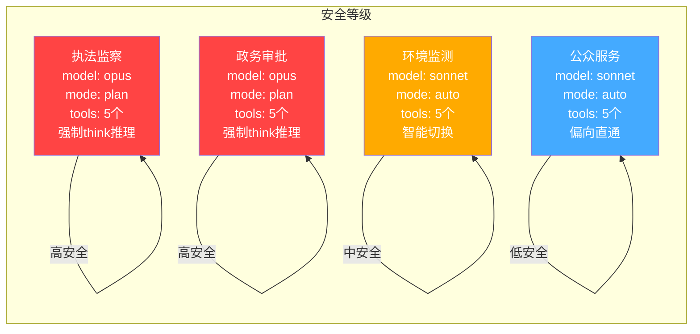
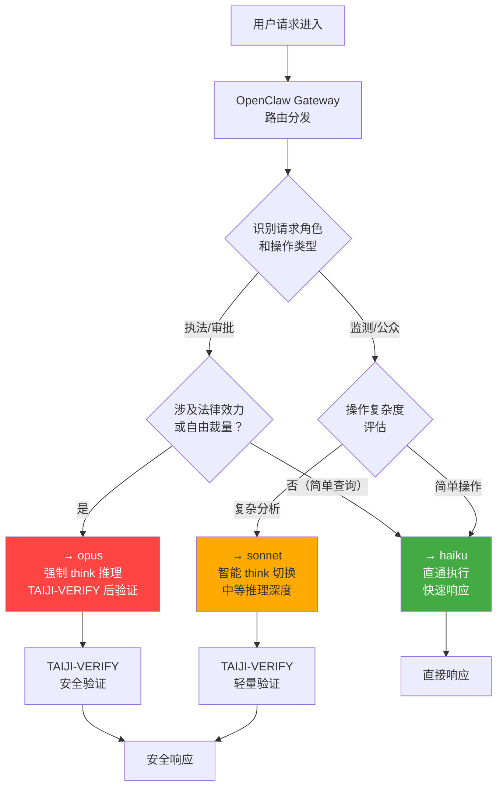
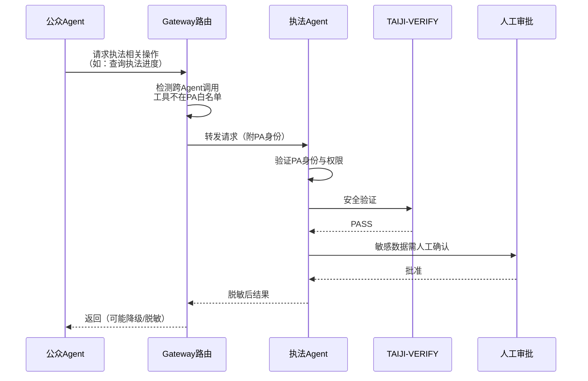
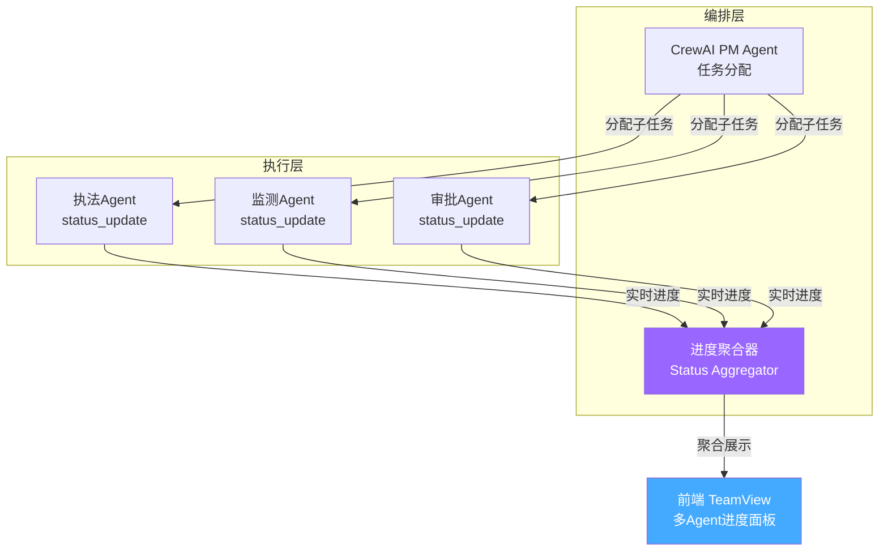

# EcoMind OS 技术开发方案 v3.0 — Agent 提示词架构版

> **版本**: v3.0（六大提示词最佳实践融入 Agent 架构）
> **日期**: 2026-05-25
> **状态**: 启动版 · 紧扣 Agent 提示词工程实施
> **编制**: 齐活林（Qi）· 交付总监（综合产品经理 + 架构师双视角）
> **来源**: 
> - `ecomind-os-tech-development-plan-v2.0-final.md`（五层架构 + D1-D11 技术决策）
> - `agent-prompts-collection/` 四大项目评比结果（wshobson/agents 95分 + CreatorEdition 88分）
> - `MEMORY.md`（项目约定 + 技术栈）

---

## 目录

1. [方案概述](#1-方案概述)
2. [Agent 三层渐进披露架构](#2-agent-三层渐进披露架构)
3. [四类 Agent 详细规格](#3-四类-agent-详细规格)
4. [模型路由策略](#4-模型路由策略)
5. [工具权限矩阵](#5-工具权限矩阵)
6. [推理双模式流程](#6-推理双模式流程)
7. [进度报告协议](#7-进度报告协议)
8. [Phase 1 启动实施任务](#8-phase-1-启动实施任务)
9. [与现有架构集成](#9-与现有架构集成)

---

## 1. 方案概述

### 1.1 v3.0 定位

v3.0 在 v2.0 Final 的**五层架构 + 11大技术决策**基础上，新增 **Agent 提示词工程体系**——将业界最佳实践（wshobson 的三层渐进披露 + 模型分层 + 工具白名单；CreatorEdition 的 `<think>` 双模式 + status_update_spec）系统性地融入 EcoMind OS 四类 Agent 的设计中。

v3.0 **不改变** v2.0 的任何技术决策（D1-D11），**不改变**五层架构，**不改变** Phase 路线图。v3.0 是 v2.0 的 **Agent 层增强补丁**。

### 1.2 v3.0 核心变化

| # | 新增内容 | 来源 | 影响范围 |
|---|---------|------|---------|
| 1 | Agent 三层渐进披露文件结构（TOC → Definition → Skills → References） | wshobson | 所有 Agent prompt 文件组织 |
| 2 | Agent Frontmatter 规范（name/description含PROACTIVELY when/model/tools） | wshobson | 每个 Agent 的元数据头 |
| 3 | 模型分层路由策略（opus/sonnet/haiku 按操作类型分配） | wshobson | Agent 推理时的模型选择 |
| 4 | 工具白名单权限矩阵（每个 Agent tools:[] 最小权限） | wshobson | Agent 可用工具范围 |
| 5 | `<think>` 推理双模式（规划模式 + 执行模式） | CreatorEdition/Devin | Agent 内部推理流程 |
| 6 | status_update_spec 进度协议（步骤/置信度/下一步/阻塞） | CreatorEdition/Cursor | Agent 执行进度汇报 |

### 1.3 与 v2.0 的关系

| 维度 | v2.0 Final | v3.0 |
|------|-----------|------|
| 五层架构 | ✅ 完整定义 | ✅ 不变 |
| D1-D11 决策 | ✅ 全部包含 | ✅ 不变（新增 D12） |
| Phase 路线图 | ✅ Phase 1-4 | ✅ 不变，仅增强 Phase 1 任务 |
| Agent 团队协作 | ✅ LangGraph + CrewAI 双引擎 | ✅ 不变 |
| **Agent 提示词工程** | ❌ 未涉及 | ✅ **全新章节（§2-§7）** |
| 安全防御链 | ✅ 八层 | ✅ 不变 |
| 记忆系统 | ✅ 四层 | ✅ 不变 |

### 1.4 新增决策 D12

| # | 决策 | 选择 | 依据 |
|---|------|------|------|
| **D12** | Agent 提示词工程规范 | **wshobson 三层渐进披露 + CreatorEdition 双模式推理** | 业界最高分 Agent 提示词体系（wshobson 95分），结合工业级推理机制（Devin/Cursor），为 EcoMind 四类 Agent 建立统一的提示词工程质量标准 |

---

## 2. Agent 三层渐进披露架构

### 2.1 设计原则

借鉴 wshobson/agents 的核心设计：**AGENTS.md 是地图（≤150行），不是百科全书**。细节下沉到 Skills（按需加载）和 References（深度知识）。每个 Agent 严格遵循四层文件组织。

### 2.2 文件组织结构

```
ecomind/agents/
├── AGENTS.md                          # ← 总索引（≤150行 TOC）
│
├── enforcement-agent/                 # 执法监察 Agent
│   ├── AGENT.md                       # 第0层：TOC索引（≤80行）
│   ├── agent-definition.md            # 第1层：Agent定义（frontmatter+能力）
│   ├── skills/                        # 第2层：技能（按需加载，每个≤8KB）
│   │   ├── case-analysis.md           #   案件分析技能
│   │   ├── evidence-collection.md     #   证据采集技能
│   │   ├── penalty-assessment.md      #   处罚评估技能
│   │   └── legal-reference.md         #   法规检索技能
│   └── references/                    # 第3层：深度知识库
│       ├── laws/                      #   环保法律法规
│       │   ├── environmental-protection-law.md
│       │   ├── air-pollution-law.md
│       │   └── water-pollution-law.md
│       ├── standards/                 #   排放标准
│       │   ├── gb-3095-2012.md
│       │   └── gb-3838-2002.md
│       └── cases/                     #   历史案例库
│           └── penalty-precedents.md
│
├── monitoring-agent/                  # 环境监测 Agent
│   ├── AGENT.md
│   ├── agent-definition.md
│   ├── skills/
│   │   ├── alert-analysis.md          #   告警分析
│   │   ├── trend-prediction.md        #   趋势预测
│   │   ├── data-visualization.md      #   数据可视化
│   │   └── anomaly-detection.md       #   异常检测
│   └── references/
│       ├── indicators/                #   监测指标体系
│       ├── thresholds/                #   阈值标准
│       └── models/                    #   预测模型参数
│
├── approval-agent/                    # 政务审批 Agent
│   ├── AGENT.md
│   ├── agent-definition.md
│   ├── skills/
│   │   ├── eia-review.md              #   环评审查
│   │   ├── permit-approval.md         #   排污许可审批
│   │   ├── compliance-check.md        #   合规检查
│   │   └── document-generation.md     #   公文生成
│   └── references/
│       ├── regulations/               #   审批法规
│       ├── templates/                 #   公文模板
│       └── workflows/                 #   审批流程定义
│
└── public-agent/                      # 公众服务 Agent
    ├── AGENT.md
    ├── agent-definition.md
    ├── skills/
    │   ├── info-query.md              #   信息公开查询
    │   ├── complaint-filing.md        #   投诉举报
    │   └── credit-lookup.md           #   企业信用查询
    └── references/
        ├── faq/                       #   常见问题
        └── public-data/               #   公开数据集
```

### 2.3 Frontmatter 规范模板

每个 Agent 的 `agent-definition.md` 文件头部必须包含以下 YAML frontmatter：

```yaml
---
name: <agent-name>                    # kebab-case
description: >
  <一句话能力描述>.
  Use PROACTIVELY when: 
  (1) <触发场景1>
  (2) <触发场景2>
  (3) <触发场景3>
model: <opus|sonnet|haiku|inherit>    # 模型层级
tools:                                 # 最小权限工具白名单
  - <tool-1>
  - <tool-2>
  - <tool-3>
mode: <plan|auto>                      # plan=强制think推理, auto=智能切换
skills:                                # 关联的技能文件
  - skills/<skill-1>.md
  - skills/<skill-2>.md
---
```

**字段约束**：
- `name`: 必须 kebab-case，如 `enforcement-agent`
- `description`: 第一句为能力概括，`Use PROACTIVELY when` 后列出 3-5 条**具体触发场景**（不是抽象描述）
- `model`: 四个可选值——`opus`（安全/架构）、`sonnet`（分析/文档）、`haiku`（工具/运维）、`inherit`（跟随编排层决策）
- `tools`: 必须显式列出，不允许 `*` 通配符
- `mode`: `plan` 强制所有请求先进 `<think>` 推理；`auto` 由路由层根据复杂度自动选择

### 2.4 Skills 拆分策略

借鉴 wshobson 的"每个 skill 是自包含的 SOP"设计：

| 约束 | 值 | 依据 |
|------|-----|------|
| 单个 skill 文件上限 | 8KB | wshobson Codex CLI 适配器限制 |
| 每 Agent skills 数量 | 3-5 个 | 覆盖核心业务场景即可 |
| 技能加载方式 | 按需加载（Lazy Load） | 不在 agent-definition 中内联全部内容 |
| 深度内容 | 外链到 references/ | 避免 skill 文件膨胀 |
| 跨 Agent 共享技能 | 放在 `skills/shared/` | 避免重复定义 |

**Skills 文件模板**（参考 wshobson SKILL.md）：

```markdown
# <技能名称>

## 触发条件
Use when: (1) ... (2) ...

## 核心概念
<2-3句概述>

## 执行步骤
1. ...
2. ...
3. ...

## 输出格式
<结构化输出模板>

## 异常处理
- 情况A → 动作A
- 情况B → 动作B

## 参考资料
- references/<相关文件>.md
```

### 2.5 References 知识库结构

References 是三层披露的最深层，包含 Agent 所需的静态领域知识：

| 知识库分类 | 内容 | 加载策略 | 更新频率 |
|-----------|------|---------|---------|
| `laws/` | 环保法律法规全文 | RAG 检索 + 向量索引 | 法规修订时 |
| `standards/` | 国家/行业排放标准 | RAG 检索 | 标准更新时 |
| `cases/` | 历史执法/审批案例 | 相似案例检索 | 持续积累 |
| `indicators/` | 监测指标定义和计算方法 | 按需加载 | 季度更新 |
| `templates/` | 公文/报告模板 | 按需加载 | 模板变更时 |
| `faq/` | 公众常见问题库 | 语义搜索 | 持续积累 |

---

## 3. 四类 Agent 详细规格

### 3.1 执法监察 Agent

```yaml
---
name: enforcement-agent
description: >
  生态环境执法监察 Agent，负责辅助执法人员完成巡查取证、违规判定、处罚建议生成。
  Use PROACTIVELY when:
  (1) 收到群众举报或上级交办的执法线索
  (2) 执法人员请求查询某企业的历史违规记录
  (3) 需要对监测异常点位进行现场核查辅助
  (4) 需要生成执法文书（现场检查笔录、处罚告知书）
  (5) 需要比对多个证据链做出综合违规判定
model: opus
tools:
  - query_case_law          # 查询法律法规和罚则条款
  - geo_trace               # 地理轨迹追溯（污染源定位）
  - evidence_record         # 证据记录与链式关联
  - penalty_assess          # 处罚标准评估（四档裁量）
  - report_generate         # 执法文书自动生成
mode: plan
skills:
  - skills/case-analysis.md
  - skills/evidence-collection.md
  - skills/penalty-assessment.md
  - skills/legal-reference.md
---
```

| 维度 | 规格 |
|------|------|
| **触发条件（PROACTIVELY when）** | ①收到执法线索 ②查询违规记录 ③现场核查辅助 ④生成执法文书 ⑤多证据链综合判定 |
| **模型层级** | **opus** — 执法涉及法律条文精确引用和处罚裁量，不可出错，需要最强推理能力 |
| **工具白名单** | `query_case_law`（法规检索）、`geo_trace`（地理追溯）、`evidence_record`（证据管理）、`penalty_assess`（处罚评估）、`report_generate`（文书生成） |
| **`<think>` 触发条件** | ①多证据链综合判定（≥3条证据） ②处罚金额≥10万元 ③涉及刑事移送 ④法条存在竞合（多条同时适用） |
| **直通执行条件** | ①查询单一企业的历史违规记录 ②生成标准格式的检查通知 ③按给定模板填充执法文书 |
| **status_update 模板** | `[步骤 X/Y] 已完成：{操作描述} → {结果摘要}`<br>`[置信度] {高/中/低} ({百分比}) — 依据：{引用法条/数据源}`<br>`[下一步] {即将执行的操作} → 预计 {时间}`<br>`[风险] {法律风险提示，如有}` |
| **示例交互** | 用户："查一下XX化工厂最近3年的违规记录" → 直通执行 → 返回违规记录表。用户："综合这些证据，给个处罚建议" → 进入 think 模式 → 分析证据链 → 引用法条 → 输出裁量建议 |

### 3.2 环境监测 Agent

```yaml
---
name: monitoring-agent
description: >
  环境监测数据分析 Agent，负责实时监测数据解读、异常告警分析、污染趋势预测。
  Use PROACTIVELY when:
  (1) 监测平台发出异常数据告警（AQI突增、水质超标）
  (2) 用户请求分析某区域过去N天的环境质量变化趋势
  (3) 需要生成环境质量日报/周报/月报
  (4) 需要对多个监测站点的数据进行对比分析
  (5) 用户请求预测未来24-72小时空气质量
model: sonnet
tools:
  - alert_analyze           # 告警智能分析（根因定位）
  - trend_predict           # 时序预测（ARIMA/Prophet）
  - data_visualize          # 数据图表生成
  - station_compare         # 多站点对比分析
  - report_compose          # 环境质量报告自动生成
mode: auto
skills:
  - skills/alert-analysis.md
  - skills/trend-prediction.md
  - skills/data-visualization.md
  - skills/anomaly-detection.md
---
```

| 维度 | 规格 |
|------|------|
| **触发条件（PROACTIVELY when）** | ①监测告警触发 ②趋势分析请求 ③定期报告生成 ④多站点对比 ⑤空气质量预测 |
| **模型层级** | **sonnet** — 数据分析和报告生成需要较强推理但不涉及法律裁量，sonnet 是投入产出比最优 |
| **工具白名单** | `alert_analyze`（告警分析）、`trend_predict`（趋势预测）、`data_visualize`（图表）、`station_compare`（站点对比）、`report_compose`（报告生成） |
| **`<think>` 触发条件** | ①复杂污染溯源（跨区域传输分析） ②多因子耦合异常分析 ③首次遇到的罕见污染模式 |
| **直通执行条件** | ①单站点数据查询 ②标准日报/周报生成 ③AQI预测（已有模型） ④历史数据对比 |
| **status_update 模板** | `[步骤 X/Y] 已完成：{分析操作} → {关键发现}`<br>`[置信度] {高/中/低} ({百分比}) — 模型：{使用的预测模型}`<br>`[下一步] {后续分析} → 预计 {时间}`<br>`[数据质量] {完整/部分缺失/异常值已处理}` |
| **示例交互** | 用户："昨天PM2.5为什么突然飙升？" → think 模式 → 分析气象+排放源 → 输出根因。用户："今天的空气质量日报" → 直通执行 → 生成标准日报 |

### 3.3 政务审批 Agent

```yaml
---
name: approval-agent
description: >
  生态环境政务审批 Agent，负责环评审批辅助、排污许可证核发、合规性审查、公文生成。
  Use PROACTIVELY when:
  (1) 收到环评报告需要技术审查
  (2) 排污许可证申请需要合规校验
  (3) 需要生成审批意见书或行政公文
  (4) 需要对企业的环保信用进行评级
  (5) 需要检查审批材料清单完整性
model: opus
tools:
  - govmcp_approve          # GovMCP审批流（SM2签名 + 8状态流转）
  - compliance_check        # 合规性自动审查
  - document_sign           # 国密SM2电子签章
  - credit_rating           # 企业环保信用评级
  - material_check          # 材料清单完整性校验
mode: plan
skills:
  - skills/eia-review.md
  - skills/permit-approval.md
  - skills/compliance-check.md
  - skills/document-generation.md
---
```

| 维度 | 规格 |
|------|------|
| **触发条件（PROACTIVELY when）** | ①环评技术审查 ②排污许可合规校验 ③审批意见/公文生成 ④环保信用评级 ⑤材料清单检查 |
| **模型层级** | **opus** — 审批具有法律效力，错误可能导致行政诉讼，必须最强推理 + 国密签名 |
| **工具白名单** | `govmcp_approve`（审批流）、`compliance_check`（合规审查）、`document_sign`（SM2签章）、`credit_rating`（信用评级）、`material_check`（材料检查） |
| **`<think>` 触发条件** | ①环评报告技术审查（含多专业交叉） ②涉及多部门会签 ③发现合规问题需给出修正建议 ④存在自由裁量空间 |
| **直通执行条件** | ①材料清单完整性检查 ②排污许可标准条款匹配 ③信用评级查询 ④标准公文模板生成 |
| **status_update 模板** | `[步骤 X/Y] 已完成：{审批操作} → {审查结论}`<br>`[置信度] {高/中/低} — 依据：{引用法规条款}`<br>`[下一步] {审批流程下一节点} → 需 {角色} 确认`<br>`[签章状态] {已签/待签/免签}` |
| **示例交互** | 用户："审查这份环评报告的水环境影响章节" → think 模式 → 逐条核对标准 → 输出审查意见。用户："生成XX项目的排污许可证" → 直通执行 → 模板填充 → SM2签章 |

### 3.4 公众服务 Agent

```yaml
---
name: public-agent
description: >
  生态环境公众服务 Agent，负责环境信息公开查询、投诉举报受理、企业环保信用查询。
  Use PROACTIVELY when:
  (1) 公众查询所在区域的空气质量/水质信息
  (2) 公众想了解某企业的环保信用评级
  (3) 公众需要提交环境污染投诉举报
  (4) 公众查询环保政策法规的通俗解释
  (5) 公众需要查找附近的环保设施（监测站、投诉点）
model: sonnet
tools:
  - search_knowledge_base    # 公开知识库检索
  - query_public_data        # 公开环境数据查询
  - complaint_submit         # 投诉举报提交
  - policy_explain           # 政策通俗解读
  - facility_locate          # 环保设施位置查询
mode: auto
skills:
  - skills/info-query.md
  - skills/complaint-filing.md
  - skills/credit-lookup.md
---
```

| 维度 | 规格 |
|------|------|
| **触发条件（PROACTIVELY when）** | ①环境信息查询 ②企业信用查询 ③投诉举报 ④政策解读 ⑤设施查找 |
| **模型层级** | **sonnet** — 公众查询对准确性有要求但不涉及法律效力，sonnet 平衡质量与成本 |
| **工具白名单** | `search_knowledge_base`（知识检索）、`query_public_data`（数据查询）、`complaint_submit`（举报提交）、`policy_explain`（政策解读）、`facility_locate`（设施查找） |
| **`<think>` 触发条件** | ①投诉举报内容需要结构化归类 ②多政策交叉解读 ③用户问题模糊需要追问澄清 |
| **直通执行条件** | ①AQI查询 ②企业信用查询 ③标准政策问答 ④设施位置查找 |
| **status_update 模板** | `[步骤 X/Y] 已完成：{查询/操作} → {结果摘要}`<br>`[置信度] {高/中/低} — 数据更新时间：{时间}`<br>`[提示] {对公众的附加说明，如"以上AQI数据仅供参考"}` |
| **示例交互** | 用户："我家附近有没有污染企业？" → 直通执行 → 地理检索 → 返回周边企业环保信用。用户："我要举报XX工厂偷排废水" → think 模式 → 结构化举报信息 → 提交 |

### 3.5 四类 Agent 横向对比



---

## 4. 模型路由策略

### 4.1 路由决策树



### 4.2 操作类型 × 模型分配表

| 操作类型 | Agent | 模型 | think | 验证 | 响应时间目标 |
|---------|-------|------|-------|------|------------|
| 多证据链综合判定 | 执法 | opus | ✅ 强制 | 六层全量验证 | ≤30s |
| 处罚裁量建议 | 执法 | opus | ✅ 强制 | 六层全量验证 | ≤25s |
| 查询违规记录 | 执法 | haiku | ❌ 直通 | 轻量 | ≤3s |
| 执法文书填充 | 执法 | haiku | ❌ 直通 | 轻量 | ≤5s |
| 污染溯源分析 | 监测 | sonnet | ✅ 触发 | 四层验证 | ≤20s |
| 趋势预测 | 监测 | sonnet | ⚡ 可选 | 轻量 | ≤15s |
| 数据查询/报告生成 | 监测 | haiku | ❌ 直通 | 轻量 | ≤5s |
| 环评技术审查 | 审批 | opus | ✅ 强制 | 六层全量验证 | ≤30s |
| 合规性校验 | 审批 | opus | ✅ 强制 | 六层全量验证 | ≤20s |
| 材料/信用查询 | 审批 | haiku | ❌ 直通 | 轻量 | ≤3s |
| 公文模板生成 | 审批 | haiku | ❌ 直通 | 轻量 | ≤5s |
| 投诉结构化 | 公众 | sonnet | ✅ 触发 | 四层验证 | ≤10s |
| 政策交叉解读 | 公众 | sonnet | ✅ 触发 | 轻量 | ≤10s |
| 数据/信用查询 | 公众 | haiku | ❌ 直通 | 轻量 | ≤3s |

---

## 5. 工具权限矩阵

### 5.1 完整工具清单

| 工具ID | 工具名称 | 功能 | 安全等级 | 所属层 |
|--------|---------|------|:------:|--------|
| `query_case_law` | 法规检索 | 查询环保法律法规条款和罚则 | L1 | 知识检索 |
| `geo_trace` | 地理追溯 | 基于GIS的污染源空间分析和轨迹追溯 | L2 | 空间分析 |
| `evidence_record` | 证据管理 | 证据创建、链式关联、完整性校验 | L2 | 执法工具 |
| `penalty_assess` | 处罚评估 | 基于裁量基准的四档处罚建议 | L1 | 执法工具 |
| `report_generate` | 文书生成 | 执法文书/监测报告/公文自动生成 | L1 | 通用工具 |
| `alert_analyze` | 告警分析 | 监测告警的智能根因分析 | L1 | 监测工具 |
| `trend_predict` | 趋势预测 | 基于时序模型的环境质量预测 | L1 | 分析工具 |
| `data_visualize` | 数据可视化 | 环境数据的图表生成 | L1 | 展示工具 |
| `station_compare` | 站点对比 | 多监测站点数据横向对比 | L1 | 分析工具 |
| `report_compose` | 报告组合 | 环境质量报告的自动编排 | L1 | 通用工具 |
| `govmcp_approve` | 审批流转 | GovMCP审批流（SM2签名+8状态） | L5 | 政务工具 |
| `compliance_check` | 合规审查 | 环评/排污合规性自动校验 | L1 | 政务工具 |
| `document_sign` | 电子签章 | SM2国密签章 | L5 | 安全工具 |
| `credit_rating` | 信用评级 | 企业环保信用自动评分 | L1 | 政务工具 |
| `material_check` | 材料校验 | 审批材料清单完整性检查 | L1 | 政务工具 |
| `search_knowledge_base` | 知识检索 | 公开环境知识库语义搜索 | L1 | 通用工具 |
| `query_public_data` | 公开数据 | 空气质量/水质/排放等公开数据查询 | L1 | 通用工具 |
| `complaint_submit` | 举报提交 | 公众投诉举报的结构化提交 | L1 | 公众工具 |
| `policy_explain` | 政策解读 | 环保政策的通俗化解读 | L1 | 公众工具 |
| `facility_locate` | 设施查找 | 周边环保设施的地理位置查询 | L1 | 公众工具 |

### 5.2 Agent × 工具 权限矩阵

| 工具 | 执法监察 | 环境监测 | 政务审批 | 公众服务 |
|------|:---:|:---:|:---:|:---:|
| `query_case_law` | ✅ | ❌ | ✅ | ❌ |
| `geo_trace` | ✅ | ❌ | ❌ | ❌ |
| `evidence_record` | ✅ | ❌ | ❌ | ❌ |
| `penalty_assess` | ✅ | ❌ | ❌ | ❌ |
| `report_generate` | ✅ | ❌ | ✅ | ❌ |
| `alert_analyze` | ❌ | ✅ | ❌ | ❌ |
| `trend_predict` | ❌ | ✅ | ❌ | ❌ |
| `data_visualize` | ❌ | ✅ | ❌ | ❌ |
| `station_compare` | ❌ | ✅ | ❌ | ❌ |
| `report_compose` | ❌ | ✅ | ❌ | ❌ |
| `govmcp_approve` | ❌ | ❌ | ✅ | ❌ |
| `compliance_check` | ❌ | ❌ | ✅ | ❌ |
| `document_sign` | ❌ | ❌ | ✅ | ❌ |
| `credit_rating` | ❌ | ❌ | ✅ | ✅ |
| `material_check` | ❌ | ❌ | ✅ | ❌ |
| `search_knowledge_base` | ❌ | ❌ | ❌ | ✅ |
| `query_public_data` | ❌ | ❌ | ❌ | ✅ |
| `complaint_submit` | ❌ | ❌ | ❌ | ✅ |
| `policy_explain` | ❌ | ❌ | ❌ | ✅ |
| `facility_locate` | ❌ | ❌ | ❌ | ✅ |

**权限规则**：
- 公众 Agent 的工具集与执法/审批 Agent **零交集**（防止越权）
- 执法和审批共享 `query_case_law` 和 `report_generate`（合法需求）
- 审批和公众共享 `credit_rating`（公开信息，无需审批权限）

### 5.3 跨 Agent 工具调用审批流

当 Agent A 需要调用 Agent B 专属工具时：



---

## 6. 推理双模式流程

### 6.1 `<think>` 推理时序图

```mermaid
sequenceDiagram
    participant User as 用户
    participant GW as Gateway
    participant Agent as EcoMind Agent
    participant Think as &lt;think&gt;推理引擎
    participant Tools as 工具层
    participant Verify as TAIJI-VERIFY

    User->>GW: 请求
    GW->>Agent: 路由到对应Agent
    
    alt 直通执行路径（简单查询）
        Agent->>Tools: 直接调用工具
        Tools-->>Agent: 工具结果
        Agent->>Verify: 轻量验证
        Verify-->>Agent: PASS
        Agent-->>User: status_update + 结果
    else 规划模式路径（复杂任务）
        Agent->>Think: 进入 &lt;think&gt; 推理
        Think->>Think: 分析需求<br/>拆解子任务<br/>评估风险<br/>选择策略
        Think-->>Agent: 规划方案
        
        loop 执行子任务
            Agent->>Tools: 调用工具
            Tools-->>Agent: 工具结果
            Agent->>Agent: status_update
        end
        
        Agent->>Think: 综合推理
        Think->>Think: 整合所有结果<br/>交叉验证<br/>形成最终结论
        Think-->>Agent: 最终方案
        
        Agent->>Verify: 六层全量验证
        Verify-->>Agent: PASS/FAIL
        
        alt FAIL
            Agent->>User: HITL人工介入请求
        else PASS
            Agent-->>User: status_update + 完整结果
        end
    end
```

### 6.2 规划模式入口与退出条件

**入口条件（强制 think）**：
- 涉及法律效力（执法处罚、审批意见）
- 多证据链综合判定（≥3条独立证据）
- 自由裁量空间（处罚档次选择、审批条件判断）
- 多 Agent 协作（跨 Agent 工具调用）
- 未见过的新型请求（无历史案例匹配）

**入口条件（智能切换，mode: auto）**：
- 复杂度评分 ≥ 0.7（基于：操作数 + 工具调用数 + 安全等级 + 历史置信度）
- 首次遇到的异常模式
- 用户问题存在歧义

**退出条件**：
- 所有子任务完成且结果一致
- 最终结论置信度 ≥ 阈值（执法≥95%，审批≥95%，监测≥90%，公众≥85%）
- TAIJI-VERIFY 全部通过
- 如需人工确认，等待 HITL 响应

### 6.3 执行模式直通路径

**直通条件（跳过 think）**：
- 单一数据查询（查AQI、查企业信用、查法规条款）
- 模板化生成（标准日报、标准文书、标准公文）
- 确认类操作（材料完整性检查、签名验证）
- 历史完全匹配（与已有案例 100% 相似）

**直通保障**：
- 即使直通，也必须过 TAIJI-VERIFY 轻量验证（输入输出格式校验 + 基础合规检查）
- 直通失败（工具返回异常）→ 自动升级到规划模式

---

## 7. 进度报告协议

### 7.1 status_update 消息格式

所有 Agent 执行任务时必须按以下统一格式输出进度：

```
[步骤 X/Y] {刚完成的操作描述} → {关键结果摘要}
[置信度] {高/中/低} ({百分比}) — {依据说明}
[下一步] {即将执行的操作} → 预计 {时间估算}
[阻塞] {如有阻塞项，否则"无"}
```

**格式约束**：
- `[步骤 X/Y]`：X 是当前完成的步骤编号，Y 是预估总步骤数。Y 可在执行中动态调整
- `[置信度]`：高(≥90%) / 中(70-89%) / 低(<70%)，加具体百分比。必须注明依据
- `[下一步]`：必须包含时间估算（秒级）
- `[阻塞]`：如有阻塞，必须说明原因和需要的资源/权限。如无阻塞，写"无"

### 7.2 各 Agent 的 status_update 变体

**执法监察 Agent** — 增加法律风险字段：
```
[步骤 2/4] 已完成：检索XX法第X条 → 匹配罚则条款3条
[置信度] 高 (95%) — 依据：《大气污染防治法》第99条
[下一步] 评估处罚档次 → 预计 8-12 秒
[风险] ⚠️ 第99条与第108条存在竞合，需注意择重处罚原则
[阻塞] 无
```

**环境监测 Agent** — 增加数据质量字段：
```
[步骤 1/3] 已完成：拉取过去72小时PM2.5数据 → 共432条记录
[置信度] 中 (85%) — 模型：Prophet，MAPE=12.3%
[下一步] 生成趋势图与预测 → 预计 3-5 秒
[数据质量] 3个缺失值已线性插值，2个异常值已标记
[阻塞] 无
```

**政务审批 Agent** — 增加签章/审批节点字段：
```
[步骤 3/5] 已完成：合规性审查 → 3项通过，1项需补正
[置信度] 高 (92%) — 依据：《建设项目环评分类管理名录》第5条
[下一步] 生成补正通知书 → 预计 5 秒
[签章] 待科室负责人SM2签章
[阻塞] 无
```

**公众服务 Agent** — 增加提示/免责字段：
```
[步骤 1/1] 已完成：查询XX区域AQI → 当前值 85，等级"良"
[置信度] 高 (98%) — 数据更新时间：2026-05-25 10:00
[提示] 以上数据仅供参考，具体以生态环境部官方发布为准
[阻塞] 无
```

### 7.3 多 Agent 协作时的进度聚合

当一个任务涉及多个 Agent 协作时，由 LangGraph 或 CrewAI 编排引擎负责聚合：



**聚合格式**：
```
## 任务：XX化工厂综合执法检查

| Agent | 步骤 | 状态 | 置信度 | 最新更新 |
|-------|------|:---:|:------:|---------|
| 执法Agent | 2/4 | 🔵进行中 | 95% | 完成法规检索，正在评估处罚 |
| 监测Agent | 3/3 | 🟢已完成 | 88% | 过去30天排放数据已汇总 |
| 审批Agent | - | ⚪等待中 | - | 等待执法结论后启动 |

**整体进度**：3/7 子任务完成 (43%)
**预计剩余**：约 45 秒
```

### 7.4 前端 TeamView 进度展示

前端侧边栏 "TeamView" 面板设计：

```
┌─────────────────────────────────┐
│  🏭 XX化工厂综合执法检查          │
│  ━━━━━━━━━━━━━━━━━━━━━━━━━━━━━  │
│  整体进度 ████████░░░░░░ 43%     │
│                                  │
│  👮 执法Agent                    │
│  ██████████░░░░░░ 2/4 进行中     │
│  "完成法规检索，评估处罚中"        │
│                                  │
│  📊 监测Agent                    │
│  ██████████████ 3/3 ✅ 已完成    │
│  "30天排放数据已汇总"             │
│                                  │
│  📋 审批Agent                    │
│  ⚪ 等待中                       │
│                                  │
│  预计剩余 45 秒                   │
└─────────────────────────────────┘
```

---

## 8. Phase 1 启动实施任务

### 8.1 最小启动任务列表

Phase 1 在 v2.0 原有的 22 个任务基础上，新增 6 个 Agent 提示词工程任务。以下仅列出**新增任务**（原有任务保持不变）：

| ID | 任务 | 描述 | 依赖 | 工时 | 输入 → 输出 |
|----|------|------|------|:---:|-----------|
| **T1.23** | Agent 三层文件骨架搭建 | 按 §2.2 目录结构创建四个 Agent 的所有目录和空模板文件 | T1.1 (Fork TAIJI) | 1天 | v3.0方案§2.2 → 完整目录树 |
| **T1.24** | 四个 Agent 的 agent-definition.md 编写 | 按 §3.1-3.4 规格编写每个 Agent 的 frontmatter 和能力定义 | T1.23 | 2天 | §3规格 → 4个agent-definition.md |
| **T1.25** | 四个 Agent 的 Skills 编写 | 编写首批 15 个 Skill 文件（每个 3-5KB），包含触发条件/步骤/输出格式 | T1.24 | 3天 | §3 + §2.4模板 → 15个SKILL.md |
| **T1.26** | 模型路由层实现 | 实现 §4.1 路由决策树：操作类型识别 → 模型分配 → think开关 | T1.24 | 2天 | §4路由策略 → Gateway路由模块 |
| **T1.27** | `<think>` 推理引擎实现 | 实现规划模式/执行模式切换逻辑，包括复杂度评分、think提示词注入 | T1.26 | 3天 | §6 → ThinkEngine模块 |
| **T1.28** | status_update 协议实现 | 实现 §7 统一的进度汇报格式，包括单Agent和多Agent聚合展示 | T1.27 | 2天 | §7 → StatusReporter模块 + TeamView组件 |

**启动关键路径**：
```
T1.23 (1天) → T1.24 (2天) → T1.25 (Skills, 3天, 可与T1.26并行)
                            → T1.26 (路由, 2天) → T1.27 (think, 3天) → T1.28 (status, 2天)
```

**总新增工时**：约 13 个工作日（与原有任务可并行推进）

### 8.2 启动 Demo 场景（7 步）

以下是 Phase 1 启动时演示的完整链路——展示从用户请求到 Agent 响应的全过程，覆盖 2 个 Agent 协作 + think 推理 + 安全验证 + 进度汇报：

```
步骤 1 [触发] 用户（执法人员）：
  "XX化工厂附近居民投诉异味，帮我查一下这个厂最近3个月的监测数据和违规记录"

步骤 2 [路由] OpenClaw Gateway：
  识别请求 = 监测数据查询 + 违规记录查询
  → 拆分：数据查询 → 监测Agent（haiku直通），违规查询 → 执法Agent（haiku直通）
  → 两个Agent并行执行

步骤 3 [监测Agent - 直通] status_update:
  "[步骤 1/1] 已完成：查询XX化工厂近3月排放数据 → 发现PM2.5超标3次，SO2超标1次"
  "[置信度] 高 (99%) — 数据源：省监测平台实时数据库"

步骤 4 [执法Agent - 直通] status_update:
  "[步骤 1/1] 已完成：查询XX化工厂近3年违规记录 → 2次行政处罚，1次责令整改"
  "[置信度] 高 (99%) — 数据源：执法案件数据库"

步骤 5 [综合研判 - think模式]
  Gateway 检测到"异味投诉 + 排放超标 + 历史违规" → 升级为复杂任务
  → 启动执法Agent的 `<think>` 推理模式
  
  Think 推理过程（内部，不可见）：
  - 分析：投诉时间 vs 超标时间 → 高度吻合
  - 分析：超标污染物（PM2.5, SO2）→ 均可能产生异味
  - 评估：2次历史处罚 + 当前超标 → 涉嫌"屡罚不改"
  - 建议：启动现场执法检查 + 处罚裁量基准第3档

步骤 6 [安全验证]
  TAIJI-VERIFY 六层验证：
  - 事实准确性 ✓ (数据可溯源)
  - 法条引用正确性 ✓ (引用条款有效)
  - 逻辑一致性 ✓ (证据链闭合)
  - 合规边界 ✓ (未越权建议)
  - 安全风险 ✓ (无敏感信息泄露)
  - 输出质量 ✓ (建议可执行)

步骤 7 [最终输出] status_update:
  "[步骤 3/3] 已完成：综合分析XX化工厂投诉+监测+违规 → 建议启动现场执法"
  "[置信度] 高 (93%) — 监测数据+历史记录+投诉三源交叉验证"
  "[建议] ①立即现场核查排放口 ②调取近3月运行台账 ③按裁量基准第3档预评估"
  "[阻塞] 无"
  "━━━━━━━━━━━━━━━━━━━━━━━━━━"
  "总耗时：12.3秒 | think推理：4.2秒 | 工具调用：3.1秒 | 安全验证：2.8秒"
```

---

## 9. 与现有架构集成

### 9.1 Agent 模式 × 五层架构映射

| 五层 | v2.0 组件 | v3.0 新增（Agent提示词相关） |
|------|----------|---------------------------|
| **L1 智能交互** | OpenClaw Gateway, LangGraph, CrewAI, MCP/A2A/ACP/GovMCP | **+ Agent 路由决策树**（§4.1）：操作类型识别 → 模型分配 → think开关；**+ status_update 聚合器**（§7.3）：多Agent进度收集与展示 |
| **L2 沙箱执行** | OpenClaw Sandbox, SubAgentOrchestrator, LiteLLM | **+ ThinkEngine**（§6）：规划模式/执行模式切换；**+ Skills Loader**（§2.4）：按需加载 Skill 文件 |
| **L3 物联数字孪生** | EMQX, Cesium.js（Phase 2+） | 无新增（启动阶段不涉及） |
| **L4 记忆学习** | Hermes MemoryProvider, Mem0, Graphiti, GraphRAG | **+ References 知识库索引**（§2.5）：为 Skills 提供 RAG 检索的后端支持 |
| **L5 安全治理** | 八层防御链, TAIJI-VERIFY, GovMCP | **+ 工具白名单执行层**（§5）：运行时校验 Agent 工具调用是否在白名单内；**+ 跨Agent调用审批**（§5.3） |

### 9.2 与核心组件的接口约定

#### 9.2.1 与 TAIJI-VERIFY 的接口

```
Agent 输出 → TAIJI-VERIFY 六层验证 → PASS/FAIL

接口：
  verify(agent_output, context={
    agent_type: "enforcement|monitoring|approval|public",
    think_mode: true|false,          # 是否经过think推理
    risk_level: "high|medium|low",   # 操作风险等级
    requires_full_audit: true|false  # 是否需要六层全量验证
  })
  
  返回：VerifyResult(passed, failures[], suggestions[], audit_trail)
```

#### 9.2.2 与 Hermes MemoryProvider 的接口

```
think 推理过程 → Hermes MemoryProvider → 会话记忆 + 长期记忆

接口：
  memory_provider.on_think_start(session_id, task_description)
  memory_provider.on_think_step(session_id, step_result, confidence)
  memory_provider.on_think_end(session_id, final_conclusion, confidence)
  
  memory_provider.on_status_update(session_id, status_update)  # 记录每次status_update
```

#### 9.2.3 与 LangGraph 的接口

```
LangGraph StateGraph 节点集成 think 推理：

节点定义：
  "think_node": ThinkEngine.think(state) → 分析、拆解、返回子任务列表
  "execute_node": Agent.execute(state.subtask) → 调用工具
  "verify_node": TAIJI-VERIFY.verify(state.result) → 验证
  "status_node": StatusReporter.report(state) → 输出status_update

边条件：
  think → execute (子任务就绪)
  execute → verify (结果产出)
  verify → execute (验证失败，重新执行)
  verify → think (验证失败需要重新规划)
  verify → status (验证通过)
  status → END (任务完成)
```

#### 9.2.4 与 CrewAI 的接口

```
CrewAI Task 定义增加 Agent 提示词相关字段：

Task(
  description="...",
  agent=enforcement_agent,
  expected_output="...",
  # v3.0 新增字段
  force_think=True,                # 强制进入规划模式
  min_confidence=0.95,             # 最低置信度阈值
  require_verify=True,             # 是否需要VERIFY验证
  status_template="enforcement"    # 使用执法Agent的status_update模板
)
```

---

## 附录A：v3.0 新增文件清单

| 文件路径 | 类型 | 大小预估 |
|---------|------|:---:|
| `ecomind/agents/AGENTS.md` | TOC索引 | ≤150行 |
| `ecomind/agents/enforcement-agent/AGENT.md` | TOC | ≤80行 |
| `ecomind/agents/enforcement-agent/agent-definition.md` | 定义 | ~100行 |
| `ecomind/agents/enforcement-agent/skills/case-analysis.md` | Skill | ≤8KB |
| `ecomind/agents/enforcement-agent/skills/evidence-collection.md` | Skill | ≤8KB |
| `ecomind/agents/enforcement-agent/skills/penalty-assessment.md` | Skill | ≤8KB |
| `ecomind/agents/enforcement-agent/skills/legal-reference.md` | Skill | ≤8KB |
| `ecomind/agents/monitoring-agent/` (4文件) | — | — |
| `ecomind/agents/approval-agent/` (4文件) | — | — |
| `ecomind/agents/public-agent/` (3文件) | — | — |
| `ecomind/core/think_engine.py` | 推理引擎 | ~300行 |
| `ecomind/core/model_router.py` | 模型路由 | ~200行 |
| `ecomind/core/status_reporter.py` | 进度报告 | ~150行 |
| `ecomind/core/tool_guard.py` | 工具白名单 | ~100行 |
| `ecomind/core/skills_loader.py` | 技能加载器 | ~100行 |

---

## 附录B：质量标准（借鉴 wshobson）

v3.0 Agent 提示词体系的质量门禁：

```bash
# 结构验证：检查所有 Agent 文件是否符合三层披露规范
make validate-agents STRICT=1

# 技能漂移检测：检查是否有过期引用、死链接、超大 skill
make garden-agents

# Frontmatter 完整性检查：name/description/model/tools 字段是否齐全
make check-frontmatter

# 工具白名单一致性：确保没有 Agent 使用了未声明的工具
make check-tool-whitelist
```

---

*EcoMind OS 技术开发方案 v3.0 — Agent 提示词架构版 | 2026-05-25 | 齐活林（Qi）· 交付总监*
*基于：wshobson/agents 三层渐进披露 + CreatorEdition 双模式推理*
