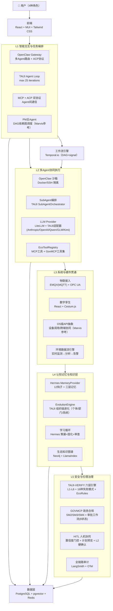

# EcoMind OS 技术开发方案

> **版本**: v1.1（基于 v1.0 评审修订）
> **日期**: 2026-05-25
> **状态**: 修订版
> **编制**: 齐活林（Qi）· 交付总监 + 许清楚（Xu）· 产品经理 + 高见远（Gao）· 架构师
> **依据**: `ecomind-os-full-fusion-plan.md` v1.0 Final（七大来源全框架融合方案）
> **评审**: `ecomind-os-tech-plan-review-and-modification.md`（团队评审报告）

---

## 目录

1. [项目定位与目标](#1-项目定位与目标)
2. [技术架构总设计](#2-技术架构总设计)
3. [产品功能规格](#3-产品功能规格)
4. [核心模块接口规格](#4-核心模块接口规格)
5. [数据模型设计](#5-数据模型设计)
6. [Phase 1 实施任务分解（0-3月）](#6-phase-1-实施任务分解0-3月)
7. [Phase 2-4 路线图摘要](#7-phase-2-4-路线图摘要)
8. [License 合规清单](#8-license-合规清单)
9. [风险与缓解](#9-风险与缓解)
10. [附录：来源融合决策摘要](#10-附录来源融合决策摘要)

---

## 1. 项目定位与目标

### 1.1 产品定义

**EcoMind OS**（代号 **GAIA-ECO**）是面向**生态环境垂直领域**的智能操作系统，服务于政府生态环境局、环保执法机构及相关公众。

| 属性 | 内容 |
|------|------|
| **产品类型** | 工具型垂直领域 AI OS（非通用 AGI） |
| **核心差异化** | 政务合规 + 生态专业知识 + 可审计人机协同 |
| **目标用户** | 执法人员、环境监测人员、审批人员、公众 |
| **核心承诺** | 可审计、人在环路（HITL）、不做"AI虚幻"承诺 |

### 1.2 业务域覆盖目标

| 状态 | 业务域 | 优先级 |
|------|--------|--------|
| ✅ Phase 1 覆盖 | 环境监测、政务审批合规、排污许可管理 | P0 |
| ✅ Phase 2 覆盖 | 执法监察、应急管理、生态督察、生物多样性保护、生态修复 | P1 |
| ✅ Phase 3 覆盖 | 环境影响评价 | P2 |
| 🔶 Phase 3 目标覆盖（当前来源部分覆盖） | 碳排放管理 | P2 |
| 🔶 Phase 4 增强 | 公众参与/信息公开、气候变化适应 | P3 |

### 1.3 五大技术决策（不可更改）

| # | 决策 | 选择 | 依据 |
|---|------|------|------|
| D1 | 后端核心框架 | **TAIJI-AGENT 2.0（fork + 二次开发）** | 已内置 Agent Loop + EventBus + Plugin + GovMCP + 国密 + 审批，省 6-12 个月 |
| D2 | 验证引擎 | **TAIJI-VERIFY 2.0（pip 依赖 + 适配器）** | 六层架构 + 450 测试 + 91% 覆盖率 + 16 种失败模式 |
| D3 | 记忆系统 | **Hermes MemoryProvider（Plugin 模式集成）** | 12 钩子全生命周期管理，业界最成熟记忆抽象 |
| D4 | 路由编排 | **OpenClaw Gateway + ACP 协议** | 成熟多 Agent 路由标准，沙箱 + 技能市场生态 |
| D5 | OpenHuman | **仅参考设计理念，严禁复制任何代码** | GPL-3.0 传染风险，所有功能有 MIT 替代方案 |

---

## 2. 技术架构总设计

### 2.1 五层系统架构图



### 2.2 技术栈汇总

| 层面 | 技术选型 | 来源 | License |
|------|----------|------|---------|
| 后端核心框架 | TAIJI-AGENT 2.0 (fork) | TAIJI | MIT ✅ |
| LLM 统一接口 | LiteLLM + TAIJI 原生适配器 | LiteLLM + TAIJI | MIT ✅ |
| 记忆系统 | Hermes MemoryProvider (提取集成) | Hermes-Agent | MIT ✅ |
| 验证引擎 | TAIJI-VERIFY 2.0 (pip 依赖) | TAIJI | MIT ✅ |
| 政务合规 | GOVMCP (内嵌) | GOVMCP/TAIJI | MIT ✅ |
| 路由编排 | OpenClaw Gateway + ACP | OpenClaw | MIT ✅ |
| 前端框架 | React + MUI + Tailwind CSS | — | MIT ✅ |
| 前端状态管理 | Zustand + React Query | — | MIT ✅ |
| 流式通信 | Server-Sent Events (SSE) | — | — |
| 地理可视化 | Cesium.js（数字孪生，Phase 3） | Cesium | Apache-2.0 ✅ |
| 工作流引擎 | Temporal.io | Temporal | MIT ✅ |
| 主数据库 | PostgreSQL + pgvector | — | BSD ✅ |
| 缓存与会话存储 | Redis | — | BSD ✅ |
| 消息队列 | RabbitMQ / NATS（Phase 2） | — | Apache/MIT ✅ |
| 知识图谱 | Neo4j Enterprise 或 Apache AGE | — | 商业/Apache ✅ |
| 物联接入 | EMQX (MQTT) + OPC UA | — | Apache ✅ |
| Token 压缩 | 自研（参考 OpenHuman TokenJuice CJK 安全理念，Phase 3） | — | — |
| 安全沙箱 | Docker + L2 硬确认 | — | Apache ✅ |
| 全链路追踪 | LangSmith + OpenTelemetry | — | MIT ✅ |
| 容器编排 | Docker + Kubernetes | — | Apache ✅ |

### 2.3 项目目录结构

```
ecomind-os/
├── ecomind/                      # 主 Python 包（基于 TAIJI-AGENT fork）
│   ├── core/                     # 核心引擎（TAIJI 保留模块）
│   │   ├── engine.py             # EcoAgentEngine（TAIJI AgentLoop 扩展）
│   │   ├── event_bus.py          # EventBus（20+事件类型 + 生态扩展）
│   │   ├── plugin.py             # Plugin 生命周期管理
│   │   ├── guardrails.py         # 输入/输出护栏（增强 Prompt 注入防护）
│   │   └── hitl.py               # HITL 人工审批（置信度门控+计划预览）
│   ├── verify/                   # TAIJI-VERIFY 适配器（pip 依赖，非内嵌）
│   │   └── adapter.py            # EcoVerifyAdapter
│   ├── memory/                   # Hermes MemoryProvider 集成
│   │   ├── hermes_plugin.py      # HermesMemoryPlugin（Plugin 模式）
│   │   └── provider.py           # EcoMemoryProvider（三层记忆）
│   ├── govmcp/                   # GOVMCP 政务模块（内嵌使用）
│   │   ├── crypto.py             # SM2/SM3/SM4 国密
│   │   ├── workflow.py           # GovWorkflowManager（8状态审批）
│   │   └── tools.py              # 政务工具集（公文/脱敏/地址）
│   ├── agents/                   # 生态环境 Agent Profile
│   │   ├── enforcement.py        # 执法Agent（EnforcementAgentProfile）
│   │   ├── monitoring.py         # 监测Agent（MonitoringAgentProfile）
│   │   ├── approval.py           # 审批Agent（ApprovalAgentProfile）
│   │   └── public.py             # 公众Agent（PublicAgentProfile）
│   ├── providers/                # LLM 适配器
│   │   ├── litellm_gateway.py    # LiteLLM 统一网关
│   │   └── taiji_adapters.py     # TAIJI 原生适配器（Qwen/GLM/Kimi）
│   ├── tools/                    # 工具注册
│   │   ├── registry.py           # EcoToolRegistry
│   │   └── eco_tools/            # 生态专属工具
│   ├── auth/                     # 认证鉴权
│   │   ├── middleware.py         # JWT 认证中间件
│   │   ├── models.py             # User / Session / AuthToken 模型
│   │   └── dependencies.py       # FastAPI 依赖注入（get_current_user）
│   ├── api/                      # REST API 路由
│   │   ├── chat.py               # /api/v1/chat（含 SSE 流式端点）
│   │   ├── approval.py           # /api/v1/approval
│   │   ├── monitoring.py         # /api/v1/monitoring
│   │   ├── verify.py             # /api/v1/verify
│   │   ├── auth.py               # /api/v1/auth（登录/刷新/登出）
│   │   └── report.py             # /api/v1/report
│   ├── ecosystem/                # 生态环境专属业务模块
│   │   ├── monitoring/           # 环境监测
│   │   ├── enforcement/          # 执法监察
│   │   ├── approval/             # 政务审批
│   │   └── rules/                # EcoRules 规则集
│   ├── iot/                      # 物联接入层（Phase 3）
│   │   ├── mqtt_client.py        # EMQX MQTT 客户端
│   │   └── opcua_adapter.py      # OPC UA 工业协议适配器
│   └── observability/            # 可观测性（TAIJI 保留）
│       ├── langsmith_tracer.py   # LangSmith 追踪
│       └── otel_exporter.py      # OpenTelemetry 导出
│
├── frontend/                     # React 前端
│   ├── src/
│   │   ├── components/           # MUI + Tailwind 组件
│   │   ├── pages/                # 4种角色对应页面
│   │   ├── cesium/               # Cesium.js 数字孪生（Phase 3）
│   │   └── stores/               # 状态管理
│   └── package.json
│
├── tests/                        # 测试
│   ├── unit/
│   ├── integration/
│   └── e2e/
│
├── pyproject.toml                # Python 依赖（含 taiji-verify>=2.0.0）
├── docker-compose.yml            # 本地开发环境
└── k8s/                          # Kubernetes 部署配置
```

---

## 3. 产品功能规格

### 3.1 四类用户角色 Agent Profile

#### 3.1.1 执法人员（EnforcementAgent）

**核心用户故事**：
- 作为执法人员，我想要拍摄现场照片后由 AI 自动识别违规点，以便快速生成执法记录
- 作为执法人员，我想要语音下达检查指令，以便在现场无需手动操作即可记录
- 作为执法人员，我想要查询被检查企业的历史违规记录，以便制定针对性执法方案
- 作为执法人员，我想要生成符合国家标准的执法文书，以便减少人工撰写工作量

**关键功能清单**：

| 优先级 | 功能 | 验收标准 |
|--------|------|---------|
| P0 | 现场照片违规识别 | 准确率 ≥80%，响应 ≤10s |
| P0 | 执法记录自动生成 | 符合生态环境部标准模板，人工审核通过率 ≥90% |
| P0 | 企业历史记录查询 | 查询响应 ≤3s，覆盖近5年记录 |
| P1 | 语音指令识别 | 中文普通话识别准确率 ≥95% |
| P1 | 执法文书国密加密传输 | 全程 SM4 加密，无明文传输 |
| P2 | 离线执法模式 | 无网络时本地缓存，恢复网络后自动同步 |

**主要交互流程**：
1. 到达现场 → 选择"执法模式" → 语音/拍照记录 → AI 分析 → HITL 确认 → 生成文书 → 国密加密提交

#### 3.1.2 监测人员（MonitoringAgent）

**核心用户故事**：
- 作为监测人员，我想要通过自然语言查询某区域空气质量数据，以便快速掌握污染状况
- 作为监测人员，我想要设置阈值告警规则，以便超标时自动通知相关部门
- 作为监测人员，我想要生成监测数据分析报告，以便提交给上级部门

**关键功能清单**：

| 优先级 | 功能 | 验收标准 |
|--------|------|---------|
| P0 | 自然语言数据查询 | 支持时间/地点/指标多维查询，响应 ≤5s |
| P0 | 阈值告警规则配置 | 支持 PM2.5/PM10/SO2/NOx/CO/O3 六种指标 |
| P0 | 监测数据分析报告生成 | 一键生成，符合 HJ/T 系列标准格式 |
| P1 | 数据异常检测 | 自动识别传感器故障/数据异常，准确率 ≥85% |
| P2 | 污染溯源分析 | 基于气象数据+排放源数据的综合溯源 |

#### 3.1.3 审批人员（ApprovalAgent）

**核心用户故事**：
- 作为审批人员，我想要 AI 辅助审核排污许可申请材料的完整性，以便减少人工初审工作量
- 作为审批人员，我想要查看申请企业的环境信用信息，以便做出更准确的审批决策
- 作为审批人员，我想要在审批流程中留下批注和意见，以便多人会签时信息透明传递

**关键功能清单**：

| 优先级 | 功能 | 验收标准 |
|--------|------|---------|
| P0 | 申请材料完整性审查 | 覆盖排污许可申请12项必备材料，缺漏检出率 ≥95% |
| P0 | 8状态审批工作流 | 待受理→受理→审查→补充材料→会签→审核→发证→归档 |
| P0 | 多人会签支持 | 同步/异步会签，支持驳回重签 |
| P1 | 环境信用查询 | 联通全国排污许可管理系统，响应 ≤5s |
| P1 | 审批意见模板库 | 内置 20+ 常用审批意见模板 |
| P2 | 审批时效预警 | 临近法定审批期限自动提醒 |

#### 3.1.4 公众（PublicAgent）

**核心用户故事**：
- 作为公众，我想要了解我所在区域当前的环境质量状况，以便做好健康防护
- 作为公众，我想要举报环境违法行为，以便推动问题得到处理
- 作为公众，我想要查询环保法规政策，以便了解自己的权利和义务

**关键功能清单**：

| 优先级 | 功能 | 验收标准 |
|--------|------|---------|
| P0 | 环境质量查询（对话式）| 支持自然语言提问，响应 ≤3s |
| P1 | 环境违法举报 | 一键上传证据+定位，生成举报编号 |
| P1 | 法规政策问答 | 覆盖生态环境保护主要法律法规，准确率 ≥90% |
| P2 | 个性化环境提醒 | 按用户位置推送空气质量/污染预警 |

---

### 3.2 Phase 1 MVP 产品功能规格

#### IN SCOPE（必须实现）

| 功能模块 | 具体功能 | 验收标准 |
|---------|---------|---------|
| **Agent 核心** | 4种角色的对话式交互 | 完成一次完整对话 ≤30s 响应 |
| **环境监测** | 自然语言查询环境数据（Mock 数据） | 支持时间+地点+指标3维查询 |
| **政务审批** | 完整8状态审批工作流演示 | 全部8个状态可达，会签可用 |
| **验证引擎** | 六层 TAIJI-VERIFY 对 LLM 输出全链路验证 | 100% 输出经过验证 |
| **记忆系统** | 跨会话上下文保持 | ≥5轮对话上下文连贯 |
| **国密加密** | SM4 加密敏感数据传输 | 100% 覆盖 |
| **GovMCP 工具集** | MCP 协议注册政务工具（公文生成/数据脱敏/地址识别） | 至少 3 个政务工具可通过 MCP 调用 |
| **前端 UI** | 4种角色可切换的基础对话界面 | 可正常使用，无 P0 Bug |

#### OUT OF SCOPE（明确不做）

- 物联网设备真实接入（用 Mock 数据代替）
- Cesium.js 数字孪生（Phase 3）
- 离线模式
- 学习循环/自进化（Phase 4）
- 等保三级合规（Phase 4）
- 真实生产环境部署（MVP 阶段为本地/演示环境）

#### Demo 场景：环境监测数据分析对话闭环

**场景描述**：监测人员对某工业园区进行日常监测数据分析

**步骤**：
1. 用户登录 → 选择"监测人员"角色
2. 输入："查询XX工业园区本周PM2.5数据，是否超标？"
3. 系统：EcoAgentEngine 接收请求 → TAIJI-VERIFY L1 输入验证
4. Agent 调用 `eco_tools.query_monitoring_data(area="XX工业园区", metric="PM2.5", period="本周")`
5. TAIJI-VERIFY L2 检测 → 返回数据 + 验证结果（是否幻觉/事实错误）
6. 如超标：自动触发告警事件（EventBus → `MONITORING_ALERT`）
7. 生成分析报告草稿 → HITL 置信度门控（>0.8 自动审批，≤0.8 人工确认）
8. **【异常路径演示】**模拟验证失败场景：LLM 输出被 VERIFY 判定 FAIL（幻觉数据）→ 触发 `HITL_REQUIRED` 事件 → 前端弹出人工确认面板 → 操作员查看失败原因（FM02 事实冲突）→ 修正数据 → 重新提交 → 验证 PASS
9. 国密 SM4 加密 → 传输至政务平台 Mock API
10. Hermes MemoryProvider 同步记录本次会话（短期记忆 → 可被下次会话引用）
11. 用户收到：数据分析结果 + 超标告警 + 报告草稿链接

**成功标准**：正常流程 ≤30s，异常路径（步骤 8）全程可演示，所有 11 个步骤均可操作。

---

### 3.3 API 接口需求（产品视角）

#### 外部集成接口需求

| 接口类型 | 需求描述 | 优先级 | Phase |
|---------|---------|--------|-------|
| 全国排污许可管理系统 | 查询企业许可证信息、历史违规 | P0 | Phase 1 (Mock) |
| 生态环境数据共享平台 | 环境质量监测数据接入 | P0 | Phase 1 (Mock) |
| 政务网（省/市）| 审批结果回写、公文流转 | P0 | Phase 2 |
| EMQX 物联平台 | 传感器实时数据接入（MQTT） | P1 | Phase 3 |
| 国家气象局 API | 气象数据（风向/温度/湿度） | P1 | Phase 3 |

#### 前端所需后端 API 能力

```
# ─── 认证鉴权 ───
POST   /api/v1/auth/login          # 用户登录（返回 JWT access_token + refresh_token）
POST   /api/v1/auth/refresh         # 刷新 Token
POST   /api/v1/auth/logout          # 登出

# ─── Agent 对话（含流式输出）───
POST   /api/v1/chat                 # 发起 Agent 对话（同步）
GET    /api/v1/chat/stream          # SSE 流式 Agent 对话（实时返回中间结果）
GET    /api/v1/chat/{session_id}    # 查询会话历史

# ─── 政务审批 ───
POST   /api/v1/approval/submit      # 提交审批申请
GET    /api/v1/approval/{id}        # 查询审批状态
POST   /api/v1/approval/{id}/countersign  # 会签意见提交

# ─── 环境监测 ───
GET    /api/v1/monitoring/query     # 查询监测数据

# ─── 验证与 HITL ───
POST   /api/v1/hitl/confirm         # 人工审批确认
GET    /api/v1/verify/result/{id}   # 查询验证结果

# ─── 报告生成 ───
POST   /api/v1/report/generate      # 生成报告

# ─── GovMCP 政务工具 ───
POST   /api/v1/tools/desensitize    # 数据脱敏
POST   /api/v1/tools/address-parse  # 地址标准化解析
POST   /api/v1/tools/document-generate  # 公文辅助生成
```

#### 错误码规范

| 错误码 | 含义 | HTTP 状态码 |
|--------|------|:-----------:|
| EC-001 | 认证失败（Token 无效/过期） | 401 |
| EC-002 | 权限不足（角色无权访问） | 403 |
| EC-003 | 输入验证失败（PARAM 校验） | 400 |
| EC-010 | Agent 执行超时 | 504 |
| EC-011 | Agent 迭代次数超限 | 500 |
| EC-020 | 验证引擎判定 FAIL | 200（附带 verify_result） |
| EC-021 | 验证引擎超时 | 504 |
| EC-030 | HITL 等待人工确认 | 202（Accepted） |
| EC-040 | 审批工作流非法状态转换 | 409 |
| EC-050 | 工具调用失败 | 500 |

---

## 4. 核心模块接口规格

### 4.1 EcoVerifyAdapter（TAIJI-VERIFY 接入适配器）

```python
# ecomind/verify/adapter.py
from typing import Optional, Any
from dataclasses import dataclass
from taiji_verify.engine import TaijiVerifyEngine, Verdict
from ecomind.core.event_bus import EventBus, EventType, Event


@dataclass
class EcoVerifyConfig:
    """EcoMind 验证适配器配置"""
    enable_eco_rules: bool = True          # 启用EcoRules生态规则
    min_confidence_threshold: float = 0.8  # 最低置信度阈值
    failure_mode_filter: list[str] = None  # 过滤特定失败模式(FM01-FM16)
    hitl_on_verify_fail: bool = True       # 验证失败时触发HITL


class EcoVerifyAdapter:
    """
    TAIJI-VERIFY 六层引擎 → EcoMind EventBus 适配器
    将验证结果发布到 EventBus，供 HITL 和审计模块消费
    """

    def __init__(self, event_bus: EventBus, config: EcoVerifyConfig = None):
        self._bus = event_bus
        self._config = config or EcoVerifyConfig()
        self._engine = TaijiVerifyEngine(
            eco_rules_enabled=self._config.enable_eco_rules
        )

    async def verify(
        self,
        input_text: str,
        llm_output: str,
        ground_truth: Optional[str] = None,
        context: Optional[dict[str, Any]] = None,
    ) -> "VerifyResult":
        """
        对 LLM 输出进行六层验证，结果发布到 EventBus

        Args:
            input_text: 用户输入
            llm_output: LLM 原始输出
            ground_truth: 参考事实（可选，用于 L2 自一致性检测）
            context: 附加上下文（session_id, user_role 等）

        Returns:
            VerifyResult 验证结果

        Raises:
            VerifyTimeoutError: 验证超时（>5s 触发）
        """
        response = self._engine.verify(
            input_text=input_text,
            output=llm_output,
            ground_truth=ground_truth,
        )
        result = VerifyResult(
            is_passing=response.is_passing,
            verdict=response.verdict.value,
            confidence=response.confidence_score,
            failure_modes=[fd.to_dict() for fd in response.failure_detections],
            eco_rule_violations=response.eco_rule_violations or [],
        )
        # 发布验证结果事件
        await self._bus.publish(Event(
            event_type=EventType.VERIFY_RESULT,
            data={"result": result, "context": context},
        ))
        # 验证失败且配置了HITL → 触发人工审批
        if not result.is_passing and self._config.hitl_on_verify_fail:
            await self._bus.publish(Event(
                event_type=EventType.HITL_REQUIRED,
                data={"reason": "verify_failed", "result": result, "llm_output": llm_output},
            ))
        return result

    async def verify_stream(self, stream, **kwargs):
        """流式输出的验证（逐 chunk 验证 + 最终全文验证）"""
        ...
```

### 4.2 HermesMemoryPlugin（记忆系统 Plugin 集成）

```python
# ecomind/memory/hermes_plugin.py
from ecomind.core.plugin import Plugin
from ecomind.core.event_bus import EventType


class HermesMemoryPlugin(Plugin):
    """
    Hermes MemoryProvider → EcoMind Plugin 模式集成
    实现三层记忆：短期(会话) / 长期(PostgreSQL+pgvector) / 固化(Skill Bundles)
    12个生命周期钩子全部实现
    """
    plugin_id: str = "hermes_memory"
    version: str = "1.0.0"

    async def on_load(self) -> None:
        """Plugin 加载：初始化 MemoryProvider，注册 EventBus 监听"""
        from ecomind.memory.provider import EcoMemoryProvider
        self._provider = EcoMemoryProvider(
            session_ttl=3600,           # 短期记忆 1h
            long_term_backend="pgvector",
            skill_bundle_threshold=0.9, # 固化置信度阈值
        )
        self._bus.subscribe(EventType.TURN_START, self._on_turn_start)
        self._bus.subscribe(EventType.TURN_END, self._on_turn_end)
        self._bus.subscribe(EventType.SESSION_END, self._on_session_end)

    async def _on_turn_start(self, event) -> None:
        """对话轮次开始：检索相关记忆注入上下文"""
        query = event.data.get("user_message", "")
        user_role = event.data.get("user_role", "public")
        memory_context = await self._provider.prefetch(
            query=query,
            user_role=user_role,
            top_k=5,
        )
        event.data["memory_context"] = memory_context

    async def _on_turn_end(self, event) -> None:
        """对话轮次结束：同步本轮记忆（短期）"""
        await self._provider.sync_turn(
            user_content=event.data.get("user_message"),
            assistant_content=event.data.get("response"),
            session_id=event.data.get("session_id"),
        )

    async def _on_session_end(self, event) -> None:
        """会话结束：短期→长期记忆策展（Hermes 学习循环 Phase 4 启用）"""
        await self._provider.curate_session(
            session_id=event.data.get("session_id")
        )

    async def on_unload(self) -> None:
        """Plugin 卸载：刷新待写入记忆"""
        await self._provider.flush()
```

### 4.3 EcoAgentEngine（核心引擎扩展）

```python
# ecomind/core/engine.py
from typing import AsyncIterator, Optional
from taiji_agent.core.hermes_engine import GovEnhancedHermesEngine  # TAIJI fork 基类
from ecomind.verify.adapter import EcoVerifyAdapter
from ecomind.core.event_bus import EventBus


class EcoAgentEngine(GovEnhancedHermesEngine):
    """
    EcoMind 核心 Agent 引擎
    继承 TAIJI-AGENT 的 GovEnhancedHermesEngine，扩展生态环境专属能力
    """

    def __init__(
        self,
        agent_profile: "BaseAgentProfile",   # 4种角色之一
        verify_adapter: EcoVerifyAdapter,
        event_bus: EventBus,
        max_iterations: int = 25,             # TAIJI 原始限制保留
        hitl_confidence_threshold: float = 0.8,
    ):
        super().__init__(max_iterations=max_iterations)
        self.profile = agent_profile
        self._verifier = verify_adapter
        self._bus = event_bus
        self._hitl_threshold = hitl_confidence_threshold

    async def run(
        self,
        user_message: str,
        session_id: str,
        stream: bool = False,
    ) -> AsyncIterator[str] | str:
        """
        主 Agent 执行入口
        流程：输入验证 → 记忆注入 → Agent Loop → 输出验证 → HITL 门控 → 返回
        """
        ...

    async def _pre_verify(self, user_message: str) -> bool:
        """L1 输入验证（TAIJI-VERIFY）"""
        ...

    async def _post_verify(self, output: str, session_id: str) -> "VerifyResult":
        """L2-L6 输出全链路验证"""
        ...

    async def _hitl_gate(self, output: str, verify_result: "VerifyResult") -> str:
        """置信度门控：>threshold 自动通过，≤threshold 等待人工确认"""
        ...
```

### 4.4 GovWorkflowManager（政务审批工作流管理器）

```python
# ecomind/govmcp/workflow.py
from enum import Enum
from dataclasses import dataclass, field
from datetime import datetime
from typing import Optional


class ApprovalStatus(str, Enum):
    """8状态审批工作流"""
    PENDING_ACCEPT = "待受理"
    ACCEPTED = "已受理"
    UNDER_REVIEW = "审查中"
    SUPPLEMENTARY_NEEDED = "需补充材料"
    COUNTERSIGN = "会签中"
    APPROVED = "已审核"
    ISSUED = "已发证"
    ARCHIVED = "已归档"


class GovWorkflowManager:
    """
    政务审批工作流管理器（基于 GOVMCP 审批流 + Temporal.io DAG 驱动）
    支持：8状态流转 / 多人会签 / 驳回重签 / 审批时效预警 / 国密加密传输
    """

    async def create_workflow(
        self,
        case_type: str,                    # 审批类型（排污许可/环评/执法）
        applicant_id: str,
        materials: list["UploadedMaterial"],
        priority: int = 0,
    ) -> "ApprovalWorkflow":
        """创建审批工作流，通过 Temporal.io 调度"""
        ...

    async def advance_status(
        self,
        workflow_id: str,
        new_status: ApprovalStatus,
        operator_id: str,
        comment: Optional[str] = None,
        attachments: Optional[list] = None,
    ) -> "ApprovalWorkflow":
        """推进审批状态（记录操作人+时间戳+国密签名）"""
        ...

    async def add_countersign(
        self,
        workflow_id: str,
        countersigner_id: str,
        opinion: str,
        approve: bool,
    ) -> None:
        """会签意见（支持并行会签 + 汇总）"""
        ...

    async def query_status(self, workflow_id: str) -> "ApprovalWorkflow":
        ...

    async def generate_certificate(self, workflow_id: str) -> bytes:
        """生成许可证文书（国密 SM3 签名 + SM4 加密）"""
        ...
```

### 4.5 EcoToolRegistry（生态工具注册表）

```python
# ecomind/tools/registry.py
from typing import Callable, Any
from dataclasses import dataclass


@dataclass
class EcoTool:
    """生态工具描述符"""
    name: str
    description: str
    handler: Callable
    requires_approval: bool = False    # 是否需要 L2 硬确认
    permission_level: int = 1          # 1=只读, 2=写入, 3=设备控制
    gov_tool: bool = False             # 是否为 GovMCP 政务工具


class EcoToolRegistry:
    """
    生态工具注册表（TAIJI ToolRegistry 扩展）
    合并 MCP 工具 + GovMCP 政务工具集 + 自研生态专属工具
    """

    def register(self, tool: EcoTool) -> None:
        """注册工具"""
        ...

    def get_tools_for_role(self, role: str) -> list[EcoTool]:
        """按角色获取可用工具（执法/监测/审批/公众有不同权限）"""
        ...

    def get_mcp_schema(self) -> dict:
        """导出 MCP 协议格式的工具定义"""
        ...

    # 内置生态专属工具
    # - query_monitoring_data(area, metric, period)
    # - query_enterprise_license(enterprise_id)
    # - generate_enforcement_record(incident_data)
    # - query_eco_regulation(keyword)
    # - submit_pollution_report(evidence, location)
    # - generate_approval_draft(case_id, template_id)
```

---

## 5. 数据模型设计

### 5.1 存储分层设计

| 存储层 | 技术选型 | 存储内容 | 数据特征 |
|--------|---------|---------|---------|
| **主数据库** | PostgreSQL | 业务数据（用户/审批/工具调用/事件日志） | 结构化，强一致性，ACID |
| **向量检索** | PostgreSQL + pgvector | 长期记忆 embedding、生态知识向量 | 高维向量（1536维），余弦相似度 |
| **缓存与会话** | Redis | 短期记忆（TTL 1h）、会话状态、HITL 等待队列、SSE 连接映射 | 高频读写，TTL 自动过期 |
| **文件存储** | 本地 / MinIO | 执法照片、审批附件、生成的报告 | 非结构化，大文件 |

### 5.2 数据模型定义

```python
# ecomind/core/models.py
from dataclasses import dataclass, field
from datetime import datetime
from typing import Optional, Any
from enum import Enum
import uuid


# ─── 用户与会话 ───────────────────────────────────────────
class UserRole(str, Enum):
    ENFORCEMENT = "enforcement"    # 执法人员
    MONITORING = "monitoring"       # 监测人员
    APPROVAL = "approval"           # 审批人员
    PUBLIC = "public"               # 公众
    ADMIN = "admin"                 # 系统管理员


@dataclass
class User:
    """用户模型"""
    user_id: str = field(default_factory=lambda: str(uuid.uuid4()))
    username: str = ""
    display_name: str = ""
    role: UserRole = UserRole.PUBLIC
    department: str = ""            # 所属部门/单位
    phone: str = ""                 # 手机号（脱敏存储）
    is_active: bool = True
    created_at: datetime = field(default_factory=datetime.utcnow)
    last_login_at: Optional[datetime] = None


@dataclass
class Session:
    """会话模型（一次完整的 Agent 对话会话）"""
    session_id: str = field(default_factory=lambda: str(uuid.uuid4()))
    user_id: str = ""
    user_role: UserRole = UserRole.PUBLIC
    title: str = ""                 # 会话标题（自动生成或用户命名）
    status: str = "active"          # active / closed / archived
    turn_count: int = 0             # 对话轮次
    created_at: datetime = field(default_factory=datetime.utcnow)
    updated_at: datetime = field(default_factory=datetime.utcnow)
    expires_at: Optional[datetime] = None
    metadata: dict[str, Any] = field(default_factory=dict)


# ─── Agent 任务 ───────────────────────────────────────────
@dataclass
class AgentTask:
    """Agent 任务模型（对应一次 Agent 执行请求）"""
    task_id: str = field(default_factory=lambda: str(uuid.uuid4()))
    session_id: str = ""
    user_role: str = "public"          # enforcement / monitoring / approval / public
    user_message: str = ""
    status: str = "pending"            # pending / running / hitl_waiting / completed / failed
    created_at: datetime = field(default_factory=datetime.utcnow)
    completed_at: Optional[datetime] = None
    iterations_used: int = 0
    max_iterations: int = 25
    tool_calls: list[dict] = field(default_factory=list)
    result: Optional[str] = None
    verify_result: Optional["VerifyResult"] = None
    metadata: dict[str, Any] = field(default_factory=dict)


# ─── 生态事件 ───────────────────────────────────────────
class EcoEventType(str, Enum):
    MONITORING_DATA_RECEIVED = "monitoring.data_received"
    MONITORING_ALERT = "monitoring.alert"          # 超标告警
    ENFORCEMENT_INITIATED = "enforcement.initiated"
    APPROVAL_STATUS_CHANGED = "approval.status_changed"
    VERIFY_RESULT = "verify.result"
    HITL_REQUIRED = "hitl.required"
    HITL_CONFIRMED = "hitl.confirmed"
    MEMORY_SYNCED = "memory.synced"
    IOT_SENSOR_DATA = "iot.sensor_data"            # Phase 3


@dataclass
class EcoEvent:
    """生态环境事件（EventBus 消息体）"""
    event_id: str = field(default_factory=lambda: str(uuid.uuid4()))
    event_type: EcoEventType = EcoEventType.MONITORING_DATA_RECEIVED
    timestamp: datetime = field(default_factory=datetime.utcnow)
    source: str = ""                   # 事件来源模块
    session_id: Optional[str] = None
    data: dict[str, Any] = field(default_factory=dict)
    priority: int = 0                  # 0=普通, 1=重要, 2=紧急


# ─── 记忆记录 ───────────────────────────────────────────
class MemoryType(str, Enum):
    SHORT_TERM = "short_term"         # 当前会话记忆（TTL 1h）
    LONG_TERM = "long_term"           # 持久化记忆（pgvector）
    CONSOLIDATED = "consolidated"      # 固化记忆（Skill Bundles）


@dataclass
class MemoryRecord:
    """记忆记录（Hermes MemoryProvider 数据结构）"""
    memory_id: str = field(default_factory=lambda: str(uuid.uuid4()))
    memory_type: MemoryType = MemoryType.SHORT_TERM
    user_role: str = "public"
    session_id: str = ""
    content: str = ""                  # 记忆内容（自然语言描述）
    embedding: Optional[list[float]] = None   # pgvector 向量
    importance_score: float = 0.5     # 重要性评分（用于长期记忆筛选）
    created_at: datetime = field(default_factory=datetime.utcnow)
    expires_at: Optional[datetime] = None
    tags: list[str] = field(default_factory=list)
    source_task_id: Optional[str] = None


# ─── 验证结果 ───────────────────────────────────────────
@dataclass
class VerifyResult:
    """TAIJI-VERIFY 六层验证结果"""
    verify_id: str = field(default_factory=lambda: str(uuid.uuid4()))
    is_passing: bool = True
    verdict: str = "PASS"              # PASS / WARN / FAIL
    confidence: float = 1.0
    failure_modes: list[dict] = field(default_factory=list)   # FM01-FM16
    eco_rule_violations: list[str] = field(default_factory=list)
    layer_results: dict[str, Any] = field(default_factory=dict)   # L1-L6 各层结果
    verified_at: datetime = field(default_factory=datetime.utcnow)
    llm_output_hash: str = ""          # 被验证输出的 SM3 hash


# ─── 审批工作流 ───────────────────────────────────────────
@dataclass
class ApprovalRecord:
    """单次审批操作记录"""
    record_id: str = field(default_factory=lambda: str(uuid.uuid4()))
    operator_id: str = ""
    from_status: str = ""
    to_status: str = ""
    comment: Optional[str] = None
    timestamp: datetime = field(default_factory=datetime.utcnow)
    signature: str = ""               # SM2 数字签名


@dataclass
class ApprovalWorkflow:
    """政务审批工作流（GOVMCP + Temporal.io）"""
    workflow_id: str = field(default_factory=lambda: str(uuid.uuid4()))
    case_type: str = ""               # 排污许可/环评/执法
    applicant_id: str = ""
    current_status: str = "待受理"
    priority: int = 0
    created_at: datetime = field(default_factory=datetime.utcnow)
    deadline: Optional[datetime] = None
    records: list[ApprovalRecord] = field(default_factory=list)
    countersign_results: list[dict] = field(default_factory=list)
    materials: list[str] = field(default_factory=list)
    temporal_workflow_id: Optional[str] = None   # Temporal.io 关联 ID
    encrypted: bool = True            # 是否国密 SM4 加密传输
```

---

## 6. Phase 1 实施任务分解（0-3月）

### 6.1 任务总览

**Phase 1 目标**：完成 MVP 最小可运行系统，支持演示 Demo 场景。

**产出**：~110 个文件，~15,000 行代码，可运行的 EcoMind OS MVP。

### 6.2 详细任务清单

> **工时说明**：本版任务清单在融合方案 v1.0 Final 的 10 个任务基础上扩展至 20 个，新增任务包括 Plugin 注册、核心引擎、工具注册表、REST API、SSE 流式、认证鉴权、GovMCP 工具、前后端联调、Docker 环境、测试覆盖、用户访谈等。工时估算整体比融合方案保守约 50%，原因是：(1) 新增任务涵盖融合方案未展开的实施细节；(2) 预留了集成调试和代码审查时间；(3) 考虑了团队磨合成本。

| 任务ID | 任务名 | 所属模块 | 预计工时 | 依赖任务 | 验收标准 |
|--------|--------|---------|---------|---------|---------|
| **T1.1** | Fork TAIJI-AGENT 2.0.0，重命名包为 `ecomind` | core | 1周 | 无 | `pip install -e .` 成功，单元测试全通 |
| **T1.2** | 清理 WFGY deprecated 模块，标记兼容 shim | core | 2天 | T1.1 | `from ecomind.wfgy import TaijiVerifier` 输出 deprecated 警告 |
| **T1.3** | 集成 TAIJI-VERIFY 2.0 pip 依赖 + EcoVerifyAdapter | verify | 3天 | T1.1 | `EcoVerifyAdapter.verify()` 对样本输出正确分类 PASS/FAIL |
| **T1.4** | EcoRules 生态规则配置（5条规则加载） | verify | 2天 | T1.3 | 5条 EcoRules 规则在单元测试中全部生效 |
| **T1.5** | Hermes MemoryProvider 提取 + EcoMemoryProvider 实现 | memory | 2周 | T1.1 | 短期/长期/固化三层记忆可写入+查询 |
| **T1.6** | HermesMemoryPlugin 注册到 Plugin 系统 + EventBus 绑定 | memory | 3天 | T1.5, T1.1 | Plugin load/unload 正常，TURN_START 记忆注入 ≤100ms |
| **T1.7** | 扩展 EventBus：新增 8 种生态环境事件类型 | core | 2天 | T1.1 | 新增事件类型在 event_bus.py 注册，订阅/发布测试通过 |
| **T1.8** | GOVMCP 审批工作流适配生态环境局场景 | govmcp | 1周 | T1.1 | 8状态流转 + 会签单测通过 |
| **T1.9** | 国密 SM4 加密启用于 API 数据传输 | govmcp | 3天 | T1.8 | 敏感字段加密/解密往返测试通过，无明文传输 |
| **T1.10** | EcoAgentEngine 实现（继承 GovEnhancedHermesEngine） | core | 1.5周 | T1.3, T1.6 | 完成一次完整 Agent 执行循环（含验证+记忆） |
| **T1.11** | 4种 Agent Profile 实现（执法/监测/审批/公众） | agents | 1周 | T1.10 | 每种角色的 prompt_template + tool_permissions 配置正确 |
| **T1.12** | EcoToolRegistry + Mock 监测数据工具实现 | tools | 1周 | T1.11 | `query_monitoring_data()` 返回符合格式的 Mock 数据 |
| **T1.13** | LiteLLM 网关配置（国产模型：Qwen/GLM/Kimi） | providers | 3天 | T1.1 | 通过 LiteLLM 统一接口调用三个国产模型成功 |
| **T1.14** | React + MUI + Tailwind 前端基础框架 | frontend | 2周 | 无 | 可运行的基础对话界面，4种角色可切换 |
| **T1.15** | 后端 REST API（`/chat`, `/approval`, `/verify`） | core | 1周 | T1.10 | Postman 测试所有接口 2xx 正常响应 |
| **T1.16** | 前后端联调 + Demo 场景完整验证 | integration | 1周 | T1.14, T1.15 | Demo 场景10步全部可演示，端到端 ≤30s |
| **T1.17** | Docker Compose 本地开发环境（PostgreSQL+Redis+App） | devops | 3天 | T1.15 | `docker-compose up` 一键启动，服务全部 healthy |
| **T1.18** | 认证鉴权模块（JWT + 角色中间件） | auth | 3天 | T1.15 | 4种角色可登录/登出，权限中间件拦截非法请求 |
| **T1.19** | SSE 流式输出端点（`/api/v1/chat/stream`） | api | 1周 | T1.15, T1.10 | 前端可实时接收 Agent 中间结果（工具调用进度/验证状态） |
| **T1.20** | GovMCP 工具集 MCP 注册（公文/脱敏/地址 ≥3个） | tools | 3天 | T1.12 | 至少 3 个 GovMCP 工具通过 MCP Schema 注册并可调用 |
| **T1.21** | 单元测试覆盖（verify + memory + workflow + auth） | test | 贯穿全 Phase | T1.3-T1.18 | 核心模块测试覆盖率 ≥70% |
| **T1.22** | 目标用户访谈（并行执行，贯穿 Phase 1） | product | 贯穿全 Phase | 无 | 完成 ≥5 次目标用户访谈（参考 `user-interview-guide.md`），输出需求验证报告 |

### 6.3 里程碑节点

| 里程碑 | 时间 | 内容 | 验收方式 |
|--------|------|------|---------|
| **M1.1** | 第2周末 | TAIJI fork 可运行 + VERIFY 集成 | `pytest tests/` 全通 |
| **M1.2** | 第6周末 | 记忆系统 + 审批工作流 + 认证鉴权 可用 | 功能演示 |
| **M1.3** | 第10周末 | 4种 Agent Profile + 工具注册 + GovMCP 工具集 + SSE 流式完成 | Agent 完成对话循环演示（含流式输出） |
| **M1.4** | 第14周末（含2周Buffer） | MVP Demo 可完整演示 | Demo 场景 ≤30s 全流程（含异常路径） |

### 6.4 团队配置建议

| 角色 | 人数 | 负责任务 |
|------|------|---------|
| 后端工程师（Python） | 2 | T1.1~T1.13, T1.15, T1.18~T1.19, T1.21 |
| 前端工程师 | 1 | T1.14, T1.16, T1.19（前端对接） |
| 产品经理（兼职） | 0.5 | T1.22（用户访谈） |
| DevOps | 0.5（兼职）| T1.17 |

---

## 7. Phase 2-4 路线图摘要

### 7.1 Phase 2（4-7月）：模型集成 + 任务编排

**核心目标**：接入 OpenClaw Gateway，实现多 Agent 路由和政务审批完整闭环

**关键任务**：
- OpenClaw Gateway 路由引擎移植（~3周，高难度）
- ACP 协议 Python 实现（~2周）
- Docker/SSH 沙箱隔离（~2周）
- HITL + 计划预览（Marvis L2 硬确认理念）
- LiteLLM 扩展至 200+ 模型
- 政务审批全场景闭环（排污许可/环评/执法）

**里程碑**：多 Agent 并行执法任务演示（执法+监测+审批 3个 Agent 协同）

### 7.2 Phase 3（8-10月）：设备贯通 + 知识记忆

**核心目标**：物联网设备真实接入 + 知识图谱 + 数字孪生

**关键任务**：
- EMQX MQTT 物联接入（CEMS废气连续监测系统）
- OPC UA 工业协议（VOCs 设备）
- Neo4j 生态知识图谱（+LlamaIndex RAG）
- Cesium.js 数字孪生地图（生态修复可视化）
- Token 压缩引擎（CJK 安全，自研）

**里程碑**：真实传感器数据→Agent 分析→知识图谱查询→数字孪生展示全链路

### 7.3 Phase 4（11-12月）：自进化 + 交付

**核心目标**：学习循环上线 + 等保三级 + 全链路审计

**关键任务**：
- Hermes 学习循环（策展+固化+后台审查）
- TAIJI EvolutionEngine 组织级进化
- LangSmith + OpenTelemetry 全链路审计
- 等保三级合规审计
- Clawhub 技能生态对接

**里程碑**：系统自动将高频任务固化为技能，组织级进化报告可查

---

## 8. License 合规清单

### 8.1 代码使用合规矩阵

| 来源 | 协议 | 可复用代码 | 处理方式 | CI 检查 |
|------|------|:--------:|---------|--------|
| TAIJI-AGENT | MIT ✅ | ✅ | Fork + 保留版权声明 | 无需 |
| TAIJI-VERIFY | MIT ✅ | ✅ | pip 依赖引用 | 无需 |
| GOVMCP | MIT ✅ | ✅ | 随 TAIJI fork | 无需 |
| OpenClaw | MIT ✅ | ✅ | 提取核心路由逻辑，保留声明 | 无需 |
| Hermes-Agent | MIT ✅ | ✅ | 提取 MemoryProvider，保留声明 | 无需 |
| **OpenHuman** | **GPL-3.0** ❌ | **❌ 严禁** | **仅参考设计理念，代码完全自研** | **CI GPL 扫描** |
| **Marvis** | **闭源** ❌ | **❌ 严禁** | **仅参考公开产品文档的架构思想** | **无** |
| Neo4j Community | GPL-3.0 ❌ | ❌ | 使用 Enterprise（商业许可）或 Apache AGE | 运行时检查 |

### 8.2 CI GPL 污染检查

```yaml
# .github/workflows/license-check.yml
- name: Check GPL Contamination
  run: |
    # 禁止引入任何 GPL-3.0 来源的代码文件
    pip install licensechecker
    licensechecker --exclude-packages taiji-verify --fail-on GPL-3.0
```

---

## 9. 风险与缓解

### 9.1 技术风险（Top 8）

| # | 风险 | 影响 | 概率 | 缓解方案 |
|---|------|------|:----:|---------|
| R1 | **OpenClaw Gateway 移植复杂度**（TypeScript → Python） | 高 | 中 | 仅提取路由核心逻辑（非完整移植），优先自研 Python 实现参考 OpenClaw 的 Gateway 规范；Phase 2 预留 3 周 |
| R2 | **TAIJI-AGENT 与 Hermes MemoryProvider 集成边界** | 中 | 中 | Plugin 适配器模式解耦，Phase 1 先用简化版 MemoryProvider（短期+长期），Phase 4 再接 Hermes 完整学习循环 |
| R3 | **OPC UA 工业协议接入复杂度** | 高 | 高 | Phase 3 启动前聘请工业协议专家（1-2人），预留 3 周 + 先以 MQTT 模拟替代 |
| R4 | **ACP 协议 Python 无成熟实现** | 中 | 中 | 参考 OpenClaw ACP 规范自研 Python SDK，Phase 2 首个任务验证可行性 |
| R5 | **GPL 代码传染风险**（团队成员误用 OpenHuman 代码） | 高 | 低 | CI 自动扫描 + 代码审查 Checklist + 入职培训强调 GPL 禁区 |
| R6 | **WFGY → TAIJI-VERIFY 迁移可能遗漏功能** | 中 | 低 | T1.2 逐函数对比 WFGY 与 VERIFY 的接口，保留 WFGY shim 作为 fallback，编写迁移对照矩阵 |
| R7 | **GOVMCP 审批流与生态环境局实际流程适配差异** | 中 | 中 | T1.8 前完成至少 1 次目标客户流程调研，按实际审批流程调整 8 状态定义 |
| R8 | **Token 压缩引擎自研工作量大**（CJK 安全性要求高） | 中 | 中 | Phase 3 启动，参考 TokenJuice 设计理念但完全自研；备选方案：暂用通用压缩（如 LlamaIndex ContextEngine） |

### 9.2 项目风险（Top 5）

| # | 风险 | 缓解措施 |
|---|------|---------|
| P1 | **范围过大** — 四个 Phase 跨度 12 个月 | 每 Phase 独立锁定 scope，Phase 1 MVP 演示通过后才启动 Phase 2 |
| P2 | **现金流管控** | Phase 1-2 控制在 6 个月内，尽早寻求政务客户 PoC 合作 |
| P3 | **领域知识不足** | Phase 1 同步启动目标用户访谈（T1.22，参考 `user-interview-guide.md`），聘请生态环境局退休专家顾问 |
| P4 | **技术准备 >> 商业准备** — 产品成熟但缺乏客户验证 | Phase 1 同步执行用户访谈（T1.22），每 Phase 里程碑包含客户反馈验证环节；MVP 完成后立即启动 PoC 合作 |
| P5 | **LLM API 获取受阻**（国产模型 API 限流/涨价/政策变更） | 优先对接开源模型（Qwen/DeepSeek 本地部署）作为基线，商业模型作为增强选项 |

---

## 10. 附录：来源融合决策摘要

详细融合分析见：[`ecomind-os-full-fusion-plan.md`](./ecomind-os-full-fusion-plan.md)

### 关键去重策略（已决策）

| 冲突点 | 去重决策 | 执行方式 |
|--------|---------|---------|
| WFGY vs TAIJI-VERIFY | WFGY → deprecated | `@deprecated` 注解 + shim 保持接口兼容 |
| TAIJI CrossSessionMemory vs Hermes MemoryProvider | Hermes 替换 | Plugin 适配器，接口保持兼容 |
| TAIJI EvolutionEngine vs Hermes 学习循环 | 互补共存 | TAIJI 负责组织级，Hermes 负责个体级（Phase 4 集成） |
| GOVMCP MCP vs OpenClaw MCP+ACP | 保留 GOVMCP，补充 ACP | GOVMCP 处理政务工具，OpenClaw ACP 处理 Agent 间通信 |

### 分析来源索引

| 报告 | 路径 | 核心贡献 |
|------|------|---------|
| 全框架融合方案 | `analysis/ecomind-os-full-fusion-plan.md` | 七大来源完整融合策略 |
| TAIJI三项目融合分析 | `analysis/taiji-govmcp-verify-fusion-analysis.md` | TAIJI/GOVMCP/VERIFY三项目详细分析 |
| 四大框架综合汇总 | `analysis/frameworks-comprehensive-summary.md` | OpenClaw/Hermes/OpenHuman/Marvis对比 |
| MVP范围文档 | `analysis/mvp-scope-document.md` | Phase 1 MVP 边界定义 |
| GPL-3.0 License审查 | `analysis/gpl-license-review.md` | OpenHuman/Neo4j GPL 风险详析 |
| 合规路线图 | `analysis/compliance-roadmap.md` | 等保二三级路线图 |

---

## 附录：v1.0 → v1.1 修订记录

基于团队评审报告（`ecomind-os-tech-plan-review-and-modification.md`）的 P0/P1 级修改：

| 修改项 | 章节 | 内容摘要 |
|--------|------|---------|
| M1 | §3.2 | IN SCOPE 补充 GovMCP 工具集 + MCP 协议 |
| M2 | §9 | 技术风险新增 R6/R7/R8，项目风险新增 P4/P5 |
| M3 | §2.2, §3.3, §6.2 | 增加 SSE 流式通信 + T1.19 流式端点任务 |
| M4 | §5 | 新增 User/Session 数据模型 |
| M5 | §3.3 | 增加认证 API + 错误码规范 |
| M6 | §2.2 | 补充 Token 压缩引擎、消息队列、前端状态管理、SSE |
| M7 | §1.2 | 修正碳排放管理覆盖状态 |
| M8 | §3.2 | Demo 场景增加异常路径（验证失败→HITL） |
| M9 | §5 | 新增存储分层设计小节 |
| M10 | §2.3 | 补充 auth/、api/ 目录 |
| M11 | §2.2 | 补充前端状态管理方案（Zustand + React Query） |
| M12 | §6.2 | 新增 T1.22 目标用户访谈任务 |
| M13 | §6.3 | M1.4 里程碑增加 2 周 Buffer（第12周→第14周） |
| M14 | §6.2 | 增加工时估算差异说明段落 |

---

*EcoMind OS 技术开发方案 v1.1 | 修订于 2026-05-25 | 齐活林（Qi）· 交付总监*
