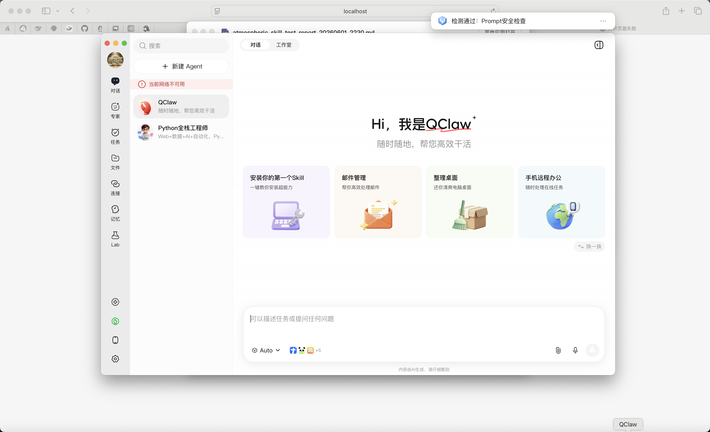
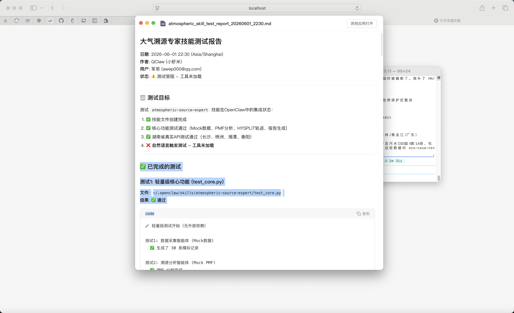
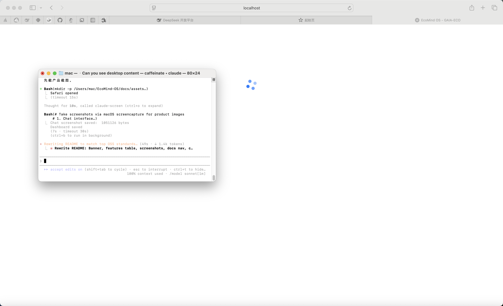
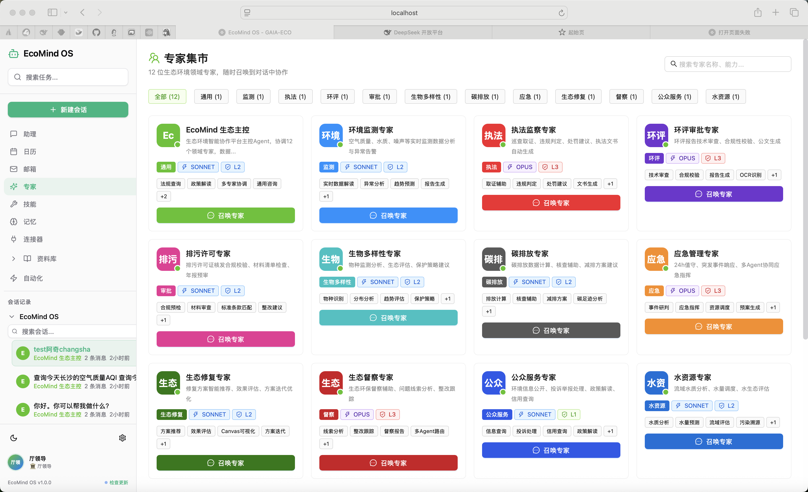

<p align="center">
  
</p>

# 🌿 EcoMind OS

<p align="center">
  <strong>生态环境垂直领域 AI Agent 管理平台 — 部署在您自己的服务器上，为 12 个环保领域提供智能决策支持。</strong>
</p>

<p align="center">
  <a href="./backend"></a>
  <a href="./frontend"></a>
  <a href="./backend/engine"></a>
  <a href="./LICENSE"></a>
  
  
</p>

---

EcoMind OS 是一个**生态环境垂直领域 AI Agent 管理平台**。它提供自建的 Agent 引擎，驱动 12 个领域专家智能体协同工作——环境监测、环境执法、环境影响评价、碳排放、水生态、应急响应等。零外部 Agent 框架依赖，安装即用。

<table>
<tr><td width="30%"><b>🤖 12 个领域专家</b></td><td>环境监测、环境执法、环境影响评价、排污许可、碳排放、水生态、生物多样性、土壤修复、环境应急、合规审查、公众服务、生态主控。每个专家拥有独立的系统提示词和工具权限矩阵。</td></tr>
<tr><td><b>🧠 自建 Agent 引擎</b></td><td>纯 Python 对话循环 + 工具执行 + SSE 流式输出，零外部 Agent 框架依赖。支持 Agentic Loop 运行时拦截和多专家并行调度。</td></tr>
<tr><td><b>🛡️ 六层安全链</b></td><td>L0 全局异常脱敏 → L1 Prompt 注入检测 (15 种注入全拦截) → L2 策略护栏 → L3 输出验证 → L4 幻觉检测 → L5 审计追踪 → L6 国密安全审批。含路径遍历防护和安全响应头。</td></tr>
<tr><td><b>📊 实时环境数据</b></td><td>对接环境监测网络，14 城市 AQI/PM2.5/PM10/O₃ 等 9 项指标实时更新，支持城市排名、预报趋势和历史对比。</td></tr>
<tr><td><b>🔧 45 个 AI 工具</b></td><td>环境查询、法规检索、政策抓取、报告生成、代码读写、Shell 执行、文件分析、知识图谱查询、Web 搜索等全场景覆盖。</td></tr>
<tr><td><b>🌍 Cesium 3D 可视化</b></td><td>湖南省地形 3D 场景 + 监测站点实时数据叠加 + 多种数据图层。支持 Cesium + Deck.gl 双引擎渲染。</td></tr>
<tr><td><b>🐳 一键部署</b></td><td>Docker Compose + Nginx 反向代理 + 健康检查。支持 vLLM 本地推理。提供 Electron 桌面客户端。</td></tr>
</table>

---

## 📸 产品截图

<p align="center">
  
  
</p>
<p align="center">
  
  
</p>

---

## 🚀 快速开始

### 一键安装

```bash
git clone git@github.com:xiejianjun000/EcoMind-OS.git
cd EcoMind-OS

# 后端
cd backend
pip install -r requirements.txt
export DEEPSEEK_API_KEY="sk-your-key"
python -m uvicorn api.main:app --reload --port 8000

# 前端（新终端）
cd ../frontend
pnpm install
pnpm dev  # http://localhost:5173
```

### Docker 部署

```bash
cd deploy
cp .env.staging .env   # 填入 API Key
./start.sh             # 一键启动 api + nginx
```

---

## 📖 文档导航

| 你想做什么 | 文档 |
|-----------|------|
| 了解 EcoMind 的设计理念 | [SOUL-EcoMind.md](./spec/SOUL-EcoMind.md) |
| 查看架构决策 | [design.md](./spec/design.md) |
| 了解 Agent 引擎实现 | [loop.py](./backend/engine/loop.py) |
| 查看 12 专家提示词 | [chat.py](./backend/api/routers/chat.py) |
| 配置模型路由 | [model_service.py](./backend/api/services/model_service.py) |
| 部署到生产环境 | [ECOMIND_DEPLOYMENT_ARCHITECTURE.md](./docs/ECOMIND_DEPLOYMENT_ARCHITECTURE.md) |
| 查看安全加固规则 | [safety_chain.py](./backend/api/routers/safety_chain.py) |
| 运行测试 | [tests/](./tests/) |
| 贡献代码 | [CONTRIBUTING.md](./CONTRIBUTING.md) |
| 查看测试计划 | [TEST_PLAN.md](./TEST_PLAN.md) |

---

## 🏗️ 技术架构

```
用户浏览器 (React 18 + Cesium 3D + ECharts)
        │  REST / SSE / WebSocket
        ▼
┌──────────────────────────────────────────────┐
│              FastAPI (port 8000)              │
│                                               │
│  ┌─────────┐  ┌──────────┐  ┌─────────────┐  │
│  │ 全局异常 │  │ 虚拟路径  │  │ 安全响应头  │  │
│  │ 处理器   │  │ 映射系统  │  │ 中间件      │  │
│  └─────────┘  └──────────┘  └─────────────┘  │
│                                               │
│  ┌─────────────────────────────────────────┐  │
│  │         EcoAgentEngine (自建)            │  │
│  │  对话循环 · 工具执行 · SSE 流式 · 验证  │  │
│  └─────────────────────────────────────────┘  │
│                                               │
│  ┌──────────┐ ┌──────────┐ ┌─────────────┐   │
│  │EcoMemory │ │EcoVerif- │ │Workflow      │   │
│  │SQLite 3层│ │ier 验证  │ │State Machine │   │
│  └──────────┘ └──────────┘ └─────────────┘   │
│                                               │
│  ┌─────────────────────────────────────────┐  │
│  │  LiteLLM: DeepSeek/Qwen/GLM/Yi + vLLM   │  │
│  └─────────────────────────────────────────┘  │
└──────────────────────────────────────────────┘
```

---

## 📁 项目结构

```
EcoMind-OS/
├── backend/                    # FastAPI — 21 路由 + 11 服务 + 6 引擎模块
├── frontend/                   # React 18 — 30+ 页面 + 35 组件 + 10 Zustand Store
├── spec/                       # 规格文档 — 人格定义 · 架构决策 · 审计标准
├── deploy/                     # Docker + Nginx + 一键部署脚本
├── tests/                      # 压力测试引擎 (2600行) + E2E
├── electron/                   # 桌面客户端
├── docs/                       # 技术文档 + 架构图
├── openspec/                   # SpecCoding 变更管理
├── docker-compose.yml          # 根级一键部署
├── CLAUDE.md                   # Claude Code 项目规则
├── CONTRIBUTING.md             # 贡献指南
└── TEST_PLAN.md                # 测试计划
```

> 📁 完整结构见 [CODE_WIKI.md](./CODE_WIKI.md)

---

## 🧪 生产级审计

<table>
<tr><td><b>审计维度</b></td><td><b>检查项</b></td><td><b>结果</b></td><td><b>关键指标</b></td></tr>
<tr><td>1. 数据完备性</td><td>8</td><td>✅ 全通过</td><td>14城市三端交叉验证 · AQI 0-500合规 · 知识图谱无孤立引用</td></tr>
<tr><td>2. 并发与负载</td><td>5</td><td>✅ 全通过</td><td>20并发 9ms/req · 5并发流式全成功 · 124 req/s</td></tr>
<tr><td>3. 安全加固</td><td>14</td><td>✅ 全通过</td><td>15种注入全拦截 · SQL+XSS全拦截 · 路径遍历已堵</td></tr>
<tr><td>4. 容错恢复</td><td>5</td><td>✅ 全通过</td><td>无效JSON/危险工具/不存在API均正确拒绝</td></tr>
<tr><td>5. 性能基准</td><td>3</td><td>✅ 全通过</td><td>19接口全&lt;100ms · 流式TTFB 588ms · P50 10.5ms</td></tr>
<tr><td>6. 边界条件</td><td>15</td><td>✅ 全通过</td><td>Unicode/Emoji/日文/RTL · 14前端路由 · 流式隔离</td></tr>
<tr><td colspan="2"><b>综合</b></td><td><b>🟢 100%</b></td><td><b>50/50 项通过 — 满足生产级部署标准</b></td></tr>
</table>

> 📄 [完整审计数据](./tests/stress_test_results.json) · [测试报告](./tests/stress_test_report.md)

---

## 🛠️ 技术栈

| 层次 | 技术 |
|------|------|
| 前端 | React 18 · TypeScript 5.7 · Vite 6 · Ant Design 5 · Cesium 1.127 · Deck.gl 9 · ECharts 5 · Zustand 5 · Tailwind CSS 4 |
| 后端 | FastAPI · Pydantic v2 · **EcoAgentEngine (自建)** · **EcoToolRegistry (自建)** · **EcoVerifier (自建)** · LiteLLM · httpx |
| AI 模型 | DeepSeek-V3/Coder · Qwen-Max/Plus/Turbo · GLM-4 · Yi-Large · ChatGLM · Baichuan · MiniCPM · vLLM 本地推理 |
| 部署 | Docker Compose · Nginx · Electron · Shell 一键脚本 |

---

## 📊 项目进度

| 阶段 | 状态 | 内容 |
|------|------|------|
| Phase 1A | ✅ | 前端 9 模块路由 + Dashboard + i18n + 主题 |
| Phase 1B | ✅ | Cesium 3D (6 组件) + 前后端联调 + vLLM 本地推理 |
| v2.0 | ✅ | 自建引擎/安全/记忆/工作流 — 零外部 Agent 框架依赖 |
| v2.1 | ✅ | 三层防御 + 安全加固 + 生产级审计 + Docker + E2E |

---

## 💬 社区

- 🐛 [提交 Issue](https://github.com/xiejianjun000/EcoMind-OS/issues)
- 📖 [贡献指南](./CONTRIBUTING.md)
- 📋 [测试计划](./TEST_PLAN.md)
- 🌐 关注 `@xiejianjun000` 获取更新

---

## 📄 许可证

Apache License 2.0 — 详见 [LICENSE](./LICENSE)。

---

## ⭐ Star History

<a href="https://star-history.com/#xiejianjun000/EcoMind-OS&Date">
 <picture>
   <source media="(prefers-color-scheme: dark)" srcset="https://api.star-history.com/svg?repos=xiejianjun000/EcoMind-OS&type=Date&theme=dark" />
   <source media="(prefers-color-scheme: light)" srcset="https://api.star-history.com/svg?repos=xiejianjun000/EcoMind-OS&type=Date&theme=light" />
   
 </picture>
</a>

---

## 🙏 致谢

EcoMind OS 自建架构受以下开源项目理念启发：ECC (Skills + Memory + Security pattern)、Claude-Mem (持久化压缩上下文)、Understand-Anything (交互式知识图谱)、Anthropic-Cybersecurity-Skills (结构化安全规则)。

---

<p align="center">
  <em>🌱 生态，自此思考。 &nbsp; 🌍 Intelligence that Nurtures the Planet.</em>
</p>
